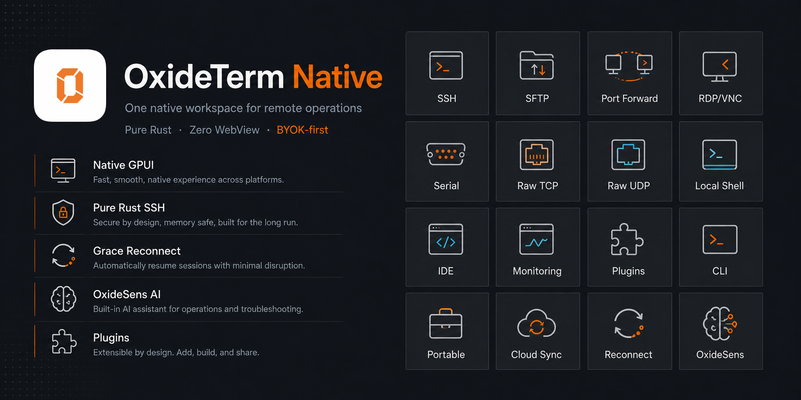
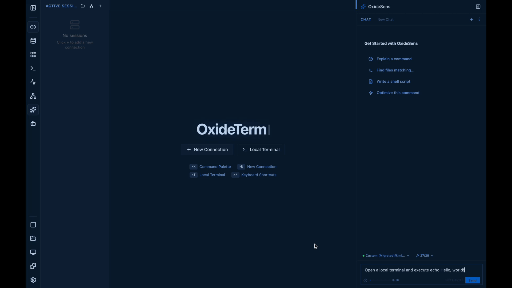

<h1 align="center">⚡ OxideTerm — Native</h1>

<p align="center">
  <strong>KI-gestützter nativer Betriebsarbeitsbereich für Remote-Server — native App aus reinem Rust</strong>
  <br>
  SSH, Telnet, serielle Terminals, RDP/VNC, SFTP, Portweiterleitung, Raw TCP/UDP und leichtes Editieren in einem nativen Arbeitsbereich.
  <br>
  GPU-gerendert. Kostenlos. Kein Konto nötig.
  <br>
  <strong>Kein WebView. Kein OpenSSL. Keine Telemetrie. Kein Abo. BYOK zuerst. Reines Rust-SSH.</strong>
</p>


<p align="center">
  
  
  
  
  
</p>

<p align="center">
  <sub>Nächste große native Ausgabe von <a href="https://github.com/AnalyseDeCircuit/oxideterm">OxideTerm</a> — GPU-gerendert, ohne WebView, mit <a href="https://github.com/zed-industries/zed/tree/main/crates/gpui">GPUI</a> (Zeds Rendering-Framework)</sub>
</p>

<p align="center">
  <a href="../../README.md">English</a> | <a href="README.zh-Hans.md">简体中文</a> | <a href="README.zh-Hant.md">繁體中文</a> | <a href="README.ja.md">日本語</a> | <a href="README.ko.md">한국어</a> | <a href="README.fr.md">Français</a> | <a href="README.de.md">Deutsch</a> | <a href="README.es.md">Español</a> | <a href="README.it.md">Italiano</a> | <a href="README.pt-BR.md">Português</a> | <a href="README.vi.md">Tiếng Việt</a>
</p>

<p align="center">
  
</p>

<div align="center">

<a href="../../docs/media/ai-terminal-demo.mp4">
  
</a>

*OxideSens folgt einer Nutzeranfrage und öffnet ein Terminal in OxideTerm.*

</div>

---

## Was OxideTerm Native ist

OxideTerm Native ist eine **GPUI-Desktop-App aus reinem Rust** – ein Open-Source-Betriebsarbeitsbereich für SSH, Dateien, Portweiterleitung, Raw TCP/UDP und Remote-Desktop-Workflows.

**Was Sie damit tun können:**

- SSH, Telnet, serielle Terminals, RDP/VNC, SFTP, Portweiterleitungen, Raw TCP/UDP, lokale Shells und leichtes Editieren in einem nativen Arbeitsbereich verwalten
- Remote-Arbeit mit der Grace-Period-Wiederverbindung bei kurzen Netzwerkaussetzern am Leben halten
- OxideSens AI kann mit Ihrem eigenen KI-Anbieter laufende Sitzungen prüfen und genehmigte Arbeitsbereichsaktionen ausführen

OxideTerm Native ist keine gehostete Cloud-Agent-Plattform. Es ist auch keine Electron-App, keine Tauri-App und kein Web-Terminal: kein Chromium, kein WebView, kein JavaScript, kein CSS.

---

## Warum OxideTerm Native?

| Wenn Ihnen wichtig ist... | OxideTerm Native bietet... |
|---|---|
| Ein Remote-Knoten, viele Werkzeuge | Terminal, SFTP, Portweiterleitung, RDP/VNC, Raw TCP/UDP, trzsz, native IDE, Überwachung und OxideSens AI im selben Arbeitsbereich |
| Native Shell ohne WebView | GPUI zeichnet die Desktop-Oberfläche direkt auf einer GPU-Oberfläche – kein DOM, CSS, JavaScript, Chromium oder WebKit |
| Lokale Betriebsabläufe | SSH, Telnet, SFTP, Weiterleitung, RDP/VNC, Raw TCP/UDP, lokale Shell, serielle Terminals und Konfiguration ohne Anmeldung |
| BYOK mit OxideSens AI statt Plattformguthaben | OxideSens nutzt Ihren OpenAI/Anthropic/Gemini/Ollama/OpenAI-kompatiblen Endpunkt mit MCP, RAG und genehmigten Arbeitsbereichsaktionen |
| Wiederverbindungsstabilität | Grace Period prüft die alte Verbindung 30 s lang, bevor sie ersetzt wird – TUI-Apps überleben kurze Netzwerkausfälle |
| Reines Rust-SSH und sichere Zugangsdaten | `russh` + `ring`, kein OpenSSL/libssh2; Passwörter und API-Schlüssel im Schlüsselbund des Betriebssystems, `.oxide`-Bundle mit ChaCha20-Poly1305 + Argon2id |

---

## Screenshots

Die native UI folgt demselben OxideTerm-Workspace-Modell und derselben visuellen Sprache wie die aktuelle Tauri-Linie.

<table>
<tr>
<td align="center"><strong>SSH-Terminal + OxideSens AI</strong><br/><br/></td>
<td align="center"><strong>SFTP-Dateimanager</strong><br/><br/></td>
</tr>
<tr>
<td align="center"><strong>Integrierte IDE</strong><br/><br/></td>
<td align="center"><strong>Intelligente Portweiterleitung</strong><br/><br/></td>
</tr>
</table>

---

## Unterschiede zu WebView/Tauri

| Aspekt | WebView/Tauri | Native |
|---|---|---|
| Rendering | Chromium/Safari/WebKit2GTK + CSS | GPUI, GPU-Oberfläche, Immediate Mode, Rust |
| Terminaldaten | WebSocket → JS Event Loop → xterm.js | Rust input → `TerminalState` → GPUI render |
| IPC | JSON-RPC pro Kommando | In-process Funktionsaufrufe |
| SSH keepalive | JavaScript Timer | Rust async task |
| Plugins | ESM im Browser-Sandbox | wasmtime WASM + typisierte Rust-Host-API |
| CLI | Desktop-App muss laufen | Eigenständiges Binary |
| Runtime-Grenze | Browser-Runtime + WebView-Bridge | Nativer Prozess; keine gebündelte Browser-Runtime |

## Funktionsübersicht

| Kategorie | Funktionen |
|---|---|
| Terminal | lokales PTY, SSH, Telnet, Raw-TCP/UDP-Terminals, lokale serielle Terminals, geteilte Fenster, Shell-Integration, Befehlsmarken, asciicast, trzsz, Sixel/Kitty graphics, Rendering-Policy |
| SSH & Auth | Connection pool, unlimited ProxyJump, Grace Period reconnect, Host-key TOFU, SSH Agent forwarding, password/key/cert/keyboard-interactive |
| SFTP / IDE | Zwei-Spalten-Browser, Transfer-Warteschlange, Vorschau, Lesezeichen, atomare Schreibvorgänge, Remote-Dateibaum, Multi-Tab-Editor, Konfliktlösung |
| Forwarding | Local, Remote, Dynamic SOCKS5, gespeicherte Regeln, Wiederherstellung nach Reconnect, Ausfallmeldung, Leerlauf-Timeout |
| Remote Desktop | Integrierte RDP- und VNC-Tabs, Reconnect-Steuerung, Viewport-Größenanpassung, Tastatur, Maus, Zwischenablage und Cursor |
| Raw TCP/UDP | Raw-TCP- und Raw-UDP-Terminals für spontane Service-, Geräteprotokoll- und Datagramm-Debugging-Aufgaben |
| KI | OxideSens mit OpenAI, Anthropic, Gemini, Ollama/compatible, MCP, RAG, Befehlsfreigabe |
| Cloud Sync / `.oxide` | push/pull/apply/resolve, S3/WebDAV/Git, rollback backups, verschlüsselter Import/Export |
| Plugins / CLI | WASM-Sandbox, native Host-API, Plugin-Einstellungen; CLI für settings, connections, forwards, plugins, secrets, cloud-sync, backup, report |

## Architektur

OxideTerm Native entfernt die WebView-Bridge und hält Terminal, SSH, Telnet, RDP, VNC, Raw TCP/UDP, SFTP, Forwarding, IDE, KI, Plugins und CLI in einer Rust-nativen Architektur. Die vollständigen Implementierungsdetails bleiben unten erhalten.

<details>
<summary><strong>Architektur, SSH-Internals, GPUI-Shell, Reconnect, KI, Plugins und mehr</strong></summary>
<br>

### Architektur — Single-Process, Zero-Bridge

```text
GPUI Render Loop
  WorkspaceApp / Tab surfaces / GPUI views
        │ in-process Arc<> / async
Domain Crates
  NodeRouter → SshConnectionRegistry
  TerminalState ← SSH PTY channel
  SftpSession / ForwardManager / IdeWorkspace
  AiProvider / CloudSyncService / PluginHost
```

Zwischen UI und SSH/Terminal-Backend gibt es keine Serialisierungsgrenze. Terminal-Bytes mutieren `TerminalState` direkt; GPUI liest den State und erzeugt GPU draw calls.

### Reines Rust-SSH — russh (ring)

Die native Edition linkt denselben `russh`-Stack wie die Tauri-Linie direkt in das Desktop-Binary:

- **Keine OpenSSL-Abhängigkeiten** durch `ring`
- Vollständiges SSH2: Key Exchange, Channels, SFTP-Subsystem, Portweiterleitung
- ChaCha20-Poly1305 / AES-GCM, Ed25519/RSA/ECDSA-Schlüssel
- SSH Agent unter Unix (`SSH_AUTH_SOCK`) und Windows (`\\.\pipe\openssh-ssh-agent`)
- Mehrstufiges ProxyJump mit unabhängiger Authentifizierung pro Hop

### Smart Reconnect mit Grace Period

Die Reconnect-Semantik entspricht der Tauri-Linie, aber die Orchestrierung läuft vollständig in Rust-async-Tasks:

1. SSH-keepalive timeout erkennen, ohne JavaScript timer throttling
2. Terminal-Panes, SFTP-Transfers, Forwards und IDE-Dateien snapshotten
3. Die alte Verbindung 30 Sekunden lang während der Grace Period prüfen, damit TUI-Apps Netzwerkwechsel überstehen können
4. Wenn die Wiederherstellung scheitert: neu verbinden, Forwards wiederherstellen, Transfers fortsetzen und IDE-Dateien erneut öffnen

Pipeline: `queued → snapshot → grace-period → ssh-connect → await-terminal → restore-forwards → resume-transfers → restore-ide → verify → done`

### SSH-Verbindungspool und Node-Routing

`SshConnectionRegistry` basiert auf `DashMap` und behält das node-first Modell der Tauri-Version ohne WebSocket-Lifecycle-Bridge bei:

- Eine physische SSH-Verbindung kann Terminal-Panes, SFTP, Port-Forwards und IDE-Arbeit bedienen
- Jede Verbindung durchläuft `connecting → active → idle → link_down → reconnecting`
- UI-Kommandos adressieren `nodeId`; `NodeRouter` löst die aktive `connectionId` atomar auf
- `NodeRuntimeStore` persistiert Topologie-Snapshots in `session_tree.json`
- Jump-Host-Ausfälle propagieren `link_down` auf nachgelagerte Nodes

### OxideSens KI

OxideSens bleibt BYOK zuerst, mit Kontextaufbau direkt im Prozess:

- Anbieter: OpenAI, Anthropic, Gemini, Ollama oder jeder OpenAI-kompatible Endpunkt
- MCP: stdio- und SSE-Transports, Tool Discovery und Invocation
- RAG: BM25-Volltext, HNSW-Vektorindex, Reciprocal Rank Fusion, CJK-Bigram-Tokenizer
- KI-Kontext stammt aus dem Arbeitsbereichsstatus; Zugangsdaten werden vor Anbieteraufrufen redigiert
- API-Schlüssel bleiben im OS-Keychain und gelangen nicht in Logs oder IPC-Frames

### GPUI Desktop-Shell

Die UI wird direkt mit GPUI gezeichnet, ohne DOM/CSS/JavaScript-Rendering-Pipeline:

- Workspace-Tab-Typen: lokale, SSH-, Telnet-, serielle, RDP-, VNC- und Raw-TCP/UDP-Terminals, SFTP, IDE, Forwards, Settings, Plugins, Topology und mehr
- Binärer Pane-Tree mit ziehbaren Dividern, bis zu vier Panes pro Terminal-Tab
- Command Palette, globale Tastenkürzel und Sidebars bestehen aus GPUI-Primitives
- Immediate-mode Rendering reagiert auf Rust-State ohne Serialisierungs-Roundtrip

### Terminalzustand und Rendering

Terminal-Rendering wird zuerst als Rust-State modelliert und anschließend von GPUI gezeichnet:

- PTY-Ausgabe landet in `TerminalState`; Scrollback, Cursor, Auswahl, Marks und Suchzustand bleiben in Rust
- Die Rendering Policy kann zwischen Boost, Normal und Idle wechseln, ohne auf einen Browser Event Loop zu warten
- Sixel- und Kitty-Grafiken werden als terminal-eigene Assets verfolgt, nicht als DOM-Nodes oder Canvas-Overlays
- Split Panes teilen dasselbe Arbeitsbereichsstatus-Modell, sodass Tab-Restore und Reconnect die Terminal-Topologie gemeinsam snapshotten können

### SFTP- und IDE-Workspace

Remote-Dateien sind Teil desselben Node-Workspace und keine getrennte Nebenfunktion:

- SFTP-Sessions werden über `NodeRouter` aufgelöst, sodass Reconnect die darunterliegende SSH-Verbindung tauschen kann, ohne die Node-Adresse der UI zu ändern
- Transfer Queues verfolgen Richtung, Fortschritt, Retry-Zustand und Speed Limits unabhängig von den sichtbaren Datei-Panes
- IDE-Tabs halten Dirty Buffers, Remote-Pfade, Conflict State und Restore-Metadaten zusammen
- Remote Writes nutzen staged/atomic behavior, wo das Backend es unterstützt, damit normale Edit-Flows keine Partial Writes sehen

### Plugins, CLI und Diagnosen

Die native Branch hält Erweiterungen und Support-Flächen innerhalb Rust-nativer Grenzen:

- Plugins laufen in einer wasmtime-Sandbox mit typisierten Host-Fähigkeiten statt Browser-Globals
- Die CLI linkt direkt gegen Domain Crates für doctor, settings, connections, forwards, portable bundles, backups und reports
- Diagnosen bevorzugen Zähler, Pfade, Feature-Flags und redigierte Hinweise statt roher payloads mit Geheimnisse
- Mutierende CLI-Flows nutzen dry-run plans, `--yes` guards und rollback backups, wo anwendbar

### Portweiterleitung — Lock-Free I/O

Forwarding behält die Tauri-Semantik in einer eigenständigen Rust-Crate:

- Local `-L`, Remote `-R`, Dynamic SOCKS5 `-D`
- Ein einzelner `ssh_io`-Task besitzt jeden SSH Channel und vermeidet `Arc<Mutex<Channel>>`
- Reconnect Auto-Restore, Death Reporting und Idle Timeout

### trzsz — In-Band-Dateitransfer

trzsz nutzt weiterhin den Terminal-Stream, ohne zusätzlichen Port oder Remote-Agent:

- Upload/download über den bestehenden Terminal-Stream
- Funktioniert durch ProxyJump-Ketten
- Native Dateiauswahl vermeidet Browser-Speichergrenzen
- Bidirektional, Verzeichnis-Support, konfigurierbare Limits

### `.oxide` verschlüsselter Export

Das verschlüsselte Bundle-Format entspricht der Tauri-Linie:

- **ChaCha20-Poly1305 AEAD** authenticated encryption
- **Argon2id KDF**: 256 MB memory cost, 4 iterations, erhöht die Kosten für GPU-Bruteforce
- Enthält connections, forwards, settings, quick commands, plugin settings und portable secrets

</details>

---

## Aus dem Quellcode starten

```sh
cargo run
OXIDETERM_RENDER_PROFILE=compatibility cargo run
./scripts/build-cli.sh
./scripts/build-agent.sh
```

## CLI

```sh
cargo run -p oxideterm-cli -- doctor --strict
cargo run -p oxideterm-cli -- settings validate --strict --json
cargo run -p oxideterm-cli -- connections search prod
cargo run -p oxideterm-cli -- cloud-sync push --dry-run --json
cargo run -p oxideterm-cli -- report --bundle ./oxideterm-report.zip
```

## Sicherheit

| Thema | Umsetzung |
|---|---|
| Passwörter & Schlüssel | macOS Keychain / Windows Credential Manager / libsecret |
| Geheimnisse im Speicher | `zeroize` / `Zeroizing` |
| Diagnosen & KI-Kontext | Secret-Werte werden vor Ausgabe oder Anbieteraufrufen redigiert |
| `.oxide` | ChaCha20-Poly1305 + Argon2id |
| CLI-Schreibzugriffe | dry-run plans, `--yes` guards, rollback backups |
| Plugins | wasmtime-Isolation und fähigkeitsbasierte Host-API |

## Release-Status

- [x] SSH Agent forwarding, Grace Period reconnect, GPUI desktop shell
- [x] In-process Terminaldatenfluss ohne WebSocket
- [x] SFTP, Forwarding, IDE, KI, Cloud Sync, Plugins, CLI
- [x] Lokale serielle Terminals
- [x] RDP/VNC Remote Desktop und Raw-TCP/UDP-Terminals
- [x] Full ProxyCommand
- [ ] Audit logging

## Beiträge

## Anbieterneutralität

OxideTerm setzt BYOK zuerst und bleibt anbieterneutral.

Anbieterintegrationen sollen Nutzern helfen, die Werkzeuge zu verbinden, denen sie bereits vertrauen. Sie sind keine Rangliste, keine Werbefläche und kein Belohnungssystem für diejenigen, die am freundlichsten nach Aufmerksamkeit fragen.

Kompatibilität, Wartbarkeit, Sicherheit und echter Nutzwert entscheiden, was dokumentiert wird. Sichtbarkeit folgt Nützlichkeit, nicht Begeisterung.

Wenn ein Feature bereits in der Tauri-Version existiert, sollen Verhalten, Labels, Interaktionszustände und Workflows übereinstimmen. Neue Crates brauchen echte Domänenverantwortung und dürfen nicht nur Re-Exports sammeln.

## Support und Wartung

Reproduzierbare Bug Reports und Regressionen mit redigierten Diagnosen werden priorisiert. Feature Requests werden nach Umfang, Sicherheit und Ausrichtung auf OxideTerms Remote-Server-Workspace-Richtung bewertet.

<p align="center">
  <a href="https://github.com/AnalyseDeCircuit/oxideterm/stargazers">
    
  </a>
</p>

Wenn OxideTerm Ihrem Workflow hilft, machen GitHub Star, Reproduktion, Übersetzungskorrektur, Plugin oder Pull Request das Projekt leichter weiterzuführen.

---

## Lizenz / Danksagung

**GPL-3.0-only**. Third-party notices stehen in `NOTICE`. Danke an `russh`, `GPUI`, `alacritty_terminal`, `portable-pty`, `wasmtime` und `tree-sitter`.
