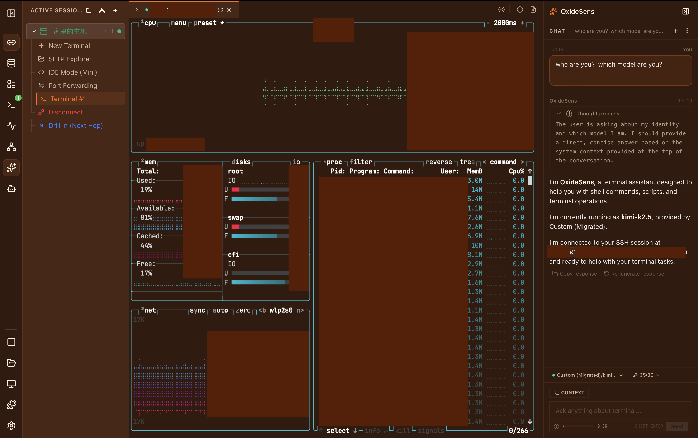
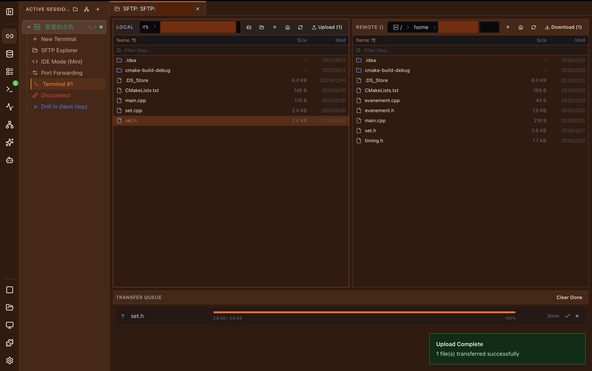
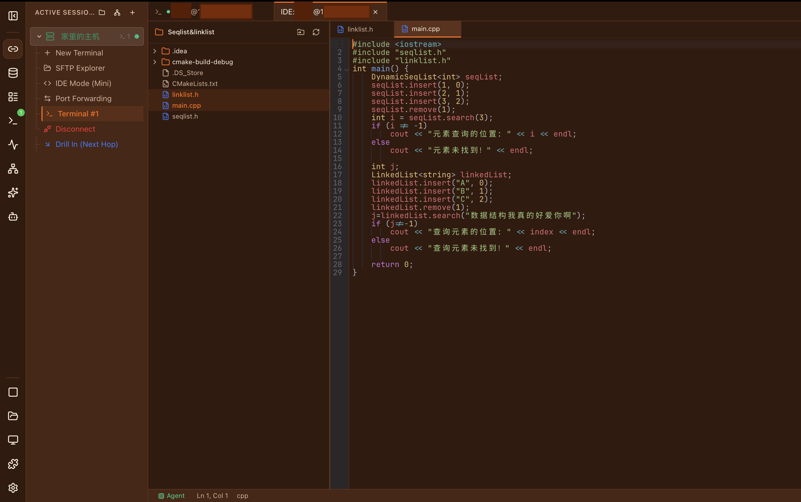
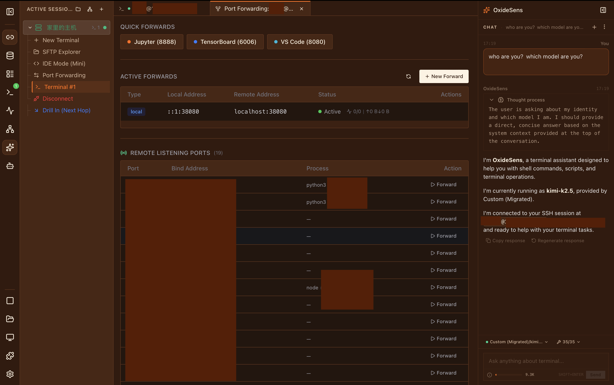

<p align="center">
  
</p>

<h1 align="center">⚡ OxideTerm</h1>

<p align="center">
  <a href="https://github.com/AnalyseDeCircuit/oxideterm/stargazers">
    
  </a>
  <br>
  <em>Nếu bạn thích OxideTerm, vui lòng cho dự án một sao trên GitHub! ⭐️</em>
</p>


<p align="center">
  <strong>OxideTerm là workspace SSH ưu tiên cục bộ, không chỉ là terminal.</strong>
  <br>
  <em>Mở một node từ xa (kết nối máy chủ) một lần, rồi làm việc quanh nó: shell, SFTP, chuyển tiếp cổng, trzsz, chỉnh sửa nhẹ và AI BYOK.</em>
  <br>
  <strong>Không Electron. Không OpenSSL. Không telemetry. Không đăng ký ứng dụng. BYOK-first. SSH thuần Rust.</strong>
</p>

<p align="center">
  
  
  
  
  
  
</p>

<p align="center">
  <a href="https://github.com/AnalyseDeCircuit/oxideterm/releases/latest">
    
  </a>
  <a href="https://github.com/AnalyseDeCircuit/oxideterm/releases">
    
  </a>
</p>

<p align="center">
  🌐 <strong><a href="https://oxideterm.app">oxideterm.app</a></strong> — Documentation & website
</p>

<p align="center">
  <a href="../../README.md">English</a> | <a href="README.zh-Hans.md">简体中文</a> | <a href="README.zh-Hant.md">繁體中文</a> | <a href="README.ja.md">日本語</a> | <a href="README.ko.md">한국어</a> | <a href="README.fr.md">Français</a> | <a href="README.de.md">Deutsch</a> | <a href="README.es.md">Español</a> | <a href="README.it.md">Italiano</a> | <a href="README.pt-BR.md">Português</a> | <a href="README.vi.md">Tiếng Việt</a>
</p>

<div align="center">

https://github.com/user-attachments/assets/4ba033aa-94b5-4ed4-980c-5c3f9f21db7e

*🤖 OxideSens AI — điều khiển terminal đang chạy và công cụ workspace từ một trợ lý duy nhất.*

</div>

---

## Tại sao chọn OxideTerm?

| Vấn đề | Giải pháp của OxideTerm |
|---|---|
| Workspace SSH, không chỉ là shell | **Workspace node từ xa**: terminal, SFTP, chuyển tiếp cổng, trzsz, IDE nhẹ, giám sát và ngữ cảnh AI nằm dưới cùng một node |
| Bạn vẫn cần shell cục bộ | **Shell cục bộ tích hợp**: zsh/bash/fish/pwsh/WSL2 chạy cạnh phiên SSH, để việc cục bộ và từ xa cùng nằm trong một UI |
| Kết nối lại = mất hết mọi thứ | **Kết nối lại với thời gian ân hạn**: thăm dò kết nối cũ trong 30 giây trước khi ngắt — vim/htop/yazi của bạn vẫn sống sót |
| Không muốn cài IDE từ xa nặng | **Chỉnh sửa nhẹ tích hợp**: CodeMirror 6 qua SFTP, chỉ dùng agent Linux tùy chọn (~1 MB) khi cần thao tác tệp nhanh hơn |
| Không tái sử dụng kết nối SSH | **Ghép kênh**: terminal, SFTP, chuyển tiếp, IDE chia sẻ một kết nối SSH duy nhất qua pool đếm tham chiếu |
| Thư viện SSH phụ thuộc OpenSSL | **russh 0.59**: SSH thuần Rust biên dịch với `ring` — không phụ thuộc C |
| Không muốn Electron | **Tauri 2.0**: backend Rust gốc, tệp nhị phân 25–40 MB |
| Không muốn telemetry hoặc đăng ký ứng dụng | **Không tracking, workflow SSH cốt lõi không cần đăng ký ứng dụng**: SSH/SFTP/chuyển tiếp cổng/shell cục bộ không cần tài khoản hay gói đăng ký; dữ liệu mặc định ở trên máy bạn; đồng bộ cloud là tùy chọn qua [plugin chính thức](#plugin-chính-thức) |
| Muốn AI không cần tài khoản nền tảng | **OxideSens BYOK-first**: dùng khóa OpenAI/Ollama/DeepSeek/API tương thích của bạn; OxideTerm không bán credit AI hay gói cloud |
| Thông tin xác thực lưu trong file cấu hình dạng rõ | **Mã hóa khi lưu trữ**: mật khẩu và API key nằm trong keychain hệ thống, metadata của kết nối đã lưu được niêm phong cục bộ và file `.oxide` được mã hóa bằng ChaCha20-Poly1305 + Argon2id |

## Là gì / Không phải là gì

OxideTerm là một **workspace SSH ưu tiên cục bộ**: mở một node từ xa một lần, rồi làm việc ở cùng một nơi với shell, tệp, cổng, truyền tệp trong terminal, chỉnh sửa nhẹ và ngữ cảnh AI.

OxideTerm **không phải** nền tảng AI cloud, dịch vụ Agent được host, hộp công cụ cho mọi giao thức từ xa, hay dự án lấy benchmark render terminal làm mục tiêu chính. Nhiều terminal hiện đại đang phát triển quanh shell cục bộ, panel AI hoặc nền tảng Agent cloud; OxideTerm tập trung vào workspace SSH ưu tiên cục bộ.

---

## Ảnh chụp màn hình

<table>
<tr>
<td align="center"><strong>Terminal SSH + OxideSens AI</strong><br/><br/></td>
<td align="center"><strong>Trình quản lý tệp SFTP</strong><br/><br/></td>
</tr>
<tr>
<td align="center"><strong>IDE tích hợp (CodeMirror 6)</strong><br/><br/></td>
<td align="center"><strong>Chuyển tiếp cổng thông minh</strong><br/><br/></td>
</tr>
</table>

---

## Tải xuống

Tải phiên bản mới nhất từ [GitHub Releases](https://github.com/AnalyseDeCircuit/oxideterm/releases/latest).

---

## Tổng quan tính năng

| Danh mục | Tính năng |
|---|---|
| **Terminal** | PTY cục bộ (zsh/bash/fish/pwsh/WSL2), SSH từ xa, chia bảng, phát sóng đầu vào, ghi/phát lại phiên (asciicast v2), kết xuất WebGL, 30+ giao diện + trình biên tập tùy chỉnh, bảng lệnh (`⌘K`), chế độ zen, truyền tệp **trzsz** tích hợp |
| **SSH & Xác thực** | Pool kết nối & ghép kênh, ProxyJump (nhảy không giới hạn) với đồ thị topo, tự động kết nối lại với thời gian ân hạn, Chuyển tiếp Agent. Xác thực: mật khẩu, khóa SSH (RSA/Ed25519/ECDSA), SSH Agent, chứng chỉ, 2FA tương tác bàn phím, Known Hosts TOFU |
| **SFTP** | Trình duyệt hai bảng, kéo thả, xem trước thông minh (ảnh/video/âm thanh/mã/PDF/hex/phông chữ), hàng đợi truyền tải với tiến trình & ETA, đánh dấu, giải nén lưu trữ |
| **Chế độ IDE** | CodeMirror 6 với 30+ ngôn ngữ, cây tệp + trạng thái Git, đa tab, giải quyết xung đột, terminal tích hợp. Agent từ xa tùy chọn cho Linux (9 kiến trúc bổ sung) |
| **Chuyển tiếp cổng** | Cục bộ (-L), từ xa (-R), SOCKS5 động (-D), I/O truyền thông điệp không khóa, tự động khôi phục khi kết nối lại, báo cáo ngừng hoạt động, hết thời gian nhàn rỗi |
| **AI (OxideSens)** | Trợ lý hướng mục tiêu cho kết nối đã lưu, phiên SSH đang chạy, bộ đệm terminal, đường dẫn SFTP, cài đặt và mục trong cơ sở kiến thức; có thể chẩn đoán output từ xa, chạy lệnh đã được phê duyệt, kiểm tra tệp và giải thích lỗi mà không cần tài khoản OxideTerm |
| **Plugin** | Tải ESM runtime, 18 không gian tên API, 24 thành phần UI Kit, API đóng băng + ACL Proxy, ngắt mạch, tự động vô hiệu hóa khi có lỗi |
| **CLI** | Công cụ đồng hành `oxt`: JSON-RPC 2.0 qua Unix Socket / Named Pipe, status/health/list/forward/config/connect/focus/attach/SFTP/import/AI, đầu ra dạng người đọc + JSON |
| **Bảo mật** | Xuất .oxide được mã hóa (ChaCha20-Poly1305 + Argon2id 256 MB), cấu hình cục bộ được mã hóa khi lưu trữ, chuỗi khóa hệ điều hành, Touch ID (macOS), kho khóa mã hóa di động, TOFU khóa máy chủ, xóa bộ nhớ `zeroize` |
| **i18n** | 11 ngôn ngữ: EN, 简体中文, 繁體中文, 日本語, 한국어, FR, DE, ES, IT, PT-BR, VI |

---

## Bên trong

### Kiến trúc — Giao tiếp hai mặt phẳng

OxideTerm tách dữ liệu terminal khỏi lệnh điều khiển thành hai mặt phẳng độc lập:

```
┌─────────────────────────────────────┐
│        Frontend (React 19)          │
│  xterm.js 6 (WebGL) + 19 stores     │
└──────────┬──────────────┬───────────┘
           │ Tauri IPC    │ WebSocket (nhị phân)
           │ (JSON)       │ cổng mỗi phiên
┌──────────▼──────────────▼───────────┐
│         Backend (Rust)              │
│  NodeRouter → SshConnectionRegistry │
│  Wire Protocol v1                   │
│  [Type:1][Length:4][Payload:n]      │
└─────────────────────────────────────┘
```

- **Mặt phẳng dữ liệu (WebSocket)**: mỗi phiên SSH có cổng WebSocket riêng. Các byte terminal chảy dưới dạng khung nhị phân với header Type-Length-Payload — không JSON serialization, không mã hóa Base64, không overhead trên đường dẫn nóng.
- **Mặt phẳng điều khiển (Tauri IPC)**: quản lý kết nối, thao tác SFTP, chuyển tiếp, cấu hình — JSON có cấu trúc, nhưng ngoài đường dẫn nóng.
- **Định danh theo nút**: frontend không bao giờ chạm `sessionId` hay `connectionId`. Mọi thứ được định danh bằng `nodeId`, được giải quyết nguyên tử phía máy chủ bởi `NodeRouter`. Kết nối lại SSH thay đổi `connectionId` bên dưới — nhưng SFTP, IDE và chuyển tiếp hoàn toàn không bị ảnh hưởng.

### 🔩 SSH thuần Rust — russh 0.59

Toàn bộ ngăn xếp SSH là **russh 0.59** biên dịch với backend mật mã **`ring`**:

- **Không phụ thuộc C/OpenSSL** — toàn bộ ngăn xếp mật mã là Rust. Không còn debug "phiên bản OpenSSL nào?".
- Giao thức SSH2 đầy đủ: trao đổi khóa, kênh, hệ thống con SFTP, chuyển tiếp cổng
- Bộ mật mã ChaCha20-Poly1305 và AES-GCM, khóa Ed25519/RSA/ECDSA
- **`AgentSigner`** tùy chỉnh: bọc SSH Agent hệ thống và thực thi trait `Signer` của russh, giải quyết vấn đề ràng buộc `Send` RPITIT bằng cách clone `&AgentIdentity` thành giá trị owned trước khi vượt qua `.await`

```rust
pub struct AgentSigner { /* wraps system SSH Agent */ }
impl Signer for AgentSigner { /* challenge-response via Agent IPC */ }
```

- **Hỗ trợ nền tảng**: Unix (`SSH_AUTH_SOCK`), Windows (`\\.\pipe\openssh-ssh-agent`)
- **Chuỗi proxy**: mỗi bước nhảy sử dụng xác thực Agent độc lập
- **Kết nối lại**: `AuthMethod::Agent` được phát lại tự động

### 🔄 Kết nối lại thông minh với thời gian ân hạn

Hầu hết client SSH hủy mọi thứ khi ngắt kết nối và bắt đầu lại từ đầu. Bộ điều phối kết nối lại của OxideTerm áp dụng cách tiếp cận khác biệt cơ bản:

1. **Phát hiện** hết thời gian heartbeat WebSocket (300 giây, được hiệu chỉnh cho macOS App Nap và throttling bộ hẹn giờ JS)
2. **Chụp ảnh** toàn bộ trạng thái: bảng terminal, chuyển SFTP đang thực hiện, chuyển tiếp cổng đang hoạt động, tệp IDE đang mở
3. **Thăm dò thông minh**: sự kiện `visibilitychange` + `online` kích hoạt keepalive SSH chủ động (~2 giây phát hiện so với 15–30 giây timeout thụ động)
4. **Thời gian ân hạn** (30 giây): thăm dò kết nối SSH cũ qua keepalive — nếu phục hồi (ví dụ: chuyển điểm truy cập WiFi), ứng dụng TUI của bạn (vim, htop, yazi) sống sót hoàn toàn
5. Nếu phục hồi thất bại → kết nối SSH mới → tự động khôi phục chuyển tiếp → tiếp tục chuyển SFTP → mở lại tệp IDE

Pipeline: `queued → snapshot → grace-period → ssh-connect → await-terminal → restore-forwards → resume-transfers → restore-ide → verify → done`

Toàn bộ logic chạy qua một `ReconnectOrchestratorStore` chuyên dụng — không có mã kết nối lại rải rác trong hooks hay components.

### 🛡️ Pool kết nối SSH

`SshConnectionRegistry` đếm tham chiếu dựa trên `DashMap` cho truy cập đồng thời không khóa:

- **Một kết nối, nhiều người dùng**: terminal, SFTP, chuyển tiếp cổng và IDE chia sẻ một kết nối SSH vật lý duy nhất — không bắt tay TCP dư thừa
- **Máy trạng thái mỗi kết nối**: `connecting → active → idle → link_down → reconnecting`
- **Quản lý vòng đời**: hết thời gian nhàn rỗi có thể cấu hình (5 phút / 15 phút / 30 phút / 1 giờ / không bao giờ), khoảng keepalive 15 giây, phát hiện lỗi heartbeat
- **Heartbeat WsBridge**: khoảng 30 giây, hết thời gian 5 phút — chịu được macOS App Nap và throttling JS trình duyệt
- **Lan truyền dây chuyền**: lỗi máy chủ nhảy → tất cả nút hạ nguồn tự động đánh dấu `link_down` với đồng bộ trạng thái
- **Ngắt kết nối nhàn rỗi**: phát `connection_status_changed` tới frontend (không chỉ `node:state` nội bộ), ngăn mất đồng bộ giao diện

### 🤖 OxideSens AI

Trợ lý AI ưu tiên quyền riêng tư với hai chế độ tương tác:

- **Bảng inline** (`⌘I`): lệnh terminal nhanh, đầu ra được tiêm qua bracketed paste
- **Trò chuyện thanh bên**: cuộc trò chuyện liên tục với lịch sử đầy đủ
- **Ngữ cảnh workspace hướng mục tiêu**: xem kết nối đã lưu, phiên SSH đang chạy, bộ đệm terminal, đường dẫn SFTP, cài đặt và mục trong cơ sở kiến thức như các mục tiêu của workspace
- **Hành động đã phê duyệt**: có thể chẩn đoán output từ xa, chạy lệnh đã được phê duyệt, kiểm tra tệp và giải thích lỗi mà không cần tài khoản OxideTerm
- **Hỗ trợ MCP**: kết nối máy chủ [Model Context Protocol](https://modelcontextprotocol.io) bên ngoài (stdio & SSE) cho tích hợp công cụ bên thứ ba
- **Cơ sở kiến thức RAG** (v0.20): nhập tài liệu Markdown/TXT vào bộ sưu tập có phạm vi (toàn cục hoặc mỗi kết nối). Tìm kiếm lai kết hợp chỉ mục từ khóa BM25 + tương đồng cosine vector qua Reciprocal Rank Fusion. Phân đoạn nhận biết Markdown bảo tồn phân cấp tiêu đề. Tokenizer bigram CJK cho tiếng Trung/Nhật/Hàn.
- **Nhà cung cấp**: OpenAI, Ollama, DeepSeek, OneAPI, hoặc bất kỳ endpoint `/v1/chat/completions` nào
- **Bảo mật**: khóa API lưu trong chuỗi khóa hệ điều hành; trên macOS, đọc khóa được bảo vệ bởi **Touch ID** qua `LAContext` — không cần entitlement hay ký mã, được cache sau lần xác thực đầu tiên mỗi phiên

###  Chuyển tiếp cổng — I/O không khóa

Chuyển tiếp cục bộ (-L), từ xa (-R) và SOCKS5 động (-D) đầy đủ:

- **Kiến trúc truyền thông điệp**: kênh SSH thuộc sở hữu của một task `ssh_io` duy nhất — không `Arc<Mutex<Channel>>`, loại bỏ hoàn toàn tranh chấp mutex
- **Báo cáo ngừng hoạt động**: các task chuyển tiếp chủ động báo cáo lý do thoát (ngắt SSH, đóng cổng từ xa, hết thời gian) để chẩn đoán rõ ràng
- **Tự động khôi phục**: chuyển tiếp `Suspended` tự động tiếp tục khi kết nối lại mà không cần can thiệp người dùng
- **Hết thời gian nhàn rỗi**: `FORWARD_IDLE_TIMEOUT` (300 giây) ngăn tích tụ kết nối zombie

### 📦 trzsz — Truyền Tệp Tích Hợp

Tải lên và tải xuống tệp trực tiếp qua phiên SSH — không cần kết nối SFTP:

- **Giao thức tích hợp**: tệp được truyền dưới dạng các frame Base64 trong luồng terminal hiện có — hoạt động trong suốt qua chuỗi ProxyJump và tmux mà không cần cổng hoặc agent bổ sung
- **Hai chiều**: server chạy `tsz <tệp>` để gửi tệp đến client; `trz` kích hoạt tải lên từ client; hỗ trợ kéo và thả
- **Hỗ trợ thư mục**: truyền đệ quy qua `trz -d` / `tsz -d`
- **Giới hạn truyền tệp**: giới hạn có thể cấu hình theo phiên cho kích thước chunk, số lượng tệp và tổng byte
- **I/O Tauri gốc**: đọc và ghi tệp sử dụng hộp thoại tệp gốc của Tauri và Rust I/O — không bị giới hạn bộ nhớ trình duyệt
- **Thông báo trực tiếp**: thông báo Toast cho bắt đầu, hoàn thành, hủy và lỗi — bao gồm gợi ý khi phát hiện trzsz nhưng tính năng bị tắt
- Bật trong **Cài đặt → Thiết bị đầu cuối → Truyền tệp tích hợp**

### 🔌 Hệ thống plugin runtime

Tải ESM động với bề mặt API đóng băng và được tăng cường bảo mật:

- **API PluginContext**: 18 không gian tên — terminal, ui, commands, settings, lifecycle, events, storage, system
- **24 thành phần UI Kit**: thành phần React dựng sẵn (nút, trường nhập liệu, hộp thoại, bảng…) được tiêm vào sandbox plugin qua `window.__OXIDE__`
- **Màng bảo mật**: `Object.freeze` trên tất cả đối tượng ngữ cảnh, ACL dựa trên Proxy, whitelist IPC, ngắt mạch với tự động vô hiệu hóa sau lỗi lặp lại
- **Module chia sẻ**: React, ReactDOM, zustand, lucide-react được cung cấp cho plugin sử dụng mà không trùng lặp bundle

### ⚡ Kết xuất thích ứng

Bộ lập lịch kết xuất ba tầng thay thế batching cố định `requestAnimationFrame`:

| Tầng | Kích hoạt | Tần suất | Lợi ích |
|---|---|---|---|
| **Boost** | Dữ liệu khung ≥ 4 KB | 120 Hz+ (ProMotion gốc) | Loại bỏ lag cuộn khi `cat largefile.log` |
| **Bình thường** | Nhập liệu chuẩn | 60 Hz (RAF) | Nền tảng mượt mà |
| **Nhàn rỗi** | 3 giây không I/O / tab ẩn | 1–15 Hz (suy giảm lũy thừa) | Tải GPU gần bằng không, tiết kiệm pin |

Các chuyển đổi hoàn toàn tự động — được điều khiển bởi lượng dữ liệu, đầu vào người dùng và API Page Visibility. Tab nền tiếp tục xả dữ liệu qua bộ hẹn giờ nhàn rỗi mà không đánh thức RAF.

### 🔐 Xuất mã hóa .oxide

Sao lưu kết nối di động, chống giả mạo:

- Mã hóa xác thực **ChaCha20-Poly1305 AEAD**
- **KDF Argon2id**: chi phí bộ nhớ 256 MB, 4 vòng lặp — chống brute-force GPU
- Checksum toàn vẹn **SHA-256**
- **Nhúng khóa tùy chọn**: khóa riêng tư được mã hóa base64 trong payload đã mã hóa
- **Phân tích trước**: phân tích loại xác thực, phát hiện khóa thiếu trước khi xuất

### 📡 ProxyJump — Đa chặng nhận biết topo

- Độ sâu chuỗi không giới hạn: `Client → Chặng A → Chặng B → … → Đích`
- Tự động phân tích `~/.ssh/config`, xây dựng đồ thị topo, tìm đường Dijkstra cho tuyến tối ưu
- Nút nhảy tái sử dụng như phiên độc lập
- Lan truyền lỗi dây chuyền: máy chủ nhảy hỏng → tất cả nút hạ nguồn tự động đánh dấu `link_down`

### ⚙️ Terminal cục bộ — PTY an toàn luồng

Shell cục bộ đa nền tảng qua `portable-pty 0.8`, được bảo vệ bởi feature gate `local-terminal`:

- `MasterPty` bọc trong `std::sync::Mutex` — luồng I/O chuyên dụng giữ đọc PTY chặn khỏi vòng lặp sự kiện Tokio
- Tự động phát hiện shell: `zsh`, `bash`, `fish`, `pwsh`, Git Bash, WSL2
- `cargo build --no-default-features` loại bỏ PTY cho bản build di động/nhẹ

### 🪟 Tối ưu hóa Windows

- **ConPTY gốc**: gọi trực tiếp API Windows Pseudo Console — hỗ trợ đầy đủ TrueColor và ANSI, không có WinPTY cũ
- **Quét shell**: tự động phát hiện PowerShell 7, Git Bash, WSL2, CMD qua Registry và PATH

### Và nhiều hơn nữa

- **Chế độ IDE**: CodeMirror 6 qua SFTP, 24 ngôn ngữ, cây tệp với trạng thái Git, đa tab, giải quyết xung đột — agent từ xa tùy chọn (~1 MB) cho các tính năng nâng cao trên Linux
- **Trình phân tích tài nguyên**: CPU/bộ nhớ/mạng trực tiếp qua kênh SSH liên tục đọc `/proc/stat`, tính toán dựa trên delta, tự động giảm xuống chỉ RTT trên hệ thống không phải Linux
- **Công cụ giao diện tùy chỉnh**: 30+ giao diện tích hợp, trình biên tập trực quan với xem trước trực tiếp, 20 trường xterm.js + 24 biến màu UI, tự động suy diễn màu UI từ bảng màu terminal
- **Ghi phiên**: định dạng asciicast v2, ghi và phát lại đầy đủ
- **Phát sóng đầu vào**: gõ một lần, gửi đến tất cả bảng chia — thao tác máy chủ hàng loạt
- **Thư viện nền**: hình nền từng tab, 16 loại tab, điều khiển độ mờ/làm mờ/khớp
- **CLI đồng hành** (`oxt`): nhị phân ~1 MB, JSON-RPC 2.0 qua Unix Socket / Named Pipe, status/health/list/forward/config/connect/focus/attach/SFTP/import/AI với đầu ra dạng người đọc hoặc `--json`
- **WSL Graphics** ⚠️ thử nghiệm: trình xem VNC tích hợp — 9 môi trường desktop + chế độ ứng dụng đơn, phát hiện WSLg, Xtigervnc + noVNC

#### Plugin chính thức

| Plugin | Mô tả | Kho lưu trữ |
|---|---|---|
| **Cloud Sync** | Đồng bộ tự lưu trữ được mã hóa — tải lên và nhập snapshot `.oxide` qua WebDAV, HTTP JSON, Dropbox, Git hoặc S3 | [oxideterm.cloud-sync](https://github.com/AnalyseDeCircuit/oxideterm.cloud-sync) |
| **Telnet Client** | Trình khách Telnet gốc cho bộ định tuyến, switch và thiết bị cũ — không cần file nhị phân bên ngoài | [oxideterm.telnet](https://github.com/AnalyseDeCircuit/oxideterm.telnet) |

<details>
<summary>📸 11 ngôn ngữ đang hoạt động</summary>
<br>
<table>
  <tr>
    <td align="center"><br><b>English</b></td>
    <td align="center"><br><b>简体中文</b></td>
    <td align="center"><br><b>繁體中文</b></td>
  </tr>
  <tr>
    <td align="center"><br><b>日本語</b></td>
    <td align="center"><br><b>한국어</b></td>
    <td align="center"><br><b>Français</b></td>
  </tr>
  <tr>
    <td align="center"><br><b>Deutsch</b></td>
    <td align="center"><br><b>Español</b></td>
    <td align="center"><br><b>Italiano</b></td>
  </tr>
  <tr>
    <td align="center"><br><b>Português</b></td>
    <td align="center"><br><b>Tiếng Việt</b></td>
    <td></td>
  </tr>
</table>
</details>

---

## Yêu cầu runtime

OxideTerm sử dụng runtime WebView gốc do hệ điều hành cung cấp. Hầu hết người dùng đã có sẵn; chỉ cần cài thủ công nếu ứng dụng không khởi động hoặc môi trường của bạn không có internet.

| Nền tảng | Phụ thuộc runtime |
|---|---|
| **Windows** | [WebView2 Runtime](https://developer.microsoft.com/en-us/microsoft-edge/webview2/) — được cài sẵn trên Windows 10 (1803+) và Windows 11. Đối với môi trường **không có internet / mạng nội bộ**, hãy sử dụng [trình cài đặt độc lập Evergreen](https://developer.microsoft.com/en-us/microsoft-edge/webview2/#download) (ngoại tuyến, ~170 MB) hoặc triển khai runtime **phiên bản cố định** qua group policy. |
| **macOS** | Không cần (sử dụng WebKit gốc) |
| **Linux** | `libwebkit2gtk-4.1` (thường được cài sẵn trên các desktop hiện đại) |

---

## Chế độ di động

OxideTerm hỗ trợ chế độ di động hoàn toàn độc lập — tất cả dữ liệu (kết nối, bí mật, cài đặt) được lưu trữ bên cạnh tệp nhị phân của ứng dụng, lý tưởng cho USB hoặc môi trường ngoại tuyến.

### Kích hoạt

**Cách A — Tệp đánh dấu** (đơn giản nhất): tạo một tệp trống tên `portable` (không có phần mở rộng) bên cạnh ứng dụng.

| Nền tảng | Vị trí đặt tệp `portable` |
|---|---|
| **macOS** | Bên cạnh `OxideTerm.app` (cùng thư mục) |
| **Windows** | Bên cạnh `OxideTerm.exe` |
| **Linux (AppImage)** | Bên cạnh tệp `.AppImage` |

```
/my-usb/
├── OxideTerm.app   (or .exe / .AppImage)
├── portable        ← tệp trống bạn tạo
└── data/           ← tự động tạo khi khởi chạy lần đầu
```

**Cách B — `portable.json`** (thư mục dữ liệu tùy chỉnh): đặt một tệp `portable.json` ở cùng vị trí:

```json
{
  "enabled": true,
  "dataDir": "my-data"
}
```

- `enabled` mặc định là `true` khi bỏ qua
- `dataDir` phải là **đường dẫn tương đối** (không được dùng `..`); mặc định là `data`

### Cách hoạt động

1. **Lần chạy đầu tiên** — Màn hình khởi động yêu cầu bạn tạo mật khẩu di động. Mật khẩu này mã hóa kho khóa cục bộ (ChaCha20-Poly1305 + Argon2id) và bảo vệ tất cả bí mật đã lưu.
2. **Lần chạy tiếp theo** — Nhập mật khẩu để mở khóa. Trên macOS có Touch ID, bạn có thể bật mở khóa sinh trắc học trong **Settings → General → Portable Runtime**.
3. **Khóa phiên bản** — Chỉ một phiên bản OxideTerm có thể sử dụng thư mục dữ liệu di động tại một thời điểm (`data/.portable.lock`).
4. **Quản lý** — Thay đổi mật khẩu di động hoặc bật mở khóa sinh trắc học trong **Settings → General → Portable Runtime**.
5. **Tính di động** — Sao chép toàn bộ thư mục (ứng dụng + tệp đánh dấu `portable` + `data/`) sang máy khác. Mật khẩu đi cùng kho khóa.

> [!TIP]
> Cập nhật tự động được tắt trong chế độ di động. Để cập nhật, thay thế tệp nhị phân ứng dụng và giữ lại thư mục `data/`.

---

## Bắt đầu nhanh

### Yêu cầu

- **Rust** 1.85+
- **Node.js** 18+ (khuyến nghị pnpm)
- **Công cụ nền tảng**:
  - macOS: Xcode Command Line Tools
  - Windows: Visual Studio C++ Build Tools
  - Linux: `build-essential`, `libwebkit2gtk-4.1-dev`, `libssl-dev`

### Phát triển

```bash
git clone https://github.com/AnalyseDeCircuit/oxideterm.git
cd oxideterm && pnpm install

# Build CLI companion (cần thiết cho tính năng CLI)
pnpm cli:build

# Ứng dụng đầy đủ (frontend + backend Rust với hot reload)
pnpm run tauri dev

# Chỉ frontend (Vite trên cổng 1420)
pnpm dev

# Build sản phẩm
pnpm run tauri build
```

---

## Ngăn xếp công nghệ

| Tầng | Công nghệ | Chi tiết |
|---|---|---|
| **Framework** | Tauri 2.0 | Nhị phân gốc, 25–40 MB |
| **Runtime** | Tokio + DashMap 6 | Hoàn toàn bất đồng bộ, map đồng thời không khóa |
| **SSH** | russh 0.59 (`ring`) | Thuần Rust, không phụ thuộc C, SSH Agent |
| **PTY cục bộ** | portable-pty 0.8 | Feature-gated, ConPTY trên Windows |
| **Frontend** | React 19.1 + TypeScript 5.8 | Vite 7, Tailwind CSS 4 |
| **Trạng thái** | Zustand 5 | 19 store chuyên biệt |
| **Terminal** | xterm.js 6 + WebGL | Tăng tốc GPU, 60 fps+ |
| **Trình soạn thảo** | CodeMirror 6 | 30+ chế độ ngôn ngữ |
| **Mã hóa** | ChaCha20-Poly1305 + Argon2id | AEAD + KDF tiêu tốn bộ nhớ (256 MB) |
| **Lưu trữ** | redb 2.1 | Store KV nhúng |
| **i18n** | i18next 25 | 11 ngôn ngữ × 22 không gian tên |
| **Plugin** | ESM Runtime | PluginContext đóng băng + 24 UI Kit |
| **CLI** | JSON-RPC 2.0 | Unix Socket / Named Pipe |

---

## Quy mô dự án

Được đo bằng `tokei`, không tính dependency và artifact build.

| Chỉ số | Quy mô hiện tại |
|---|---:|
| Tổng mã nguồn | 286K+ |
| TypeScript / TSX | 130K+ |
| Rust | 100K+ |
| Mã test frontend | 24K+ |
| Tệp test frontend | 128 |
| Tệp nguồn (`src` + `src-tauri/src`) | 664 |

---

## Bảo mật

| Mối quan tâm | Triển khai |
|---|---|
| **Mật khẩu** | Chuỗi khóa hệ điều hành (macOS Keychain / Windows Credential Manager / libsecret) |
| **Kho khóa di động** | Kho lưu trữ mã hóa ChaCha20-Poly1305 bên cạnh ứng dụng, tùy chọn liên kết sinh trắc học qua chuỗi khóa hệ điều hành |
| **Khóa API AI** | Chuỗi khóa hệ điều hành + xác thực sinh trắc học Touch ID trên macOS |
| **Xuất** | .oxide: ChaCha20-Poly1305 + Argon2id (256 MB bộ nhớ, 4 vòng lặp) |
| **Bộ nhớ** | An toàn bộ nhớ Rust + `zeroize` để xóa dữ liệu nhạy cảm |
| **Khóa máy chủ** | TOFU với `~/.ssh/known_hosts`, từ chối thay đổi (ngăn MITM) |
| **Plugin** | Object.freeze + ACL Proxy, ngắt mạch, whitelist IPC |
| **WebSocket** | Token dùng một lần với giới hạn thời gian |

---

## Lộ trình

- [x] Chuyển tiếp SSH Agent
- [ ] Hỗ trợ ProxyCommand đầy đủ
- [ ] Nhật ký kiểm toán
- [ ] Nâng cao Agent
- [ ] Tìm kiếm phiên & chuyển đổi nhanh

---

## Hỗ trợ và bảo trì

OxideTerm được duy trì bởi một nhà phát triển độc lập theo nguyên tắc **nỗ lực tối đa**. Báo cáo lỗi và hồi quy có thể tái hiện được ưu tiên; yêu cầu tính năng luôn được hoan nghênh, nhưng không phải lúc nào cũng được triển khai.

Nếu OxideTerm giúp ích cho workflow của bạn, một GitHub star, bản tái hiện issue, sửa bản dịch, plugin hoặc pull request đều giúp dự án tiếp tục tiến lên.

---

## Giấy phép

**GPL-3.0** — phần mềm này là phần mềm tự do được cấp phép theo [Giấy phép Công cộng GNU v3.0](https://www.gnu.org/licenses/gpl-3.0.html).

Bạn được tự do sử dụng, sửa đổi và phân phối phần mềm này theo các điều khoản của GPL-3.0. Bất kỳ tác phẩm phái sinh nào cũng phải được phân phối theo cùng giấy phép.

OxideTerm đã chuyển từ **PolyForm Noncommercial 1.0.0** sang **GPL-3.0** kể từ v1.0.0. Đây là lựa chọn có chủ đích: không cosplay "mã nguồn mở" bằng bẫy phi thương mại hay điều khoản cấm cạnh tranh, mà là quyền tự do copyleft rõ ràng cho người dùng, fork, bên phân phối lại và nhà vận hành thương mại.

Mã công khai không tự động là mã nguồn mở. Nếu một dự án treo một giấy phép mã nguồn mở quen thuộc nhưng lại thêm các điều khoản như "không được phân phối lại", "không được đóng gói lại", "không được tạo sản phẩm cạnh tranh" hoặc "không được phân phối trên nền tảng chưa được phê duyệt", đó giống tiếp thị source-available hơn là quyền tự do mà người dùng kỳ vọng ở mã nguồn mở. OxideTerm không thêm điều khoản chống cạnh tranh hay chống phân phối lại: các điều khoản GPL-3.0 là toàn bộ điều khoản.

Toàn văn: [Giấy phép Công cộng GNU v3.0](https://www.gnu.org/licenses/gpl-3.0.html)

---

## Lời cảm ơn

[russh](https://github.com/warp-tech/russh) · [portable-pty](https://github.com/wez/wezterm/tree/main/pty) · [Tauri](https://tauri.app/) · [xterm.js](https://xtermjs.org/) · [CodeMirror](https://codemirror.net/) · [Radix UI](https://www.radix-ui.com/)

---

<p align="center">
  <sub>271.000+ dòng Rust & TypeScript — xây dựng với ⚡ và ☕</sub>
</p>

## Star History

<a href="https://www.star-history.com/?repos=AnalyseDeCircuit%2Foxideterm&type=date&legend=top-left">
 <picture>
   <source media="(prefers-color-scheme: dark)" srcset="https://api.star-history.com/chart?repos=AnalyseDeCircuit/oxideterm&type=date&theme=dark&legend=top-left" />
   <source media="(prefers-color-scheme: light)" srcset="https://api.star-history.com/chart?repos=AnalyseDeCircuit/oxideterm&type=date&legend=top-left" />
   
 </picture>
</a>
