# OxideTerm Native Architecture

> **Version**: Native user-guide architecture draft
> **Last updated**: 2026-06-19
> **Workspace version**: Cargo workspace `2.0.0-gpui-preview.9`
> **Reference style**: based on the Tauri architecture documents, rewritten for the Rust/GPUI native app.

This document describes the OxideTerm Native system architecture, design decisions, and core components. It follows the same architectural writing style as the Tauri reference: start with principles, show the whole system, separate data and control paths, then describe each subsystem and its lifecycle.

## Contents

1. [Design Principles](#design-principles)
2. [Architecture Overview](#architecture-overview)
3. [Two-Plane Architecture](#two-plane-architecture)
4. [Native Workspace Layers](#native-workspace-layers)
5. [Node-First Runtime Model](#node-first-runtime-model)
6. [Desktop Workspace Architecture](#desktop-workspace-architecture)
7. [Terminal Architecture](#terminal-architecture)
8. [SSH Connection Pool](#ssh-connection-pool)
9. [SFTP Architecture](#sftp-architecture)
10. [IDE Architecture](#ide-architecture)
11. [Port Forwarding Architecture](#port-forwarding-architecture)
12. [Graphics And VNC Sessions](#graphics-and-vnc-sessions)
13. [Reconnect And Recovery](#reconnect-and-recovery)
14. [Settings And Persistence](#settings-and-persistence)
15. [Cloud Sync, Backups, And Portable Bundles](#cloud-sync-backups-and-portable-bundles)
16. [OxideSens AI Architecture](#oxidesens-ai-architecture)
17. [Plugin Architecture](#plugin-architecture)
18. [CLI Companion Boundary](#cli-companion-boundary)
19. [Security Design](#security-design)
20. [Performance Design](#performance-design)
21. [Detailed Module Structure](#detailed-module-structure)
22. [Data Flow Walkthroughs](#data-flow-walkthroughs)
23. [State Machines And Lifecycles](#state-machines-and-lifecycles)
24. [Ownership And Persistence Matrix](#ownership-and-persistence-matrix)
25. [Event And Notification Model](#event-and-notification-model)
26. [Failure Model](#failure-model)
27. [Native Crate Map](#native-crate-map)
28. [Tauri Reference Mapping](#tauri-reference-mapping)

---

## Design Principles

### Core Principles

1. **Desktop app first** - The GPUI desktop app is the primary user surface. The CLI is a companion for automation and diagnostics.
2. **Terminal responsiveness** - Terminal input, output, resize, and rendering are latency-sensitive hot-path work.
3. **Node-first remote workspace** - Remote workflows are anchored by a stable SSH node, not by a transient terminal pane.
4. **One connection, many consumers** - Terminal, SFTP, forwarding, IDE, AI tools, and plugins can consume the same remote node.
5. **Explicit lifecycle ownership** - Saved profiles, live nodes, terminal sessions, SFTP sessions, forwards, editor buffers, and tabs have different owners.
6. **Local-first state** - SSH, SFTP, local terminal, settings, plugins, and AI provider configuration work without an OxideTerm cloud account.
7. **Secret separation** - Navigation metadata, settings, AI prompts, logs, support bundles, and plugin labels are not secret storage.
8. **Minimum visible coupling** - User-facing surfaces should not require users to reason about internal transport handles.

### Why Rust + GPUI

| Concern | Native Rust/GPUI Direction |
|---|---|
| User experience | One desktop workspace for terminal, files, forwarding, IDE, AI, settings, and plugins |
| Backend ownership | Long-lived runtime state is held by Rust domain crates instead of ad hoc UI state |
| Terminal path | Terminal input/output stays isolated from heavy management work |
| Safety | SSH, SFTP, forwarding, persistence, secrets, and AI boundaries are explicit Rust domains |
| Portability | Desktop package can include app resources, agent binaries, icons, and CLI companion |
| Maintainability | Crates split by responsibility rather than by screen or file size |

---

## Architecture Overview

```mermaid
flowchart TB
    subgraph App["Desktop App (GPUI)"]
        Shell["Workspace Shell<br/>tabs · panes · activity bar · command palette"]
        Sessions["Sessions<br/>saved connections · active nodes"]
        Monitor["Connection Monitor / Host Tools<br/>pool · health · resources · reconnect"]
        TermUI["Terminal UI<br/>local + SSH panes"]
        SftpUI["SFTP / File Manager"]
        IdeUI["IDE Workspace"]
        ForwardUI["Port Forwarding"]
        GraphicsUI["Graphics / VNC Viewer"]
        AiUI["OxideSens AI Sidebar"]
        PluginUI["Plugin Manager"]
        SyncUI["Cloud Sync / Backups"]
        SettingsUI["Settings"]
    end

    subgraph Runtime["Runtime Domains"]
        ConnStore["Saved Connection Store"]
        NodeRuntime["Node Runtime Store"]
        SshPool["SSH Connection Registry"]
        Reconnect["Reconnect Orchestrator"]
        SftpRuntime["SFTP Session + Transfer Manager"]
        ForwardRuntime["Forwarding Manager"]
        IdeRuntime["IDE FS / Editor State"]
        HostToolsRuntime["Host Tools Samplers"]
        GraphicsRuntime["WSL Graphics · VNC Worker"]
        ModemRuntime["Modem Transfer Engine"]
        AiRuntime["AI Context · Tools · RAG · MCP"]
        PluginRuntime["Plugin Registry · Host API · Settings"]
        SyncRuntime["Cloud Sync · Backup · Portable Runtime"]
    end

    subgraph Persistence["Persistence And Secrets"]
        Settings["Settings Files"]
        Connections["Connection Records"]
        Keychain["Secret Storage"]
        Backups["Backups / Support Bundles"]
        Portable["Portable Runtime"]
    end

    Shell --> Sessions
    Shell --> TermUI
    Shell --> SftpUI
    Shell --> IdeUI
    Shell --> ForwardUI
    Shell --> GraphicsUI
    Shell --> AiUI
    Shell --> PluginUI
    Shell --> SyncUI
    Shell --> SettingsUI

    Sessions --> ConnStore
    Sessions --> NodeRuntime
    Monitor --> SshPool
    Monitor --> Reconnect
    Monitor --> HostToolsRuntime
    TermUI --> NodeRuntime
    TermUI --> SshPool
    TermUI --> ModemRuntime
    SftpUI --> SftpRuntime
    IdeUI --> IdeRuntime
    ForwardUI --> ForwardRuntime
    GraphicsUI --> GraphicsRuntime
    AiUI --> AiRuntime
    PluginUI --> PluginRuntime
    SyncUI --> SyncRuntime
    SettingsUI --> Settings

    NodeRuntime --> SshPool
    SftpRuntime --> SshPool
    ForwardRuntime --> SshPool
    IdeRuntime --> SshPool
    HostToolsRuntime --> SshPool
    AiRuntime --> NodeRuntime
    PluginRuntime --> NodeRuntime

    ConnStore --> Connections
    SettingsUI --> Settings
    ConnStore --> Keychain
    SyncRuntime --> Backups
    SyncRuntime --> Portable
```

### System Context

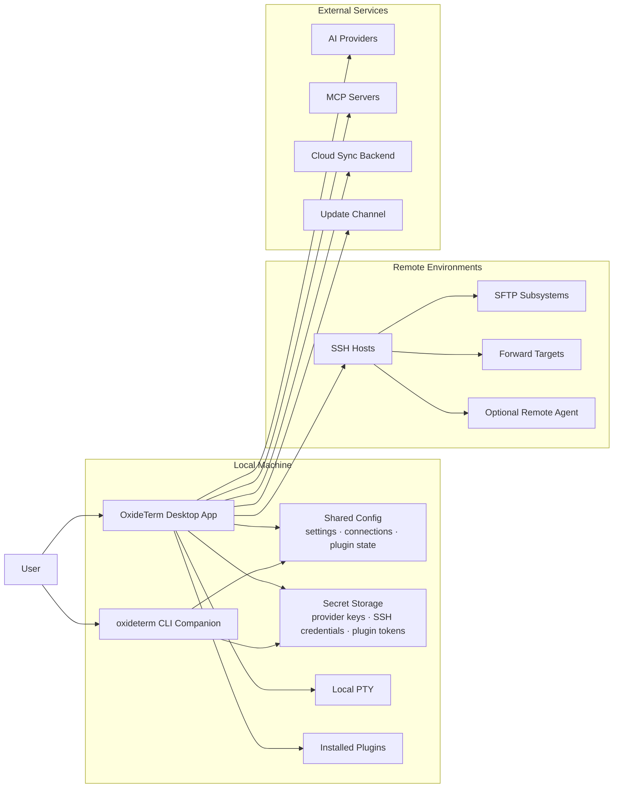

### User-Facing Summary

The app is a workspace shell around stable remote nodes. Tabs and panes are views. Saved connections are profiles. SSH nodes are live or reconnecting runtime objects. Terminal sessions, SFTP sessions, IDE workspaces, forwards, AI targets, and plugin capabilities consume those nodes.

That separation explains common behavior:

- Closing a terminal tab does not delete the saved connection.
- A node may remain visible in Connection Monitor after a pane closes.
- SFTP and IDE can recover after a reconnect because they are tied to the node, not only to a terminal pane.
- AI tools must select explicit targets before they run commands or read files.
- The CLI companion can inspect the same state, but it is not the main interactive surface.

---

## Two-Plane Architecture

The Tauri architecture describes a data plane and a control plane. Native GPUI removes the webview boundary, but the architectural split still applies.

### Data Plane

The data plane handles high-frequency terminal activity:

```text
terminal input
  -> terminal runtime
  -> local PTY or SSH shell channel
  -> terminal output
  -> terminal renderer
```

Properties:

- Low latency.
- High event volume.
- No dependence on cloud sync or backups.
- No user-visible confirmation flow for ordinary input.
- Rendering and input focus stay local to the terminal surface.

### Control Plane

The control plane handles structured management operations:

```text
user action or AI-approved tool
  -> workspace command
  -> domain runtime
  -> persistence / connection / file / sync action
  -> result, notification, or recovery hint
```

Examples:

- Create a saved connection.
- Open an SSH node.
- Start SFTP.
- Create a forward.
- Inspect host tools such as processes, Docker, services, tmux, packages, logs, ports, and filesystems.
- Open an IDE workspace.
- Open a graphics/VNC session.
- Confirm a terminal file-transfer prompt.
- Change a setting.
- Manage privilege credentials.
- Run a cloud-sync action.
- Execute an approved AI tool.
- Generate a support bundle.

### Persistence Plane

The persistence plane stores durable state:

- Settings.
- Saved connections.
- Forward rules.
- Plugin state.
- Privilege credential metadata.
- AI conversations and summaries.
- Cloud sync snapshots.
- Backups.
- Portable runtime metadata.

Secret-bearing data must cross into secret-aware storage rather than ordinary JSON/text fields. For privilege helpers, durable scope metadata can live with settings or saved connections, but the secret value belongs to the secret store.

### Plane Interaction

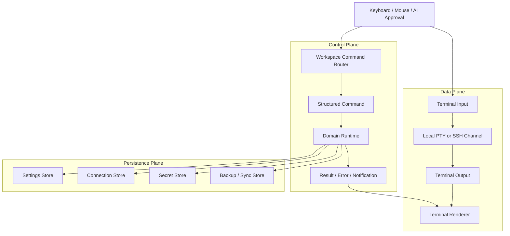

---

## Native Workspace Layers

### Layer 1: GPUI Application Shell

Owned mainly by `oxideterm-gpui-app`.

Responsibilities:

- Create the desktop window.
- Render the activity bar, tabs, pane tree, dialogs, and settings surfaces.
- Route user actions to domain crates.
- Keep UI state separate from durable domain state.
- Provide app-level notifications and command palette actions.

Representative modules:

```text
crates/oxideterm-gpui-app/src/workspace.rs
crates/oxideterm-gpui-app/src/workspace/tabs/
crates/oxideterm-gpui-app/src/workspace/pane_tree.rs
crates/oxideterm-gpui-app/src/workspace/sidebar/
crates/oxideterm-gpui-app/src/workspace/settings/
```

### Layer Dependency Shape

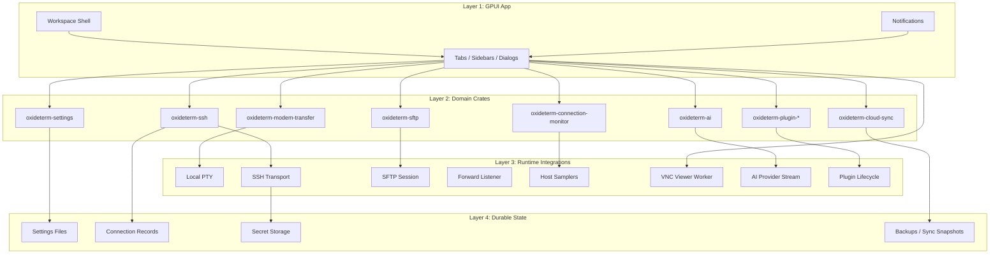

### Layer 2: Domain Crates

Domain crates own reusable business logic and protocol models.

Examples:

- `oxideterm-ssh`: SSH configuration, connection registry, node routing, reconnect model.
- `oxideterm-sftp`: SFTP protocol/session and transfer semantics.
- `oxideterm-connections`: saved connection storage and validation.
- `oxideterm-forwarding`: forward rule model.
- `oxideterm-ai`: AI providers, context window logic, RAG, MCP, orchestrator tool definitions, policy.
- `oxideterm-settings`: settings load/save/mutation logic.
- `oxideterm-cloud-sync`: sync and backup logic.
- `oxideterm-plugin-*`: plugin manifest, protocol, registry, and host API types.

### Layer 3: Runtime Integrations

Runtime integrations bridge UI requests to active resources:

- Local terminal process.
- SSH shell channel.
- SFTP channel.
- Forward listener or remote forward.
- IDE file system access.
- Plugin host lifecycle.
- Cloud sync backend.
- AI provider requests.

The important rule is ownership: a runtime object should have one clear owner, and UI views should consume it through explicit handles or snapshots.

### Layer 4: Persistence And Secret Storage

Persistent state is shared by the desktop app and CLI companion. Secret values must not be serialized into ordinary settings, support bundles, AI context, or plugin labels.

---

## Node-First Runtime Model

### Problem Avoided

The Tauri Oxide-Next architecture identified a structural problem: SFTP, IDE, and forwarding should not depend on transient terminal session IDs. A terminal session can be recreated; the remote node is the stable unit of work.

Native keeps the same user-facing model.

### Target Topology

```text
saved connection
  -> node identity
       -> SSH connection handle
       -> terminal session(s)
       -> SFTP session
       -> forward rules
       -> IDE workspace
       -> AI targets
       -> plugin consumers
```

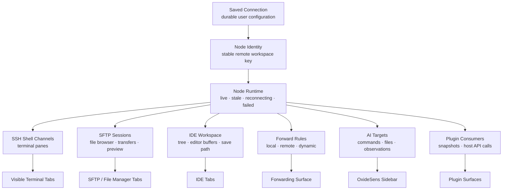

### Stable And Transient Objects

| Object | Stable Role | Transient Implementation Detail |
|---|---|---|
| Saved connection | User profile | Current transport state |
| Node | Remote workspace identity | Current connection handle |
| Terminal tab | Visible shell view | Current PTY/channel instance |
| SFTP view | File workflow for node | Current SFTP channel |
| IDE workspace | Project/editing context | Current file operation channel |
| Forward rule | Desired tunnel | Current listener/task |
| AI target | Tool-facing snapshot | Current target state |

### User Rule

When something remote fails, check the node first. Do not assume the focused tab is the owner of the whole runtime.

---

## Desktop Workspace Architecture

### Workspace Shell

The workspace shell owns visible layout:

- Tabs.
- Pane tree.
- Activity bar.
- Sidebar.
- Command palette.
- Dialog stack.
- Notifications.

It should not own low-level SSH transport or secret material.

### Tabs

Tabs are visible surfaces. A tab can represent:

- Local terminal.
- SSH terminal.
- SFTP.
- IDE workspace.
- Settings.
- File manager.
- Plugin manager.
- Connection monitor.
- Cloud sync.

Tabs are closeable views. They are not the durable source of truth for saved connections or secrets.

### Activity Bar

The activity bar is the navigation entrypoint. It should take users to app surfaces, not expose low-level runtime handles.

### Notifications

Notifications turn asynchronous domain events into user-visible messages. They should help users decide what to inspect next: connection monitor, settings, SFTP, cloud sync, plugin manager, or support bundle.

---

## Terminal Architecture

### Local Terminal

Local terminal tabs run on the local machine. They validate renderer, keyboard input, shell startup, font configuration, and terminal settings before any remote host is involved.

Local terminal responsibilities:

- Start the configured local shell.
- Render output.
- Accept keyboard input.
- Handle resize.
- Apply terminal appearance settings.
- Apply terminal background and graphics settings without making them part of the terminal buffer.
- Detect terminal-native file-transfer prompts and privilege prompts without logging secrets.
- Keep local command state separate from remote SSH node state.

### SSH Terminal

SSH terminal tabs attach to a live node. They are consumers of an SSH connection, not the connection profile itself.

SSH terminal responsibilities:

- Present a shell channel.
- Maintain visible screen and scrollback context.
- Send input.
- Render output.
- Expose terminal observations to AI tools when approved.
- Report readiness and waiting-for-input hints.
- Reuse the node-owned SSH transport while keeping shell-channel state pane-local.
- Resolve privilege credential scope through the active terminal's owning node, not through host/title/prompt heuristics.

### Terminal Rendering And Graphics

The terminal renderer combines several layers:

- The emulator text grid and scrollback.
- Cursor, selection, command marks, and inline hints.
- Terminal image protocols such as Kitty/Sixel/iTerm2.
- App-level background images, opacity, and blur.
- Context-menu and command-bar overlays.

Only emulator text belongs to the terminal buffer. Background images and app overlays are rendering state. Terminal image placements are protocol state tied to the current screen buffer, so alternate-screen transitions clear image placements to avoid drawing TUI previews after apps such as yazi exit.

### Privilege And File-Transfer Helpers

Privilege prompts and modem transfers are terminal-adjacent helpers, not ordinary typed text:

- Prompt detection watches the active terminal output.
- Secret submission uses a dedicated secret path and must not pass through plugins, AI context, logs, recordings, or shell history.
- Local privilege credentials are scoped to local terminal use; SSH privilege credentials are scoped through active terminal -> node -> saved owner.
- X/Y/ZMODEM byte-level state lives in `oxideterm-modem-transfer`; GPUI only asks for files/directories, displays progress, and writes protocol responses back to the current PTY/channel.
- Detection must stay conservative so normal command output and full-screen TUI redraws are replayed as terminal text unless protocol context is proven.

### Command Bar And Context Actions

The command bar and terminal context menu are workspace controls. They may send text, paste, select, search, trigger transfers, or route commands, but their state should not be inferred from the terminal title or prompt text. Selection actions operate on the terminal snapshot and renderer coordinates, while mutating actions route through explicit terminal/session APIs.

### Terminal Ownership Rule

Closing a terminal pane closes that pane. It should not be interpreted as deleting the saved connection profile. Depending on runtime state, other consumers such as SFTP, forwards, or IDE may still need the node or may need reconnect.

---

## SSH Connection Pool

The SSH connection pool keeps remote runtime state separate from UI tabs.

### Responsibilities

- Track active, idle, stale, reconnecting, and failed connections.
- Share one connection across multiple consumers where possible.
- Expose monitor snapshots.
- Support reconnect orchestration.
- Keep SFTP, forwarding, IDE, terminal, AI, and plugin consumers from each creating unrelated transport state.

### Consumer Model

```text
SSH connection
  |-- terminal consumer
  |-- SFTP consumer
  |-- forwarding consumer
  |-- IDE consumer
  |-- AI tool consumer
  `-- plugin consumer
```

### Monitor Model

Connection Monitor should answer:

- Which nodes are active?
- Which are reconnecting?
- Which have failed?
- Which consumers are attached?
- Which forwards or transfers need attention?

### Host Tools Model

Connection Monitor also hosts resource-oriented tools for a connected node. These tools are node-level views, not terminal commands pasted into a pane.

Host Tools cover:

- Process lists and process actions.
- Docker containers and logs.
- Services.
- tmux sessions, windows, and panes.
- Package inventory.
- System logs.
- Listening ports and exposure hints.
- Filesystem and disk usage.
- Scheduled tasks.
- CPU, memory, disk, GPU, and network metrics.

Architecture rules:

- `oxideterm-connection-monitor` owns sampler commands, parser logic, row signatures, filters, action command construction, and domain DTOs.
- `oxideterm-gpui-app` renders the monitor, confirms user actions, and dispatches commands through the owning node/runtime boundary.
- Resource snapshots are runtime observations. They can refresh, become stale, or fail without mutating saved connection profiles.
- Heavy or repeated sampling must not block terminal input or become the source of truth for SSH connection ownership.

---

## SFTP Architecture

SFTP is a node-level file capability. It should not be treated as a terminal-pane feature.

### Responsibilities

- Acquire SFTP access for a connected node.
- List directories.
- Preview files.
- Upload and download files.
- Write file content when explicitly requested.
- Manage transfer progress.
- Retry or reacquire transport after reconnect when supported.

### Directory Transfers

Directory transfers use a different execution path than single-file transfers. The app must distinguish:

- Single file upload.
- Single file download.
- Directory upload.
- Directory download.
- Background transfer state.

### Safety Model

Remote file writes are real writes on the target host. Before overwriting important files, users should verify path, target, and backup state. AI and plugins should use explicit targets and approvals for file writes.

---

## IDE Architecture

The IDE workspace is a remote project surface.

### Responsibilities

- Open a project root for a connected node.
- Maintain file tree state.
- Maintain editor tabs.
- Track dirty buffers.
- Save or discard changes explicitly.
- Preserve project context separately from terminal panes.

### Relationship To SFTP

IDE file operations may use the remote file layer, but the IDE is not simply an SFTP table. It owns editor state, project root, active editor tab, and dirty-buffer decisions.

### User Rule

Before closing an IDE tab or reconnecting an unstable host, check unsaved buffers. The connection can be rebuilt, but unsaved editor state still requires an explicit save/discard decision.

---

## Port Forwarding Architecture

Port forwarding is a connection-level capability.

### Forward Types

- **Local**: local port to remote target.
- **Remote**: remote port to local target.
- **Dynamic**: SOCKS-style dynamic forwarding.

### Runtime Responsibilities

- Create listeners or remote forward requests.
- Track running, failed, stopped, or suspended state.
- Attach forwards to an owning node.
- Restore saved or suspended forwards when reconnect succeeds.
- Show actionable errors when ports conflict or connections fail.

### Auto-Start Rule

Use auto-start only for forwards that should start whenever the owning connection opens. Otherwise, start forwards manually from the forwarding surface.

---

## Graphics And VNC Sessions

Graphics sessions are visual runtime surfaces. They are separate from terminal buffers even when a terminal or command launches the remote visual program.

### Responsibilities

- Track graphics sessions separately from terminal tabs.
- Start or reconnect the backing graphics session through the graphics runtime.
- Connect the GPUI VNC viewer to the local forwarded VNC endpoint.
- Route keyboard, pointer, and scroll input to the viewer worker.
- Keep rendered frames as viewer state, not terminal output or scrollback.

### Ownership Rule

The graphics runtime owns the server/session process lifecycle. The GPUI viewer owns the client connection, current framebuffer, pointer geometry, and input dispatch. Closing the viewer should stop or detach the graphics session according to the chosen action, but it should not rewrite saved SSH connection profiles.

---

## Reconnect And Recovery

Reconnect is a workflow across several subsystems, not a terminal-only event.

### Recovery Inputs

A recovery attempt may need:

- Node state.
- Connection status.
- Terminal panes.
- SFTP transfers.
- Forward rules.
- IDE workspaces.
- AI targets.
- Plugin consumers.
- Notifications and errors.

### Conceptual Pipeline

```text
detect stale state
  -> snapshot affected consumers
  -> attempt reconnect
  -> recreate or refresh terminal access
  -> restore forwards
  -> resume or retry transfers
  -> reopen or refresh IDE state
  -> update monitor and notifications
```

### User Workflow

1. Open Connection Monitor.
2. Identify the affected node.
3. Reconnect or wait for reconnect.
4. Refresh SFTP, IDE, forwarding, or AI target state.
5. Verify any write, transfer, or command result.

---

## Settings And Persistence

Settings are durable application state. The desktop Settings surface is the primary way to edit them interactively.

### Settings Domains

- General app behavior.
- Appearance and theme.
- Terminal behavior.
- Local terminal behavior.
- Terminal graphics, background images, and transfer helpers.
- SSH behavior.
- Privilege credentials.
- SFTP behavior.
- IDE behavior.
- AI providers and model settings.
- AI memory, tool use, and knowledge settings.
- Plugins.
- Cloud sync.
- Portable runtime.
- Keybindings.
- Help and update channel.

### Persistence Rule

Settings should store configuration, not secret values. Secret fields should write to secret-aware storage.

Privilege credential entries are split: labels, prompt matchers, enabled state, and saved-node scope are configuration; passwords or equivalent secret values must be stored only through the secret-aware boundary.

### CLI Relationship

The CLI companion can inspect and mutate settings for scripted workflows. For exploratory or visual configuration, use the desktop Settings surface.

---

## Cloud Sync, Backups, And Portable Bundles

Cloud sync, backups, and `.oxide` bundles operate on persisted state, not on live terminal bytes.

### Cloud Sync

Cloud sync aligns selected local state with a configured remote backend. It should be inspectable before direction-changing actions such as push, pull, apply, or conflict resolution.

### Backups

Backups protect users before high-impact changes:

- Bulk imports.
- Sync apply.
- Restore.
- Plugin migration.
- Settings migration.
- Portable bundle import.

### Portable Bundles

`.oxide` bundles are encrypted portable exports. They can contain connections, forwards, settings, plugin settings, quick commands, and optional portable secrets.

### Review Rule

Every import, restore, or sync apply should be previewable. Support bundles should be reviewed before sharing.

---

## OxideSens AI Architecture

OxideSens is a workspace-aware assistant. It uses configured providers and local app context; it does not require an OxideTerm account.

### Context Sources

- Conversation history.
- Current terminal context.
- Saved connections.
- Live nodes.
- Terminal sessions.
- SFTP targets.
- IDE workspaces.
- Settings summaries.
- RAG knowledge collections.
- MCP resources and tools.
- Previous tool results.

### Orchestrator Tool Model

The AI tool layer exposes high-level app tools rather than arbitrary internal APIs. Examples include:

- Target discovery and selection.
- Connect target.
- Run command.
- Observe terminal.
- Send terminal input.
- Read resource.
- Write resource.
- Transfer resource.
- Open app surface.
- Get state.
- Recall or remember preferences.

### Approval Model

AI actions are classified by risk:

- Read-only.
- Interactive.
- Execute.
- Write.
- Destructive.

Writes, terminal input, command execution, file changes, and destructive operations should be explicit and reviewable. Secrets should never be pasted into prompts.

---

## Plugin Architecture

Plugins extend the app through manifest-declared capabilities and host-provided surfaces.

### Components

- Plugin manifest.
- Plugin registry.
- Plugin host API.
- Plugin settings.
- Plugin secrets.
- Plugin UI surfaces.
- Plugin lifecycle events.

### Boundary Rules

- Plugin settings are not plugin secrets.
- Plugin UI should use the host-provided API.
- Plugin errors should be isolated from the main workspace.
- Plugin permissions should be reviewed before enabling a plugin.
- A plugin should not receive unrelated app internals by default.

---

## CLI Companion Boundary

The `oxideterm` CLI companion shares configuration and data paths with the desktop app, but it is not the primary interactive interface.

Use the CLI for:

- Headless diagnostics.
- CI validation.
- Scripted settings changes.
- Connection export or validation.
- Backup and restore automation.
- Cloud sync automation.
- Support bundle generation.
- Portable bundle validation.

Do not use the CLI as the normal way to drive interactive SSH work when the desktop app is available.

---

## Security Design

### Secret Categories

- SSH passwords.
- Private key passphrases.
- Cloud sync tokens.
- AI provider keys.
- Plugin tokens.
- Portable bundle passwords.
- Environment-derived credentials.

### Storage Rules

- Navigation metadata is not secret storage.
- Secret fields should use keychain-backed or secret-aware storage.
- CLI secret writes should prefer stdin or environment variables.
- Support bundles should contain hints and status, not raw values.
- AI context should be redacted before leaving the app boundary.

### Output Boundaries

Treat these as output boundaries:

- AI prompts.
- Tool-call payloads.
- Logs.
- Support bundles.
- Plugin messages.
- Cloud sync snapshots.
- CLI JSON output.

---

## Performance Design

### Terminal Responsiveness

Terminal hot-path work should avoid:

- Blocking disk I/O.
- Cloud sync work.
- Backup generation.
- Large plugin scans.
- Long AI summarization.
- Heavy settings serialization.

### Virtualized Views

Large lists such as files, transfers, connections, plugin entries, or logs should use stable row dimensions and virtualization where appropriate.

### Background Work

Long-running operations should show progress and avoid blocking the main workspace:

- SFTP transfers.
- X/Y/ZMODEM transfers.
- Host resource sampling.
- Graphics/VNC frame updates.
- Cloud sync.
- Backups.
- AI provider calls.
- Plugin loading.
- Remote file previews.

---

## Detailed Module Structure

This section maps the user-visible architecture to the native module layout. The purpose is not to document every file, but to make ownership clear enough that a user or contributor can understand where a behavior belongs.

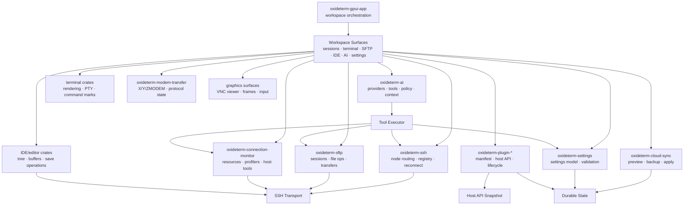

### GPUI Workspace Modules

| Module | Responsibility | User-Visible Result |
|---|---|---|
| `workspace.rs` and `workspace/root/*` | Own the top-level workspace state, window composition, initialization, and root rendering | The app opens into one coherent desktop workspace instead of separate tools |
| `workspace/tabs/*` | Create, select, render, and reconnect tab-bound views | Terminal, SFTP, IDE, and utility pages can be opened, closed, and restored independently |
| `workspace/pane_tree.rs` | Hold split-pane layout state | Users can arrange work without changing the underlying node or session ownership |
| `workspace/sidebar/*` | Render activity navigation, saved sessions, AI sidebar, and sidebar state | Navigation stays stable while the active work surface changes |
| `workspace/session_manager/*` | Manage saved connections, import/export dialogs, and connection tree/table views | Users can create, edit, import, export, and organize connection records |
| `workspace/new_connection/*` | Own the connection form, SSH connection flow, host-key dialog, and keyboard-interactive dialog | First connection setup is a guided desktop workflow, not a CLI-only path |
| `workspace/connection_monitor/*` | Track pool state, node health, topology, resource metrics, host tools, and lifecycle actions | Users can see connected nodes, resource status, host entities, reconnect state, and actionable failures |
| `workspace/sftp/*` | Render remote file browsing, dialogs, previews, conflicts, and transfer actions | SFTP is a node-level file manager, not a terminal add-on |
| `workspace/file_manager/*` | Render local file browsing, bookmarks, preview dialogs, and external open actions | Local file workflows use the same desktop patterns as remote files |
| `workspace/graphics.rs` and `workspace/graphics_vnc.rs` | Render graphics sessions, connect the VNC viewer, and route pointer/keyboard input | Visual remote workflows are separate app surfaces, not terminal scrollback |
| `workspace/ide.rs` and IDE crates | Open folders, route file operations, and manage editor state | Remote editing is presented as a workspace, not as raw SFTP operations |
| `workspace/forwards/*` | Render forwarding forms, rules, state, and actions | Port forwarding is visible and recoverable from the desktop app |
| `workspace/settings/*` | Render settings pages for terminal, appearance, AI, SFTP, IDE, privilege credentials, portable runtime, updates, and keybindings | Configuration is app-first and persists through the shared settings model |
| `workspace/cloud_sync/*` | Render sync status, confirmations, and backup actions | Cloud sync and backup operations are explicit and reversible where possible |
| `workspace/plugin_manager.rs`, `plugin_runtime.rs`, `plugin_lifecycle/*`, `plugin_settings_store.rs` | Manage plugin discovery, lifecycle, host API snapshots, settings, secrets, and UI host calls | Plugins can extend app surfaces without owning core runtime state |
| `workspace/sidebar/ai/*` | Render AI conversations, model selection, streaming, context, tool events, and transcript state | OxideSens appears as an integrated workspace assistant with explicit tool boundaries |
| `workspace/terminal_context_actions.rs` | Build terminal context-menu actions for selection, search, transfers, and command routing | Terminal actions share app menu style while still dispatching through explicit session APIs |
| `workspace/quick_commands*` and `terminal_command_bar/*` | Store quick commands and command-line completion providers | Repeated terminal actions become reusable desktop controls |
| `workspace/local_terminal_background.rs` and `workspace/root/background.rs` | Resolve app and terminal background image rendering | Background images are visual settings, not terminal buffer content |
| `workspace/notification_center.rs` | Collect and render actionable app notifications | Background failures and recovery actions are visible without blocking terminal input |
| `workspace/onboarding/*` | Render first-run setup and setup state | Users can configure the main app without starting from CLI documentation |

### SSH Domain Modules

| Module | Responsibility | Architectural Boundary |
|---|---|---|
| `oxideterm-ssh/src/config.rs` | Define SSH connection configuration and validation-facing types | Saved metadata is kept separate from live transport handles |
| `connection_registry.rs` | Track reusable SSH connections and pool identity | Multiple consumers can share a node without each owning a socket |
| `router.rs` and `router/node_router.rs` | Route work to nodes and enforce node identity | User actions target nodes, not incidental terminal tabs |
| `router/runtime_store.rs` | Store live node state used by consumers and monitors | Runtime state is queryable without becoming durable profile data |
| `router/events.rs` | Publish node and connection events | UI and tools receive state changes without polling every domain directly |
| `reconnect.rs` | Describe reconnect policy and retry behavior | Disconnects become recoverable lifecycle events where possible |
| `monitor.rs` | Convert lower-level state into monitor-facing health | Connection Monitor can show health without exposing transport internals |
| `host_key.rs` | Handle host-key verification semantics | Trust decisions stay explicit and auditable |
| `transport/auth.rs` | Handle password, key, agent, and keyboard-interactive authentication paths | Credential collection is isolated from ordinary UI state |
| `transport/client.rs`, `connection.rs`, `handler.rs`, `output.rs` | Open SSH clients, channels, handlers, and output streams | Terminal and file consumers share transport behavior but keep separate view state |
| `transport/paths.rs`, `signers.rs` | Resolve SSH paths and signing helpers | Key material and path resolution stay in the transport layer |

### Connection Monitor And Host Tools Modules

| Module | Responsibility | Architectural Boundary |
|---|---|---|
| `oxideterm-connection-monitor/src/profiler.rs` | Own sampling cadence, shell setup, timeout limits, and profiler state | Sampling is runtime observation, not saved connection data |
| `metrics.rs`, `summary.rs`, `stats.rs` | Parse metrics and build compact monitor rows | UI rows are derived from structured snapshots, not raw command text |
| `process.rs` | Filter, sort, display, and build actions for processes | Process actions are explicit host-tool commands, not terminal keystrokes |
| `docker.rs`, `service.rs`, `tmux.rs` | Model host managers and their actions | Manager-specific parsing stays in the monitor domain |
| `package.rs`, `log.rs`, `port.rs`, `filesystem.rs`, `scheduled_task.rs` | Sample package inventory, logs, ports, filesystems, and scheduled tasks | Resource tools can fail independently without changing SSH node ownership |

### SFTP Domain Modules

| Module | Responsibility | Architectural Boundary |
|---|---|---|
| `oxideterm-sftp/src/session.rs` | Own high-level SFTP session behavior | File browsing is tied to a node-level session |
| `session/basic.rs` | Provide basic session operations | Simple operations use one consistent session entry point |
| `session/file_ops.rs` | Implement read, write, rename, delete, and metadata operations | Mutating file operations stay outside UI rendering code |
| `session/preview.rs` and `preview_helpers.rs` | Build safe previews for text, media, and unsupported content | Preview logic is separated from transfer logic |
| `session/transfers.rs` | Bridge sessions to upload/download operations | Transfers reuse node/session state instead of terminal commands |
| `transfer_manager.rs` | Track transfer queue, status, progress, and cancellation | Users can inspect and cancel long-running file operations |
| `progress.rs` | Represent progress events and byte counts | UI progress is structured rather than parsed from text |
| `retry.rs` | Centralize retry decisions | Recoverable network failures do not need ad hoc UI retries |
| `tar_transfer.rs` | Handle directory transfers through archive-based paths where appropriate | Directory upload/download can remain efficient and progress-aware |
| `path_utils.rs` | Normalize and validate remote paths | Remote path behavior stays consistent across SFTP and IDE |
| `types.rs` and `error.rs` | Define common SFTP DTOs and errors | UI surfaces can display precise errors without depending on implementation details |

### AI Domain Modules

| Module | Responsibility | Architectural Boundary |
|---|---|---|
| `chat.rs` and `types.rs` | Define conversation and message types | UI transcript state is based on structured records |
| `context_window.rs` | Decide what fits into the model context | Token budgeting is centralized instead of scattered through the sidebar |
| `context_sanitizer.rs` | Redact sensitive values before model or tool boundaries | AI context is an output boundary |
| `key_store.rs` and `touch_id.rs` | Store and unlock provider keys | Provider credentials stay out of normal settings text |
| `providers/*` and `streaming/*` | Discover models, select providers, build requests, and parse streaming responses | Provider differences are hidden behind shared streaming semantics |
| `orchestrator.rs` | Define orchestrator tool names, schemas, and dispatch contracts | Tool definitions remain stable for model-facing behavior |
| `policy.rs` | Decide which tool actions need approval or rejection | Dangerous or state-changing actions are not executed solely because a model requested them |
| `persistence.rs` | Store conversations and AI durable state | Long-running chat history survives app restarts where configured |
| `profiles.rs` and `settings.rs` | Manage AI profiles and settings | Model/provider choices are user configuration, not hardcoded defaults |
| `rag/*` | Chunk, embed, store, and search knowledge sources | Retrieval is a domain service, not sidebar rendering logic |
| `mcp/*` | Manage MCP registry, process startup, and protocol types | External tool servers are isolated from core app state |
| `references.rs`, `slash.rs`, `suggestions.rs` | Provide references, slash commands, and suggestions | Assistant input helpers remain separate from provider transport |

### Persistence, Settings, Plugin, And Sync Crates

| Area | Native Owner | Notes |
|---|---|---|
| Settings | `oxideterm-settings`, `oxideterm-settings-model`, `oxideterm-gpui-settings-view` | Settings are loaded and saved through shared models, then rendered by GPUI pages |
| Saved connections | `oxideterm-connections`, session manager modules | Connection records are durable; active nodes are runtime objects |
| Forwarding | `oxideterm-forwarding`, app forwarding modules | Rules are configuration; listeners are runtime state |
| Privilege credentials | Settings privilege page, terminal privilege prompt, secret-aware storage | Scope and prompt matchers are configuration; secret values stay outside ordinary settings |
| Terminal modem transfers | `oxideterm-modem-transfer`, `oxideterm-gpui-terminal` modem worker | Protocol state is terminal-runtime work; file selection and progress are UI concerns |
| Graphics sessions | `oxideterm-wsl-graphics`, app graphics/VNC modules | Session/server lifecycle is separate from viewer framebuffer and terminal buffers |
| Plugins | `oxideterm-plugin-*`, plugin manager and lifecycle modules | Manifests, settings, host API calls, and plugin secrets have separate boundaries |
| Cloud sync | `oxideterm-cloud-sync`, `oxideterm-gpui-cloud-sync`, app cloud-sync modules | Sync plans, backup creation, and apply steps are explicit control-plane operations |
| Portable runtime | `oxideterm-portable-runtime`, settings portable-runtime modules | Portable metadata and encrypted payload handling are separate from normal settings pages |
| Notifications | `oxideterm-notification-center`, app notification module | Background status is surfaced as actionable notifications |
| CLI companion | `oxideterm-cli` | CLI reads and mutates shared state for automation, but does not replace the desktop workflow |

### Why This Split Matters

The module split preserves four user-visible invariants:

1. A view can be closed without destroying the underlying durable object.
2. A runtime object can recover without rewriting the saved profile.
3. A background operation can fail without blocking terminal input.
4. A secret can be used for authentication or provider access without becoming ordinary app text.

---

## Data Flow Walkthroughs

### First Launch And Local Terminal

```text
app start
  -> load settings
  -> initialize workspace state
  -> render onboarding or main workspace
  -> create local terminal tab
  -> attach local PTY
  -> stream output to terminal renderer
```

The local terminal path is intentionally short. It should not wait for cloud sync, plugin scans, AI provider discovery, or remote connection checks.

### Saved SSH Connection Open

```text
Sessions
  -> select saved connection
  -> load connection record
  -> collect missing credentials if needed
  -> verify host key if needed
  -> open SSH transport
  -> register node runtime
  -> create terminal/SFTP/IDE/forward consumer as requested
  -> publish health to Connection Monitor
```

The saved connection remains durable metadata. The live node is created only after transport setup succeeds or enters a reconnectable state.

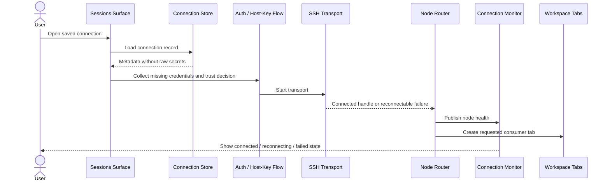

### Terminal Input And Output

For local terminals:

```text
keyboard input -> terminal pane -> local PTY -> output stream -> renderer
```

For SSH terminals:

```text
keyboard input -> terminal pane -> node shell channel -> SSH transport -> output stream -> renderer
```

Terminal text is not a reliable structured API. Features that need file metadata, transfer progress, forward state, or tool results should use domain APIs rather than scraping terminal output.

### SFTP List And Preview

```text
SFTP page
  -> select node
  -> acquire SFTP session for node
  -> list remote path
  -> normalize entries
  -> render file list
  -> preview selected file through preview logic
  -> surface permission/network/unsupported-content errors
```

Preview is separate from download. A preview may cap file size, choose a renderer, or refuse unsupported content while normal transfer remains available.

### SFTP Upload And Download

```text
user starts transfer
  -> build transfer request
  -> enqueue in transfer manager
  -> stream bytes through SFTP session
  -> emit progress events
  -> handle conflict/retry/cancel
  -> update transfer list and notification center
```

Single-file transfers can stream directly. Directory transfers may use archive-based helpers where that preserves structure and progress semantics.

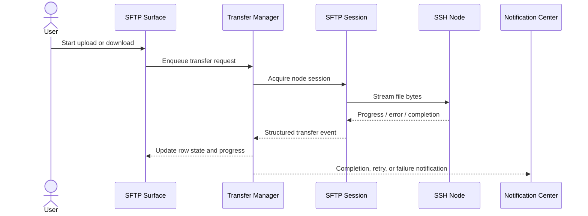

### IDE Open And Save

```text
open IDE workspace
  -> choose node and root path
  -> load tree through remote file APIs
  -> open file into editor buffer
  -> edit locally in workspace state
  -> save through remote write path
  -> clear dirty state or show save failure
```

The editor buffer is a view/workspace object. The remote file is durable state on the node. Save is the explicit bridge between them.

### Forward Creation

```text
forward form
  -> validate local/remote ports and direction
  -> bind rule to node or saved connection
  -> start listener through forwarding runtime
  -> publish running/suspended/failed state
  -> recover or suspend when node health changes
```

Forward rules can be persisted, but an active listener depends on node health and local port availability.

### AI Tool Call

```text
user message
  -> build redacted context
  -> select model/provider
  -> stream model response
  -> parse tool request
  -> evaluate policy and target
  -> request user approval when required
  -> execute through domain runtime
  -> append structured result to transcript
```

AI tools do not get implicit shell ownership. A command, file read, file write, or settings action must resolve to an allowed target and pass policy.

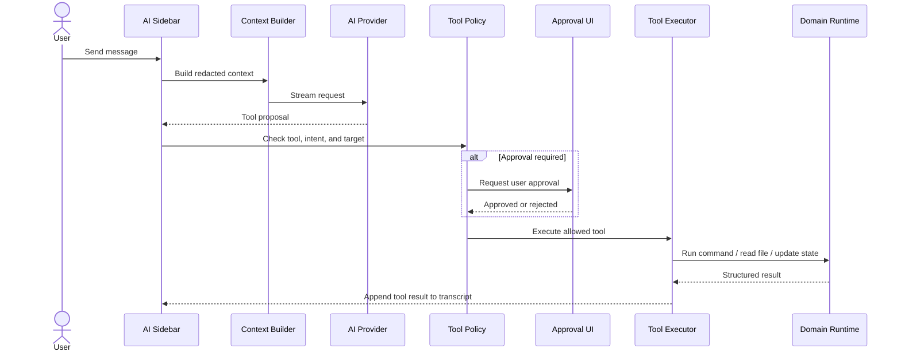

### Cloud Sync Apply And Backup

```text
user opens sync
  -> load local state summary
  -> fetch or read remote snapshot
  -> build preview/plan
  -> ask for confirmation when applying changes
  -> create backup if required
  -> apply selected mutations
  -> show result and conflicts
```

The preview step is part of the architecture, not a decorative screen. It gives users a chance to understand mutations before persistent state changes.

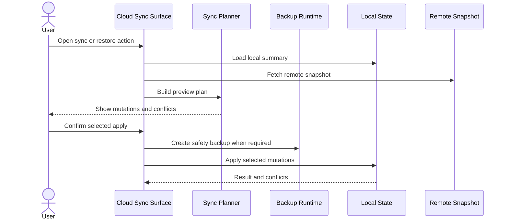

### Plugin Enable

```text
plugin manager
  -> discover manifest
  -> validate metadata and permissions
  -> load settings defaults
  -> request credentials if needed
  -> enable lifecycle hooks
  -> expose host API snapshot
  -> render plugin-provided surfaces or actions
```

Plugins receive snapshots and host API calls. They should not directly own SSH transports, terminal panes, or secret storage.

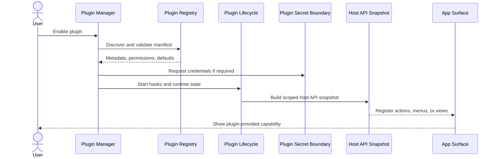

---

## State Machines And Lifecycles

### Saved Connection Lifecycle

| State | Meaning | Next Common Actions |
|---|---|---|
| Draft | Form data exists but is not durable | Save, test, discard |
| Saved | Durable connection record exists | Connect, edit, export, delete |
| Edited | User changed fields but has not committed them | Save changes or revert |
| Imported | Record was created from an import flow | Review, save, connect |
| Exported | Record was included in an export operation | Continue using locally or share the export |
| Deleted | Durable record was removed | Existing live nodes may continue until closed |

### SSH Node Lifecycle

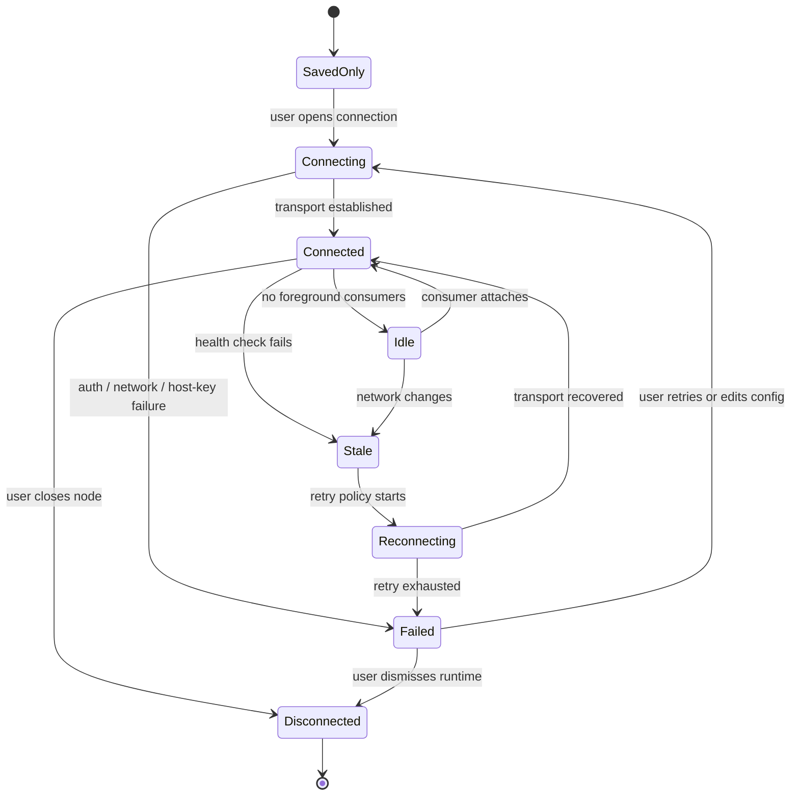

| State | Meaning | User Impact |
|---|---|---|
| Saved only | Profile exists, no live connection | Can be connected later |
| Connecting | Transport is being opened | Dependent views wait or show progress |
| Connected | Node is live and usable | Terminal, SFTP, IDE, forwards, AI tools can target it |
| Idle | Node is connected but has no active foreground consumer | Monitor can still show it |
| Stale | Last known connection is no longer trustworthy | Consumers should pause or refresh |
| Reconnecting | Retry policy is attempting recovery | Views should avoid destructive assumptions |
| Failed | Connection attempt or recovery failed | User action is required |
| Disconnected | Runtime object was closed | Views must detach or ask to reconnect |

### Terminal Lifecycle

| State | Meaning | User Impact |
|---|---|---|
| Created | Pane/tab exists | Startup may still be in progress |
| Starting | PTY or SSH channel is opening | Input may be delayed |
| Ready | Terminal can accept input | Normal interaction |
| Busy | Command is producing output | Terminal stays responsive but output volume may be high |
| Waiting for input | Process is prompting | AI observation and user controls can report this state |
| Closed | Channel or PTY is gone | View can show exit state or close |

### SFTP Transfer Lifecycle

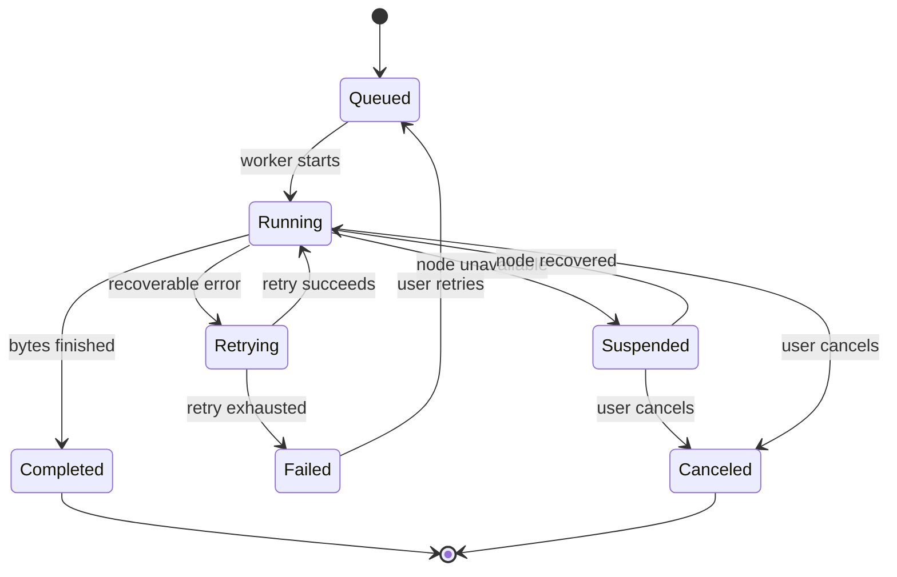

| State | Meaning | User Impact |
|---|---|---|
| Queued | Transfer request exists | Waiting for worker capacity or node readiness |
| Running | Bytes are moving | Progress is visible |
| Retrying | A recoverable failure occurred | Progress may pause |
| Suspended | Node or app state prevents progress | User can reconnect or cancel |
| Completed | Transfer finished | Result is visible in transfer history |
| Failed | Transfer cannot continue | Error and retry options should be shown |
| Canceled | User stopped the transfer | Partial output may require cleanup |

### Modem Transfer Lifecycle

| State | Meaning | User Impact |
|---|---|---|
| Detected | Terminal output matched a conservative protocol trigger | User may be prompted for a file or directory |
| Prompting | UI is waiting for local path selection | Protocol bytes are held by the transfer consumer where needed |
| Running | Worker is exchanging protocol frames with the PTY/channel | Progress, cancellation, and errors should be visible |
| Completed | Transfer finished and terminal state is released | File result is visible at the chosen path |
| Canceled | User canceled or the terminal closed | Protocol consumer must release terminal output |
| Failed | Protocol or I/O error occurred | User can retry with a clearer command/path |

### Forward Lifecycle

| State | Meaning | User Impact |
|---|---|---|
| Configured | Rule exists but no listener is active | Can be started |
| Starting | Listener or remote channel is being opened | Port may not be usable yet |
| Running | Forward is active | Traffic can pass |
| Suspended | Owning node is unavailable or policy paused it | Rule remains visible |
| Stopped | Listener is closed by user or app | Can be restarted |
| Failed | Bind, permission, or connection error occurred | User must change rule or recover node |

### Graphics Session Lifecycle

| State | Meaning | User Impact |
|---|---|---|
| Available | Graphics support can be started | User can launch a visual session |
| Starting | Server/session process and VNC viewer are being prepared | Viewer may show progress |
| Active | VNC frames and input are flowing | User can interact with the visual surface |
| Disconnected | Viewer or backing session stopped | User can reconnect or launch again |
| Failed | Prerequisites, server startup, or viewer connection failed | User should inspect prerequisites or stop the session |

### IDE Buffer Lifecycle

| State | Meaning | User Impact |
|---|---|---|
| Clean | Buffer matches last loaded or saved content | Closing is safe |
| Dirty | User has unsaved edits | Closing or switching may prompt |
| Saving | Write is in progress | UI should avoid duplicate saves |
| Save failed | Write failed | Buffer remains dirty |
| Conflict | Remote state changed unexpectedly | User needs compare/overwrite/reload decision |
| Closed | Buffer is no longer visible | Remote file is unchanged unless saved |

### AI Tool Lifecycle

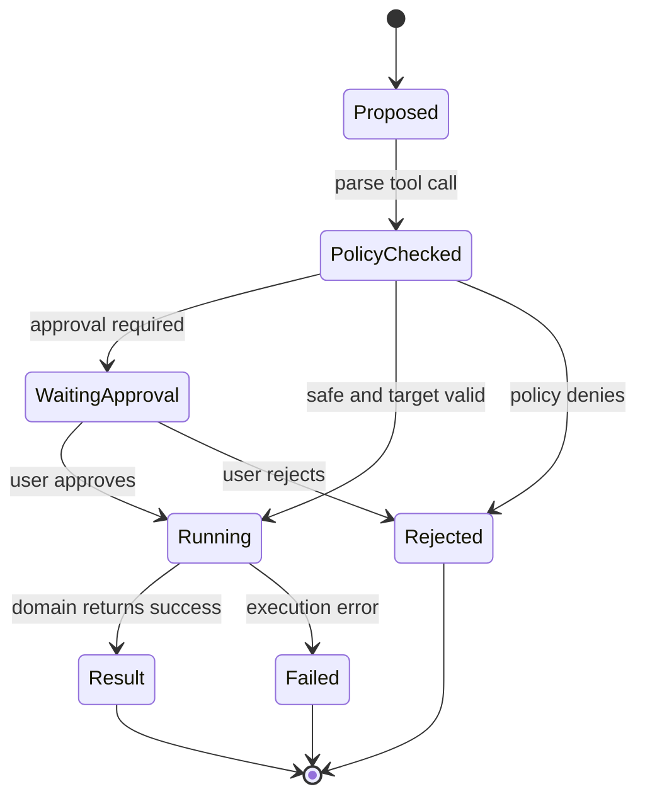

| State | Meaning | User Impact |
|---|---|---|
| Proposed | Model requested a tool | No side effect yet |
| Policy checked | Tool was compared against policy and target state | May proceed, reject, or require approval |
| Waiting approval | User decision is required | Execution is paused |
| Running | Tool is executing | Result should be streamed or summarized |
| Result | Tool completed | Transcript records structured output |
| Rejected | Policy or user denied it | Transcript records denial |
| Failed | Execution failed | Error is shown without leaking secrets |

### Sync And Plugin Lifecycles

| Area | States | Meaning |
|---|---|---|
| Cloud sync | Unconfigured, ready, previewing, applying, conflict, completed, failed | Sync is a plan-and-apply workflow, not silent background mutation |
| Plugin | Discovered, installed, enabled, failed, disabled, updated, removed | Plugin availability is separate from plugin runtime health |

---

## Ownership And Persistence Matrix

| User Concept | Runtime Owner | Persisted Owner | Secret Owner | Survives App Close | Survives Reconnect | User Recovery |
|---|---|---|---|---|---|---|
| Saved connection | Session manager / connection store | Connection record | Keychain or secret-aware store | Yes | Yes | Edit, delete, import, export |
| SSH node | SSH router / registry | None as a live handle | SSH auth layer | No | Not as the same socket | Reconnect or open again |
| Terminal session | Terminal pane/runtime | Optional history/settings only | None by default | Usually no | Only if backing node recovers and channel is recreated | Reopen terminal |
| Terminal image placement | Terminal graphics state | None | None | No | Cleared on screen-buffer transition | Re-render from application output |
| Privilege credential | Settings privilege surface / terminal helper | Scope metadata only | Secret storage | Yes when saved | Yes through local or saved-node scope | Edit scope, re-enter secret, disable helper |
| Modem transfer | Terminal runtime / modem worker | Destination files only | None by default | No | Usually cancel and retry | Retry transfer or choose another path |
| SFTP session | SFTP runtime | None as a live handle | SSH auth layer | No | Reacquire after reconnect | Refresh or reconnect |
| Transfer | Transfer manager | Transfer history where configured | None by default | Partial/history only | Can retry if operation supports it | Retry, cancel, clean partial file |
| Forward rule | Forwarding surface/runtime | Forward configuration | SSH auth layer for remote side | Yes for rule | Listener must restart | Restart or edit ports |
| Host tool snapshot | Connection monitor / profiler | None as a live sample | SSH auth layer | No | Refresh after reconnect | Refresh, rerun action, or reconnect node |
| Graphics session | Graphics runtime / VNC viewer | None as a live viewer | Usually none beyond SSH/session launch | No | Reconnect viewer/session where possible | Reconnect, stop, or launch again |
| IDE workspace | IDE surface/runtime | Recent workspace/settings | SSH auth layer for remote side | Recent entry yes | Reopen or refresh after reconnect | Save, reload, resolve conflict |
| Editor buffer | IDE/editor state | File only after save | None by default | Unsaved content depends on recovery policy | Node reconnect does not save it | Save, reload, discard |
| AI conversation | AI sidebar/runtime | AI persistence | Provider key store | Yes when enabled | Not node-dependent unless tools target nodes | Continue, compact, delete |
| AI provider key | AI key store | Secret storage | Secret storage | Yes | Yes | Re-enter or unlock |
| Plugin setting | Plugin settings store | Plugin settings file/store | Separate plugin secret store for credentials | Yes | Usually yes | Reset, disable plugin |
| Plugin secret | Plugin lifecycle secret boundary | Secret storage | Secret storage | Yes | Yes | Re-enter, revoke, disable |
| Cloud sync config | Sync runtime/settings | Settings/cloud-sync state | Secret storage for credentials | Yes | Network-dependent | Re-authenticate or disable |
| Portable runtime | Portable runtime crate | Portable metadata/payload | Portable key material | Yes | Not connection-dependent | Unlock, restore, recreate |
| Support bundle | Backup/support flow | Generated artifact | Must exclude raw secrets | Artifact exists until removed | Not applicable | Regenerate after fixing scope |

---

## Event And Notification Model

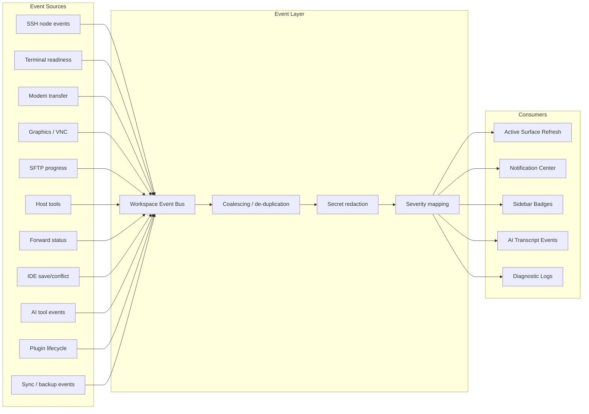

### Event Sources

The app receives structured events from multiple domains:

- SSH node status changes.
- Terminal readiness and process state.
- Terminal privilege prompt state and modem transfer progress.
- Graphics/VNC connection, frame, and disconnect state.
- Host tool sampling status, resource snapshots, and action results.
- SFTP transfer progress and conflicts.
- Forward start, stop, suspend, and failure.
- IDE save, conflict, and reload outcomes.
- Plugin install, enable, disable, settings, and host API failures.
- Cloud sync preview, apply, conflict, and backup results.
- AI tool proposals, approvals, execution results, and policy rejections.

### Notification Rules

Notifications should be actionable and scoped:

- A notification should point to the page that can resolve it.
- It should not contain raw credentials, request headers, tokens, or terminal buffer dumps.
- Repeated events should coalesce when they describe the same underlying condition.
- Terminal input should not be blocked by unrelated background notifications.
- Support bundle suggestions should explain what will be included and what is excluded.

### Refresh Versus Events

Events are the primary way to keep active pages current. Explicit refresh remains necessary when:

- A page was inactive during many state changes.
- The app recovered from sleep or network changes.
- A plugin or external tool changed durable state.
- A domain reports that its cached view may be stale.

The UI should not become the source of truth for connection health, transfer state, or persisted settings. It renders state owned by the relevant domain.

### Staleness Rules

Staleness means "the app cannot prove this state is current." It does not automatically mean data is deleted or corrupted.

- A stale node should stop accepting new high-risk operations until refreshed or reconnected.
- A stale file listing should offer refresh before destructive actions.
- A stale forward should show suspended or failed state rather than pretending traffic is flowing.
- A stale AI target should require target re-selection or tool rejection.

---

## Failure Model

| Symptom | First Surface To Check | Subsystem | Likely Cause | Recovery Action |
|---|---|---|---|---|
| Terminal tab closed but host still appears connected | Connection Monitor | Tabs and node runtime | A tab is a view; the node can outlive it | Close the node from Connection Monitor if it is no longer needed |
| Terminal opens but does not accept input | Terminal tab | Terminal runtime | PTY/channel is still starting or failed readiness | Wait for readiness, reopen terminal, or reconnect the node |
| Terminal output is delayed during large operations | Terminal tab and Notification Center | Data plane contention | A heavy background task may be competing for resources | Pause transfers/sync or wait for the task to complete |
| TUI preview leaves a stale block after exit | Terminal tab | Terminal graphics/image placement | Full-screen app did not fully clear image placement or alternate-screen state | Clear screen, reopen the terminal, or file a terminal rendering bug with the captured command |
| Saved terminal background does not appear | Terminal or runtime page | Terminal background rendering | Background setting is not enabled for that surface or the image library selection is stale | Re-select the image, check enabled tab types, or reload the surface |
| Privilege password helper does not trigger | Terminal tab and Privilege settings | Terminal helper | Prompt was not detected or the active session has no matching credential scope | Check active terminal scope, prompt matcher, and saved credential ownership |
| Wrong privilege password is submitted | Terminal tab and Privilege settings | Secret scope resolution | Credential was scoped to the wrong local/SSH owner | Stop the command, edit the credential scope, and retry after prompt returns |
| Modem transfer opens unexpectedly | Terminal tab | Modem protocol detector | Output looked like a protocol prelude without enough context | Cancel helper, continue terminal output, and report the trigger sample |
| Modem transfer stalls | Transfer prompt or notification | Modem transfer engine | Peer stopped responding, path prompt was canceled, or protocol negotiation failed | Cancel or retry with an explicit `rz`/`sz` command and a stable local path |
| SSH connection fails before password prompt | New Connection or Sessions | SSH transport | Host, port, proxy, or DNS is incorrect | Edit connection settings and test again |
| Host-key prompt appears unexpectedly | Host-key dialog | SSH trust boundary | Remote host key changed or first connection is untrusted | Verify the fingerprint before accepting |
| Keyboard-interactive auth repeats | New Connection dialog | SSH auth | Server requested additional answers or rejected credentials | Re-enter answers, update saved credentials, or check server auth policy |
| Node shows reconnecting for a long time | Connection Monitor | Reconnect orchestrator | Network is unavailable or retry policy is still active | Wait, cancel reconnect, or edit connection details |
| Host Tools page is empty or stale | Connection Monitor / Host Tools | Connection monitor samplers | Node is stale, sampler command failed, or parser rejected output | Refresh, reconnect the node, or inspect the action error |
| Host Tools action fails | Host Tools action dialog | Connection monitor action path | Permission denied, missing binary, stale node, or command failure | Review confirmation output, adjust permissions, and retry on the live node |
| Node is connected but SFTP cannot open | SFTP page | SFTP session | Server lacks SFTP support or session acquisition failed | Reconnect, check server subsystem, or use terminal fallback |
| Remote file list is empty or outdated | SFTP page | SFTP listing/cache | Path changed, permission denied, or cached view is stale | Refresh path, navigate upward, or check permissions |
| SFTP upload stalls | Transfer list | Transfer manager | Network interruption, remote disk pressure, or suspended node | Resume/retry, reconnect node, or cancel partial transfer |
| Directory transfer is slow | Transfer list | SFTP transfer strategy | Many small files or archive helper fallback | Let the transfer complete or split the directory |
| Preview refuses a file | Preview dialog | SFTP preview | File is too large, binary, unsupported, or permission denied | Download/open externally or use terminal tools |
| Forward is suspended | Forwarding and Connection Monitor | Forwarding runtime | Owning node is stale or disconnected | Reconnect node or stop the forward |
| Forward fails to start | Forwarding page | Forwarding runtime | Local port is already used, permission denied, or remote bind failed | Change port, close conflicting process, or edit direction |
| Traffic does not pass through a running forward | Forwarding and terminal/network tool | Forwarding runtime | Remote endpoint is unavailable or rule targets the wrong host/port | Test endpoint from the remote host and edit rule |
| VNC viewer is blank or disconnected | Graphics / VNC page | Graphics session runtime | Viewer cannot reach forwarded endpoint or backing session stopped | Reconnect viewer, restart the graphics session, or inspect prerequisites |
| IDE workspace opens but tree is missing files | IDE workspace | IDE FS | Root path is wrong, permissions block listing, or cache is stale | Refresh tree or open another root |
| IDE save fails | IDE workspace and Connection Monitor | IDE write path | Node disconnected, permission denied, conflict, or remote file changed | Reconnect, resolve conflict, or save to another path |
| Unsaved editor changes remain after reconnect | IDE workspace | Editor buffer | Reconnect restores node access, not implicit file writes | Save explicitly after reconnect |
| AI wants to run on a saved host | AI approval and Sessions | AI target selection | Saved profile is not a live shell target | Connect the host first or choose another active target |
| AI tool is rejected | AI sidebar | AI policy | Tool is dangerous, missing approval, or target is not allowed | Approve when prompted, narrow target, or use a safer request |
| AI context omits recent terminal output | AI sidebar | Context window | Token budget or redaction removed data | Attach the needed context explicitly or ask for a narrower task |
| AI provider call fails | AI settings and AI sidebar | Provider transport | Missing key, invalid model, quota, or network failure | Update provider settings and retry |
| Plugin setting changed but page did not update | Plugin manager and affected page | Plugin lifecycle | Page needs refresh or plugin event did not re-render the view | Refresh page, disable/enable plugin, or restart app |
| Plugin fails to enable | Plugin manager | Plugin registry/lifecycle | Manifest invalid, permission denied, missing dependency, or secret unavailable | Review plugin details, update settings, or remove plugin |
| Cloud sync conflict appears | Cloud Sync | Sync planner | Local and remote durable state changed independently | Review preview, choose local/remote resolution, then apply |
| Backup generation fails | Cloud Sync or backup dialog | Backup runtime | Destination unavailable, permission denied, or secret redaction failure | Choose another destination or reduce selected data |
| Portable runtime cannot unlock | Portable settings | Portable runtime | Wrong passphrase, missing key material, or corrupted payload | Re-enter passphrase, restore backup, or recreate portable data |
| CLI report differs from app view | CLI and app page | Shared state boundary | CLI reads persisted state while app also has live runtime state | Refresh app state or compare with Connection Monitor |
| Support bundle lacks expected data | Support bundle dialog | Output boundary | Secret redaction or selected scope excluded it | Regenerate with the right scope, still excluding raw secrets |

---

## Native Crate Map

| Area | Crates |
|---|---|
| Desktop shell and workspace glue | `oxideterm-gpui-app`, `oxideterm-workspace` |
| Shared GPUI components and platform helpers | `oxideterm-gpui-ui`, `oxideterm-gpui-platform`, `oxideterm-theme` |
| Terminal rendering and terminal domain | `oxideterm-gpui-terminal`, `oxideterm-terminal`, `oxideterm-terminal-*` |
| Terminal modem transfers | `oxideterm-modem-transfer`, terminal modem worker integration |
| SSH, node routing, reconnect | `oxideterm-ssh`, `oxideterm-topology` |
| Host Tools and connection monitoring | `oxideterm-connection-monitor`, app connection monitor surface |
| SFTP and transfers | `oxideterm-sftp` |
| Saved connections | `oxideterm-connections` |
| Forwarding | `oxideterm-forwarding`, app forwarding surface |
| Graphics and VNC sessions | `oxideterm-wsl-graphics`, app graphics/VNC surface |
| IDE and editor | `oxideterm-gpui-ide`, `oxideterm-ide-core`, `oxideterm-ide-fs`, `oxideterm-code-editor`, `oxideterm-editor-*` |
| Settings and privilege credentials | `oxideterm-settings`, `oxideterm-settings-model`, `oxideterm-gpui-settings-view`, secret-aware app boundary |
| AI, RAG, MCP, tool policy | `oxideterm-ai`, app AI sidebar |
| Plugins | `oxideterm-plugin-*`, app plugin lifecycle |
| Cloud sync and portable runtime | `oxideterm-cloud-sync`, `oxideterm-gpui-cloud-sync`, `oxideterm-portable-runtime` |
| Notifications, launcher, update | `oxideterm-notification-center`, `oxideterm-launcher`, `oxideterm-update` |
| CLI companion | `oxideterm-cli` |

---

## Tauri Reference Mapping

| Tauri Architecture Section | Native Architecture Equivalent |
|---|---|
| React frontend layer | GPUI workspace shell and app surfaces |
| Tauri command backend | Rust domain crates and runtime integrations |
| Data plane | Terminal hot path |
| Control plane | Structured app/domain commands |
| SessionTreeStore and AppStore split | Saved connection store, node runtime state, connection monitor snapshots |
| Oxide-Next node sovereignty | Node-first runtime model |
| SFTP on connection rather than terminal | Node-level SFTP architecture |
| Host/resource side panels | Connection Monitor / Host Tools architecture |
| Terminal protocol helpers | Terminal privilege helpers and X/Y/ZMODEM modem transfer engine |
| Visual remote sessions | Graphics / VNC session architecture |
| ReconnectOrchestratorStore | Native reconnect orchestration model |
| AI sidebar and tools | OxideSens AI architecture |
| Plugin runtime | Plugin registry, host API, lifecycle, settings, secrets |
| SettingsStore | Settings domain crates and Settings surface |
| `.oxide` format and backups | Portable bundles, backups, cloud sync |

The implementation details are native GPUI/Rust rather than Tauri/React, but the architectural intent is the same: keep terminal hot-path work responsive, route remote capabilities through stable node identity, separate user views from runtime owners, and keep secrets out of ordinary app text.
