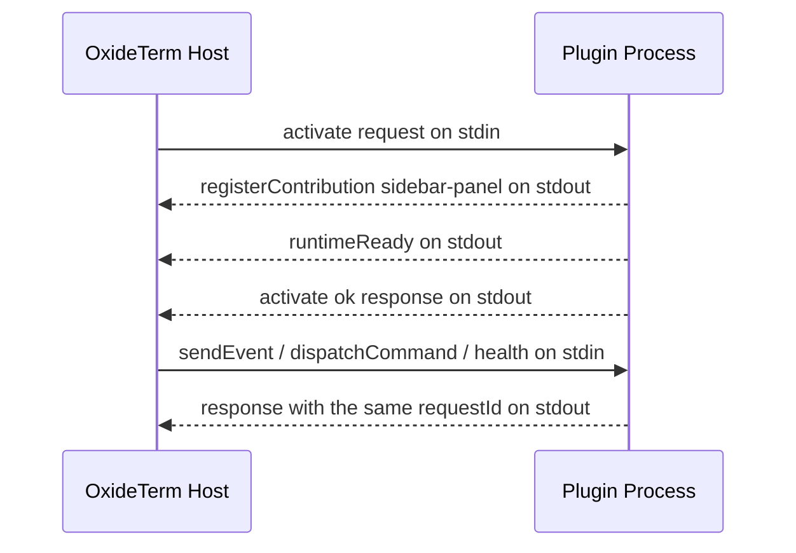
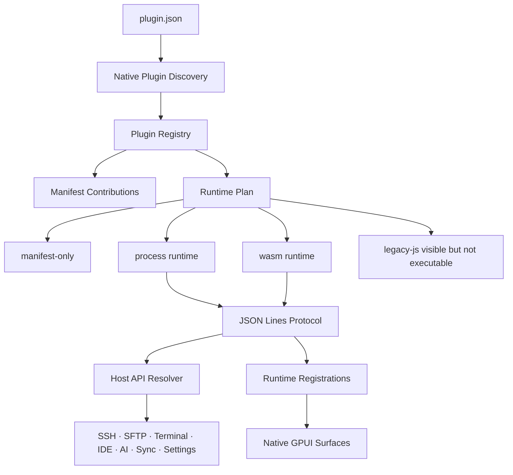

# Native Plugin Development

This guide describes the OxideTerm Native plugin model. It is intentionally different from the Tauri/Web plugin model: native plugins do not run React components, do not inject CSS, and do not execute `main.js` through a WebView. A native plugin is discovered through `plugin.json`, then either contributes manifest-only metadata or runs through a host-owned process/WASM runtime bridge.

## Contents

1. [Build A Running Plugin](#build-a-running-plugin)
2. [Runtime Conversation](#runtime-conversation)
3. [Host Calls In Plugin Code](#host-calls-in-plugin-code)
4. [UI And Event Recipes](#ui-and-event-recipes)
5. [Common Failure Checks](#common-failure-checks)
6. [Native Plugin Model](#native-plugin-model)
7. [Native Versus Tauri Plugins](#native-versus-tauri-plugins)
8. [Plugin Directory](#plugin-directory)
9. [Minimal Manifest-Only Plugin](#minimal-manifest-only-plugin)
10. [Process Runtime Plugin](#process-runtime-plugin)
11. [Protocol Frames](#protocol-frames)
12. [Runtime Registrations](#runtime-registrations)
13. [Declarative Native UI](#declarative-native-ui)
14. [Host API Calls](#host-api-calls)
15. [Permissions And Capabilities](#permissions-and-capabilities)
16. [Settings, Storage, And Secrets](#settings-storage-and-secrets)
17. [Terminal, SFTP, Forwarding, IDE, And AI](#terminal-sftp-forwarding-ide-and-ai)
18. [Packaging And Installation](#packaging-and-installation)
19. [Interface Reference](#interface-reference)
20. [Host API Reference](#host-api-reference)
21. [Events Reference](#events-reference)
22. [Debugging](#debugging)
23. [Migration Notes](#migration-notes)

---

## Build A Running Plugin

Start with a process plugin. It is the easiest runtime to debug because every message is visible as JSON Lines over stdio.

Create this directory inside the user plugin directory:

```text
hello-native/
  plugin.json
  bin/
    hello.js
```

The process entry must be a real executable inside the plugin directory. On macOS/Linux, give the script an executable bit:

```sh
chmod +x hello-native/bin/hello.js
```

Use this manifest:

```json
{
  "id": "com.example.hello-native",
  "name": "Hello Native",
  "version": "0.1.0",
  "description": "Minimal native process plugin.",
  "runtime": {
    "kind": "process",
    "entry": "bin/hello.js"
  },
  "contributes": {
    "sidebarPanels": [
      {
        "id": "hello-panel",
        "title": "Hello",
        "icon": "panel-left",
        "position": "top"
      }
    ],
    "settings": [
      {
        "id": "message",
        "type": "string",
        "default": "Hello from a native plugin",
        "title": "Message"
      }
    ],
    "apiCommands": [
      "get_app_version"
    ]
  }
}
```

Use this process runner:

```js
#!/usr/bin/env node

const readline = require("node:readline");

const pluginId = "com.example.hello-native";
let nextHostRequest = 1;
const pendingHostCalls = new Map();

// Keep stdout reserved for protocol frames.
function writeFrame(payload, requestId = null) {
  process.stdout.write(JSON.stringify({
    protocolVersion: 1,
    requestId,
    payload
  }) + "\n");
}

function respondOk(requestId, value) {
  writeFrame({
    requestId,
    result: {
      status: "ok",
      value
    }
  }, requestId);
}

function respondError(requestId, code, message) {
  writeFrame({
    requestId,
    result: {
      status: "error",
      error: {
        code,
        message,
        recoverable: false
      }
    }
  }, requestId);
}

function registerPanel() {
  writeFrame({
    type: "registerContribution",
    registration: {
      registrationId: "hello-panel-view",
      pluginId,
      kind: "sidebar-panel",
      metadata: {
        panelId: "hello-panel",
        schema: {
          kind: "form",
          title: "Hello Native",
          sections: [
            {
              id: "main",
              controls: [
                {
                  kind: "markdown",
                  text: "This panel was registered by a native process plugin."
                },
                {
                  kind: "button",
                  id: "refresh",
                  label: "Refresh"
                }
              ]
            }
          ]
        }
      }
    }
  });
}

// Returnable host calls are matched by requestId.
function callHost(namespace, method, args = {}) {
  const requestId = `host-${nextHostRequest++}`;
  writeFrame({
    type: "callHostApi",
    requestId,
    namespace,
    method,
    args
  });
  return new Promise((resolve, reject) => {
    pendingHostCalls.set(requestId, { resolve, reject });
  });
}

// Host-call responses arrive on stdin like normal host requests.
function handleHostResponse(payload) {
  const pending = pendingHostCalls.get(payload.requestId);
  if (!pending) {
    return false;
  }
  pendingHostCalls.delete(payload.requestId);
  if (payload.result.status === "ok") {
    pending.resolve(payload.result.value);
  } else {
    pending.reject(new Error(payload.result.error.message));
  }
  return true;
}

// Host requests and host-call responses share the same input stream.
async function handleRequest(envelope) {
  const request = envelope.payload;
  if (handleHostResponse(request)) {
    return;
  }

  const requestId = request.requestId;
  switch (request.kind.type) {
    case "activate":
      registerPanel();
      writeFrame({
        type: "runtimeReady"
      });
      respondOk(requestId, { activated: true });
      break;
    case "sendEvent":
      respondOk(requestId, { received: request.kind.event.name });
      break;
    case "health":
      respondOk(requestId, { ok: true });
      break;
    case "deactivate":
    case "kill":
      respondOk(requestId, { stopped: true });
      process.exit(0);
      break;
    case "dispatchCommand":
      try {
        const version = await callHost("api", "invoke", {
          command: "get_app_version",
          args: {}
        });
        respondOk(requestId, { version });
      } catch (error) {
        respondError(requestId, "command_failed", error.message);
      }
      break;
    default:
      respondError(requestId, "unsupported_request", `Unsupported request ${request.kind.type}`);
  }
}

readline.createInterface({
  input: process.stdin,
  crlfDelay: Infinity
}).on("line", (line) => {
  if (!line.trim()) {
    return;
  }
  handleRequest(JSON.parse(line)).catch((error) => {
    process.stderr.write(`Plugin error: ${error.stack || error.message}\n`);
  });
});
```

This example demonstrates the important contract:

- `stdout` is reserved for protocol frames, one JSON object per line.
- `stderr` is for human diagnostics.
- The plugin must answer the activation request with the same `requestId`.
- Runtime UI is not React. It is a declarative schema registered through a `sidebar-panel` or `tab` contribution.
- A returnable host call is sent as an outbound `callHostApi` frame; the host writes the response back on stdin.

## Runtime Conversation

The process runtime has one line-oriented conversation.



Activation request from host to plugin. The `manifest` object is shortened here; the real request carries the parsed `plugin.json`:

```json
{
  "protocolVersion": 1,
  "requestId": "activate:com.example.hello-native",
  "payload": {
    "requestId": "activate:com.example.hello-native",
    "kind": {
      "type": "activate",
      "manifest": {
        "id": "com.example.hello-native",
        "name": "Hello Native",
        "version": "0.1.0"
      },
      "permissions": {
        "capabilities": [],
        "allowedHostApis": [
          "api.invoke",
          "app.getVersion",
          "settings.get"
        ]
      }
    },
    "timeoutMs": 5000
  }
}
```

Activation response from plugin to host:

```json
{
  "protocolVersion": 1,
  "requestId": "activate:com.example.hello-native",
  "payload": {
    "requestId": "activate:com.example.hello-native",
    "result": {
      "status": "ok",
      "value": {
        "activated": true
      }
    }
  }
}
```

Error response:

```json
{
  "protocolVersion": 1,
  "requestId": "activate:com.example.hello-native",
  "payload": {
    "requestId": "activate:com.example.hello-native",
    "result": {
      "status": "error",
      "error": {
        "code": "invalid_config",
        "message": "Missing required plugin setting",
        "recoverable": false
      }
    }
  }
}
```

Host-call request from plugin to host:

```json
{
  "protocolVersion": 1,
  "requestId": null,
  "payload": {
    "type": "callHostApi",
    "requestId": "host-1",
    "namespace": "app",
    "method": "getVersion",
    "args": {}
  }
}
```

Host-call response from host to plugin:

```json
{
  "protocolVersion": 1,
  "requestId": "host-1",
  "payload": {
    "requestId": "host-1",
    "result": {
      "status": "ok",
      "value": "0.1.0"
    }
  }
}
```

The process bridge rejects malformed frames before they reach the workspace. Common rejection causes are unsupported `protocolVersion`, missing `requestId` on responses, mismatched response ids, invalid registration ownership, and stdout text that is not JSON.

## Host Calls In Plugin Code

Host calls are not global JavaScript functions. They are protocol messages. A call is accepted only when both checks pass:

- The host API name is allowed by the plugin permission set, either exactly such as `terminal.getActiveTarget` or by namespace wildcard such as `terminal.*`.
- For `api.invoke`, `args.command` is also listed in `contributes.apiCommands`.

Read a plugin setting:

```json
{
  "type": "callHostApi",
  "requestId": "host-2",
  "namespace": "settings",
  "method": "get",
  "args": {
    "key": "message"
  }
}
```

Read the active terminal target:

```json
{
  "type": "callHostApi",
  "requestId": "host-3",
  "namespace": "terminal",
  "method": "getActiveTarget",
  "args": {}
}
```

Write text to the active terminal:

```json
{
  "type": "callHostApi",
  "requestId": "host-4",
  "namespace": "terminal",
  "method": "writeToActive",
  "args": {
    "text": "pwd\n"
  }
}
```

Read a remote file through SFTP:

```json
{
  "type": "callHostApi",
  "requestId": "host-5",
  "namespace": "sftp",
  "method": "readFile",
  "args": {
    "nodeId": "node-1",
    "path": "/etc/hostname"
  }
}
```

That SFTP call also requires the `filesystem.read` capability. Write operations require `filesystem.write`. Port forwarding mutations require `network.forward`.

Import an `.oxide` bundle:

```json
{
  "type": "callHostApi",
  "requestId": "host-6",
  "namespace": "sync",
  "method": "importOxide",
  "args": {
    "fileData": [1, 2, 3],
    "password": "user-entered-password",
    "conflictStrategy": "rename",
    "importAppSettings": true,
    "importPluginSettings": true
  }
}
```

Do not log or echo passwords, secret values, terminal buffers, connection config, or raw import/export payloads.

## UI And Event Recipes

Register a tab view:

```json
{
  "type": "registerContribution",
  "registration": {
    "registrationId": "hello-tab-view",
    "pluginId": "com.example.hello-native",
    "kind": "tab",
    "metadata": {
      "tabId": "hello-tab",
      "schema": {
        "kind": "form",
        "title": "Hello",
        "controls": [
          {
            "kind": "markdown",
            "text": "This tab is rendered by OxideTerm, not by plugin HTML."
          }
        ]
      }
    }
  }
}
```

Subscribe to terminal/session events by registering `event-subscription`:

```json
{
  "type": "registerContribution",
  "registration": {
    "registrationId": "watch-active-node",
    "pluginId": "com.example.hello-native",
    "kind": "event-subscription",
    "metadata": {
      "namespace": "sessions",
      "method": "onNodeStateChange",
      "nodeId": "node-1"
    }
  }
}
```

When the event fires, the host sends a normal `sendEvent` request to the process:

```json
{
  "protocolVersion": 1,
  "requestId": "event:sessions.nodeStateChanged",
  "payload": {
    "requestId": "event:sessions.nodeStateChanged",
    "kind": {
      "type": "sendEvent",
      "event": {
        "name": "sessions.nodeStateChanged",
        "payload": {
          "nodeId": "node-1"
        }
      }
    }
  }
}
```

The plugin must still respond:

```json
{
  "protocolVersion": 1,
  "requestId": "event:sessions.nodeStateChanged",
  "payload": {
    "requestId": "event:sessions.nodeStateChanged",
    "result": {
      "status": "ok",
      "value": {
        "handled": true
      }
    }
  }
}
```

Custom plugin events use `events.emit` and `events.on`. They are scoped by plugin id, so one plugin cannot take ownership of arbitrary global event names.

## Common Failure Checks

If the plugin never activates:

- Check that `runtime.entry` points to an existing executable file inside the plugin directory.
- Check that the process prints only JSON Lines to stdout.
- Check that the activation response has both envelope `requestId` and payload `requestId`.
- Check that `protocolVersion` is `1`.
- Check stderr for plugin diagnostics.

If UI does not appear:

- `contributes.tabs` or `contributes.sidebarPanels` must declare the surface id.
- Runtime registration must use the same `tabId` or `panelId`.
- `registration.pluginId` must match the manifest `id`.
- `metadata.schema.kind` should be `form`.
- Interactive controls such as `button`, `text`, `password`, `number`, `checkbox`, and `select` need stable `id` values.

If a Host API call fails:

- Confirm the call is in `allowedHostApis`.
- Confirm the method name and argument names match the reference tables below.
- For `api.invoke`, confirm the command is listed in `contributes.apiCommands`.
- For SFTP or forwarding, confirm the required capability is present.
- For secrets and passwords, confirm the plugin is not trying to send secret values through logs or UI text.

## Native Plugin Model



The host owns every durable and security-sensitive boundary:

- Manifest parsing and validation.
- Runtime startup and timeout handling.
- Contribution registration and cleanup.
- Host API permission checks.
- Plugin settings, storage, and secrets.
- UI rendering through native GPUI controls.

The plugin never receives raw GPUI elements, DOM nodes, React instances, SSH transport handles, or direct filesystem access outside approved host APIs.

## Native Versus Tauri Plugins

| Area | Tauri/Web Plugin | Native Plugin |
|---|---|---|
| Runtime | ESM `main.js` loaded through dynamic import | `runtime.kind` is `process`, `wasm`, or `manifest-only` |
| UI | React components and CSS | Declarative native UI schema rendered by GPUI |
| Shared modules | `window.__OXIDE__` | Not available |
| Styling | CSS and theme variables | Host-owned native controls only |
| Host API | Frozen `PluginContext` object | JSON protocol calls with namespace/method/args |
| Legacy JS | Executable in Tauri | Shown as `legacy-js`, not executed |
| Security boundary | Browser membrane plus Tauri commands | Runtime bridge, permission gates, scoped storage/secrets |

If a plugin has `main` but no native `runtime` block, Native classifies it as legacy JS. It can appear in Plugin Manager for migration, but it is not executed.

## Plugin Directory

Plugins live under the app configuration directory:

```text
<config-dir>/plugins/<plugin-id>/
  plugin.json
  bin/
    plugin-runtime
  assets/
  locales/
```

Use `oxideterm paths --json` to find the active configuration directory. The CLI can enable, disable, and inspect plugin state for headless workflows, but interactive install/update/uninstall work is owned by the desktop Plugin Manager.

## Minimal Manifest-Only Plugin

Manifest-only plugins are useful for static metadata, declared settings, AI tool metadata, and future package migration. They do not execute code.

```json
{
  "id": "com.example.audit",
  "name": "Audit Helper",
  "version": "0.1.0",
  "description": "Adds audit-related settings and tool metadata.",
  "author": "Example",
  "runtime": {
    "kind": "manifest-only",
    "entry": ""
  },
  "contributes": {
    "settings": [
      {
        "id": "scanDepth",
        "type": "number",
        "default": 3,
        "title": "Scan depth",
        "description": "Maximum audit depth."
      }
    ],
    "aiTools": [
      {
        "name": "audit_summarize",
        "description": "Summarize visible connection and terminal state.",
        "capabilities": ["state.list", "terminal.observe"],
        "risk": "read",
        "targetKinds": ["ssh-node", "terminal-session"]
      }
    ]
  }
}
```

Supported setting types are `string`, `number`, `boolean`, and `select`. A `select` setting must provide `options`, and option values must be strings or numbers.

## Process Runtime Plugin

A process plugin is an executable inside the plugin directory. The host starts it with stdin/stdout pipes and exchanges newline-delimited JSON protocol frames.

```json
{
  "id": "com.example.native-dashboard",
  "name": "Native Dashboard",
  "version": "0.1.0",
  "runtime": {
    "kind": "process",
    "entry": "./bin/native-dashboard"
  },
  "contributes": {
    "tabs": [
      { "id": "dashboard", "title": "Dashboard", "icon": "LayoutDashboard" }
    ],
    "sidebarPanels": [
      { "id": "dashboard-panel", "title": "Dashboard", "icon": "Activity", "position": "bottom" }
    ],
    "terminalHooks": {
      "shortcuts": [
        { "key": "Ctrl+Shift+D", "command": "dashboard.refresh" }
      ]
    },
    "apiCommands": [
      "app.getVersion",
      "connections.getAll",
      "ui.showToast"
    ]
  }
}
```

Rules:

- `runtime.entry` must be a relative path inside the plugin directory.
- The entry must exist for `process` and `wasm` runtimes.
- The process must not write arbitrary human logs to stdout. Stdout is the protocol channel.
- Use stderr for diagnostic text.
- Every protocol frame is a single JSON object followed by `\n`.

## Protocol Frames

The host wraps every request and response in an envelope:

```json
{
  "protocolVersion": 1,
  "requestId": "activate-1",
  "payload": {
    "requestId": "activate-1",
    "kind": {
      "type": "activate",
      "manifest": {
        "id": "com.example.runtime",
        "name": "Example Runtime",
        "version": "0.1.0"
      },
      "permissions": {
        "capabilities": [],
        "allowedHostApis": []
      }
    },
    "timeoutMs": 3000
  }
}
```

The plugin responds with a matching `requestId`:

```json
{
  "protocolVersion": 1,
  "requestId": "activate-1",
  "payload": {
    "requestId": "activate-1",
    "result": {
      "status": "ok",
      "value": { "activated": true }
    }
  }
}
```

The host may send request kinds such as `activate`, `deactivate`, `dispatchCommand`, `sendEvent`, `callHostApi`, `health`, and `kill`. A plugin may emit outbound frames such as `runtimeReady`, `registerContribution`, `disposeContribution`, `callHostApi`, `emitEvent`, `reportProgress`, `log`, and `runtimeError`.

## Runtime Registrations

Runtime registrations let a running process/WASM plugin add host-owned contributions:

```json
{
  "protocolVersion": 1,
  "requestId": null,
  "payload": {
    "type": "registerContribution",
    "registration": {
      "registrationId": "cmd-refresh",
      "pluginId": "com.example.native-dashboard",
      "kind": "command",
      "metadata": {
        "id": "dashboard.refresh",
        "label": "Refresh Dashboard",
        "icon": "RefreshCw",
        "section": "Dashboard"
      }
    }
  }
}
```

Common registration kinds:

| Kind | Purpose |
|---|---|
| `command` | Add a command-palette action dispatched back to the plugin |
| `keybinding` | Add a keybinding after built-in shortcuts miss |
| `context-menu` | Add context menu items for declared targets |
| `status-bar` | Add a host-owned status item |
| `tab` | Register declarative UI for a declared tab |
| `sidebar-panel` | Register declarative UI for a declared panel |
| `event-subscription` | Subscribe to host events |
| `terminal-input-interceptor` | Transform or suppress terminal input |
| `terminal-output-processor` | Process terminal output before parser input |
| `terminal-shortcut` | Attach terminal shortcut handling to a command |
| `progress` | Create a host-owned progress reporter |

A registration must use the same plugin id as the plugin that emitted it. Disposal is idempotent and host-owned.

## Declarative Native UI

Native plugins render UI by registering schemas, not components.

```json
{
  "protocolVersion": 1,
  "requestId": null,
  "payload": {
    "type": "registerContribution",
    "registration": {
      "registrationId": "tab-dashboard",
      "pluginId": "com.example.native-dashboard",
      "kind": "tab",
      "metadata": {
        "tabId": "dashboard",
        "schema": {
          "kind": "form",
          "title": "Dashboard",
          "sections": [
            {
              "id": "overview",
              "title": "Overview",
              "controls": [
                { "kind": "markdown", "text": "Native plugin UI is host-rendered." },
                { "kind": "keyValue", "label": "Status", "value": "Ready" },
                { "kind": "progress", "label": "Sync", "value": 42 },
                { "kind": "button", "id": "refresh", "label": "Refresh" }
              ]
            }
          ]
        }
      }
    }
  }
}
```

Supported control kinds:

| Kind | Notes |
|---|---|
| `text`, `password`, `number`, `checkbox`, `select` | Field controls; require `id` |
| `button` | Actionable only when it has `id` and is not disabled/loading |
| `markdown` | Host-rendered text block |
| `code`, `codeBlock`, `code-block` | Code block |
| `statusBadge`, `status-badge` | Status indicator |
| `progress` | Progress display |
| `table`, `list` | Structured data display |
| `emptyState`, `empty-state` | Empty state |
| `divider` | Visual separator |
| `keyValue`, `key-value`, `keyValueRow`, `key-value-row` | Key/value row |

Button clicks are delivered as plugin UI events. The host owns focus, layout, accessibility, theme, and control rendering.

## Host API Calls

Runtime plugins call host APIs by namespace, method, and JSON args:

```json
{
  "protocolVersion": 1,
  "requestId": null,
  "payload": {
    "type": "callHostApi",
    "requestId": "host-1",
    "namespace": "connections",
    "method": "getAll",
    "args": {}
  }
}
```

The host rejects calls that are not allowed by the plugin permission set. `contributes.apiCommands` is also used as the manifest-level declaration for many host calls. Prefer exact entries such as `connections.getAll`; use namespace wildcards only when the plugin genuinely needs the full namespace.

Common namespaces include:

| Namespace | Typical use |
|---|---|
| `connections` | Read saved/live connection snapshots |
| `sessions` | Read node tree and active node state |
| `terminal` | Observe buffers or send approved input |
| `sftp` | List/read/write remote files through node-owned SFTP |
| `forward` | List/create/stop forwards |
| `transfers` | Observe transfer state |
| `profiler` | Read node metrics |
| `eventLog` | Read app event log |
| `ide` | Observe IDE project/open-file state |
| `ai` | Read sanitized AI metadata |
| `app` | Theme, platform, version, settings snapshots |
| `settings` | Plugin and syncable settings |
| `storage` | Plugin-scoped JSON KV |
| `sync` | `.oxide`, saved connections, plugin settings, sync metadata |
| `secrets` | Plugin-scoped secret storage |
| `ui` | Toasts, confirm dialogs, layout, progress |

## Permissions And Capabilities

Native uses explicit capability gates. Current shared capability names include:

| Capability | Meaning |
|---|---|
| `filesystem.read` | Read file metadata/content through approved host APIs |
| `filesystem.write` | Mutate files through approved host APIs |
| `network.forward` | Create or manage forwarding/network bridge behavior |

The runtime receives the effective permission set in the `activate` request. Treat that request as the source of truth: a manifest can declare plugin intent, but a Host API call still has to be present in `permissions.allowedHostApis`, and capability-gated calls still need the matching capability.

AI tool metadata can also declare semantic capabilities such as `terminal.observe`, `terminal.send`, `state.list`, `settings.read`, `settings.write`, and `plugin.invoke`. Those declarations describe tool behavior for the host and model-facing surfaces; they do not bypass runtime permission checks.

## Settings, Storage, And Secrets

Use the smallest storage boundary that fits the data:

| Data | Boundary | Notes |
|---|---|---|
| User-visible plugin option | `contributes.settings` and `settings.*` | Typed values; safe for export/import when not secret |
| Plugin internal cache | `storage.*` | Plugin-scoped JSON KV with size limits |
| Token/password/key | `secrets.*` | OS keychain-backed plugin-scoped storage |
| Cross-machine plugin preferences | plugin settings import/export or `.oxide` | Do not include raw secrets unless the encrypted portable flow explicitly supports them |

Never put credentials in plugin ids, names, labels, logs, AI prompts, event payloads, or support bundles.

## Terminal, SFTP, Forwarding, IDE, And AI

Native plugins should target stable node ids where possible:

- Use node/session snapshots rather than terminal tab assumptions.
- Terminal input hooks must fail open on error or timeout.
- SFTP mutating calls require file-write capability and an online node.
- Forward calls require network-forward capability and should handle suspended nodes.
- IDE APIs expose project/open-file metadata, not arbitrary editor internals.
- AI APIs expose sanitized metadata and avoid tool message content.

Destructive actions should be represented as host-visible commands or AI tools with clear risk metadata.

## Packaging And Installation

Use this package shape:

```text
com.example.native-dashboard/
  plugin.json
  bin/
    native-dashboard
  README.md
  LICENSE
```

Package rules:

- The plugin root or a single nested plugin directory must contain `plugin.json`.
- Archive entries must not escape the plugin directory.
- Keep packages below the host package size and entry-count limits.
- Prefer one plugin id per package.
- Use semver-like versions so update checks can compare releases.
- Keep runtime binaries platform-specific unless the entry is portable.

During development:

1. Copy the plugin directory into `<config-dir>/plugins/`.
2. Open the desktop Plugin Manager.
3. Enable or reload the plugin.
4. Inspect state, errors, and permissions.
5. Use CLI only for headless state/settings checks:

```sh
oxideterm plugins list --json
oxideterm plugins enable com.example.native-dashboard --dry-run --json
oxideterm plugins settings export --json
```

## Interface Reference

### Manifest Interfaces

```ts
interface NativePluginManifest {
  id: string;
  name: string;
  version: string;
  description?: string;
  author?: string;
  main?: string; // Tauri legacy JS entry; visible but not executed by Native.
  engines?: { oxideterm?: string };
  manifestVersion?: number;
  format?: string;
  assets?: string;
  styles?: string[];
  sharedDependencies?: Record<string, string>;
  repository?: string;
  checksum?: string;
  contributes?: NativePluginContributes;
  locales?: string;
  runtime?: NativePluginRuntime;
}

interface NativePluginRuntime {
  kind: 'wasm' | 'process' | 'manifest-only';
  entry: string;
}

interface NativePluginContributes {
  tabs?: NativePluginTabDef[];
  sidebarPanels?: NativePluginSidebarDef[];
  settings?: NativePluginSettingDef[];
  terminalHooks?: NativePluginTerminalHooksDef;
  terminalTransports?: string[];
  connectionHooks?: Array<'onConnect' | 'onDisconnect' | 'onReconnect' | 'onLinkDown'>;
  aiTools?: NativePluginAiToolDef[];
  apiCommands?: string[];
}

interface NativePluginTabDef {
  id: string;
  title: string;
  icon: string;
}

interface NativePluginSidebarDef {
  id: string;
  title: string;
  icon: string;
  position?: 'top' | 'bottom';
}

interface NativePluginSettingDef {
  id: string;
  type: 'string' | 'number' | 'boolean' | 'select';
  default: unknown;
  title: string;
  description?: string;
  options?: Array<{ label: string; value: string | number }>;
}

interface NativePluginTerminalHooksDef {
  inputInterceptor?: boolean;
  outputProcessor?: boolean;
  shortcuts?: Array<{ key: string; command: string }>;
}

interface NativePluginAiToolDef {
  name: string;
  description: string;
  parameters?: unknown;
  capabilities?: string[];
  risk?: 'read' | 'write-file' | 'execute-command' | 'interactive-input' | 'destructive' | 'network-expose' | 'settings-change' | 'credential-sensitive';
  targetKinds?: Array<'local-shell' | 'ssh-node' | 'terminal-session' | 'sftp-session' | 'ide-workspace' | 'app-tab' | 'mcp-server' | 'rag-index'>;
  resultSchema?: unknown;
}
```

Validation rules:

- `id`, `name`, `version`, contribution ids, titles, and icons must be non-empty text.
- Relative paths must stay inside the plugin directory.
- `terminalTransports` currently accepts `telnet`.
- `apiCommands` entries are host API names such as `connections.getAll` or `sftp.listDir`.
- Legacy `main` without `runtime` produces `legacy-js` state and is not executed.

### Protocol Interfaces

```ts
interface PluginProtocolEnvelope<T> {
  protocolVersion: 1;
  requestId?: string | null;
  payload: T;
}

interface PluginRequest {
  requestId: string;
  kind:
    | { type: 'activate'; manifest: NativePluginManifest; permissions: PluginPermissionSet }
    | { type: 'deactivate' }
    | { type: 'callHostApi'; namespace: string; method: string; args?: unknown }
    | { type: 'dispatchCommand'; command: string; args?: unknown }
    | { type: 'sendEvent'; event: PluginEvent }
    | { type: 'cancelRequest'; requestId: string }
    | { type: 'health' }
    | { type: 'kill' };
  timeoutMs?: number;
}

interface PluginResponse {
  requestId: string;
  result:
    | { status: 'ok'; value: unknown }
    | { status: 'error'; error: PluginError };
}

interface PluginError {
  kind: string;
  code: string;
  message: string;
}

interface PluginPermissionSet {
  capabilities: string[];
  allowedHostApis: string[];
}

interface PluginEvent {
  name: string;
  payload?: unknown;
}
```

### Outbound Message Interfaces

```ts
type PluginOutboundMessage =
  | { type: 'registerContribution'; registration: PluginRegistration }
  | { type: 'disposeContribution'; registrationId: string }
  | { type: 'log'; level: 'debug' | 'info' | 'warn' | 'error'; message: string }
  | { type: 'reportProgress'; registrationId: string; value: unknown }
  | { type: 'runtimeReady' }
  | { type: 'runtimeError'; error: PluginError }
  | { type: 'emitEvent'; event: PluginEvent }
  | { type: 'callHostApi'; requestId: string; namespace: string; method: string; args?: unknown };

interface PluginRegistration {
  registrationId: string;
  pluginId: string;
  kind:
    | 'command'
    | 'keybinding'
    | 'context-menu'
    | 'status-bar'
    | 'tab'
    | 'sidebar-panel'
    | 'terminal-input-interceptor'
    | 'terminal-output-processor'
    | 'terminal-shortcut'
    | 'event-subscription'
    | 'progress';
  metadata?: unknown;
}
```

### Registration Metadata

| Registration kind | Required metadata | Optional metadata |
|---|---|---|
| `command` | `id` or `command`, `label` | `icon`, `shortcut`, `section` |
| `keybinding` | `keybinding` or `key`, `command`, `label` | `when` |
| `context-menu` | `target`, `items` | target-specific item metadata |
| `status-bar` | `text` | `alignment`, `icon`, `tooltip` |
| `tab` | `tabId`, `schema` | `title` in schema |
| `sidebar-panel` | `panelId`, `schema` | `position`, `title` in schema |
| `event-subscription` | `event` or `namespace` + `method` | `nodeId` filter for some event families |
| `terminal-input-interceptor` | `command` or `id` | none |
| `terminal-output-processor` | `command` or `id` | none |
| `terminal-shortcut` | `command` or `id` | uses declared shortcut key from manifest |
| `progress` | `id` or generated id | `title`, `message` |

### Declarative UI Interfaces

```ts
interface NativePluginDeclarativeUiSchema {
  kind?: 'form';
  title?: string;
  description?: string;
  sections?: NativePluginDeclarativeUiSection[];
  controls?: NativePluginDeclarativeUiControl[];
}

interface NativePluginDeclarativeUiSection {
  id: string;
  title?: string;
  description?: string;
  controls?: NativePluginDeclarativeUiControl[];
}

interface NativePluginDeclarativeUiControl {
  kind:
    | 'text'
    | 'password'
    | 'number'
    | 'checkbox'
    | 'select'
    | 'button'
    | 'markdown'
    | 'code'
    | 'codeBlock'
    | 'code-block'
    | 'statusBadge'
    | 'status-badge'
    | 'progress'
    | 'table'
    | 'list'
    | 'emptyState'
    | 'empty-state'
    | 'divider'
    | 'keyValue'
    | 'key-value'
    | 'keyValueRow'
    | 'key-value-row';
  id?: string;
  label?: string;
  description?: string;
  value?: unknown;
  text?: string;
  language?: string;
  options?: Array<{ label: string; value: unknown }>;
  rows?: unknown[];
  columns?: string[];
  disabled?: boolean;
  loading?: boolean;
}
```

Controls `text`, `password`, `number`, `checkbox`, `select`, and `button` require `id`. A button is actionable only when it has `id`, `disabled` is false, and `loading` is false.

## Host API Reference

All host APIs use:

```ts
interface HostCall {
  requestId: string;
  namespace: string;
  method: string;
  args?: unknown;
}
```

Calls must be allowed by `allowedHostApis`. Exact names and namespace wildcards are supported, for example `connections.getAll` and `connections.*`.

`api.invoke` has an additional allowlist: `args.command` must also appear in `contributes.apiCommands`.

| `api.invoke` command | Native adapter |
|---|---|
| `ssh_get_pool_stats` | SSH pool statistics |
| `list_connections` | Saved/known connection snapshots |
| `get_app_version` | Application version |
| `get_system_info` | Platform, architecture, OS, and family |
| `sftp_cancel_transfer` | Cancel transfer by `transferId` |
| `sftp_pause_transfer` | Pause transfer by `transferId` |
| `sftp_resume_transfer` | Resume transfer by `transferId` |
| `sftp_transfer_stats` | Transfer queue statistics |
| `node_sftp_init` | `sftp.init` adapter |
| `node_sftp_list_dir` | `sftp.listDir` adapter |
| `node_sftp_stat` | `sftp.stat` adapter |
| `node_sftp_preview` | `sftp.preview` adapter |
| `node_sftp_write` | `sftp.write` adapter |
| `node_sftp_download` | `sftp.download` adapter |
| `node_sftp_upload` | `sftp.upload` adapter |
| `node_sftp_mkdir` | `sftp.mkdir` adapter |
| `node_sftp_delete` | `sftp.delete` adapter |
| `node_sftp_delete_recursive` | `sftp.deleteRecursive` adapter |
| `node_sftp_rename` | `sftp.rename` adapter |
| `node_sftp_download_dir` | `sftp.downloadDir` adapter |
| `node_sftp_upload_dir` | `sftp.uploadDir` adapter |
| `node_sftp_tar_probe` | `sftp.tarProbe` adapter |
| `node_sftp_tar_upload` | `sftp.tarUpload` adapter |
| `node_sftp_tar_download` | `sftp.tarDownload` adapter |
| `list_port_forwards` | `forward.list` adapter |
| `create_port_forward` | `forward.create` adapter |
| `stop_port_forward` | `forward.stop` adapter |
| `delete_port_forward` | `forward.delete` adapter |
| `restart_port_forward` | `forward.restart` adapter |
| `update_port_forward` | `forward.update` adapter |
| `get_port_forward_stats` | `forward.getStats` adapter |
| `stop_all_forwards` | `forward.stopAll` adapter |
| `plugin_http_request` | HTTP/HTTPS request adapter with a 10 MiB body limit |

### App, Layout, Settings, I18n

| Host API | Args | Result |
|---|---|---|
| `api.invoke` | `{ command: string, args?: object }` | Adapter-specific result for a command declared in `contributes.apiCommands` |
| `app.getTheme` | `{}` | `{ name, isDark }` |
| `app.getSettings` | `{ category: string }` | Settings section JSON |
| `app.getVersion` | `{}` | Version string |
| `app.getPlatform` | `{}` | Platform string |
| `app.getLocale` | `{}` | Locale string |
| `app.getPoolStats` | `{}` | `{ activeConnections, totalSessions }`-style stats |
| `app.refreshAfterExternalSync` | `{}` | One-way workspace refresh effect |
| `ui.getLayout` | `{}` | Layout snapshot |
| `ui.registerTabView` | `{ tabId: string, schema: NativePluginDeclarativeUiSchema }` | Declarative tab registration result |
| `ui.registerSidebarPanel` | `{ panelId: string, schema: NativePluginDeclarativeUiSchema }` | Declarative sidebar registration result |
| `ui.openTab` | `{ tabId: string }` | Opens/focuses declared plugin tab |
| `ui.showToast` | `{ title?: string, description?: string, variant?: string }` | One-way toast effect |
| `ui.showNotification` | `{ title?: string, body?: string, severity?: string }` | One-way notification effect |
| `ui.showConfirm` | `{ title: string, description: string }` | `boolean` |
| `ui.showProgress` | `{ title?: string, message?: string, registrationId?: string, id?: string }` | `{ id, registrationId }` |
| `events.emit` | `{ name: string, payload?: unknown }` | `{ emitted: true, event }` |
| `settings.get` | `{ key: string }` | Plugin setting value or `null` |
| `settings.set` | `{ key: string, value: unknown }` | One-way setting write |
| `settings.exportSyncableSettings` | `{}` | `{ revision, exportedAt, payload, warnings }` |
| `settings.applySyncableSettings` | `{ payload: object }` | `{ revision, appliedPayload, warnings }` |
| `i18n.getLanguage` | `{}` | Language string |
| `i18n.t` | `{ key: string }` | Translated string or fallback key |

### Connections And Sessions

| Host API | Args | Result |
|---|---|---|
| `connections.getAll` | `{}` | Connection snapshots |
| `connections.get` | `{ connectionId: string }` | Connection snapshot or `null` |
| `connections.getState` | `{ connectionId: string }` | Connection state or `null` |
| `connections.getByNode` | `{ nodeId: string }` | Connection snapshot or `null` |
| `sessions.getTree` | `{}` | Node tree snapshot |
| `sessions.getActiveNodes` | `{}` | Active/connected node snapshots |
| `sessions.getNodeState` | `{ nodeId: string }` | Node state or `null` |
| `eventLog.getEntries` | `{ severity?: string, category?: string, limit?: number }` | Event-log entries |

### Terminal

| Host API | Args | Result |
|---|---|---|
| `terminal.getActiveTarget` | `{}` | Active terminal target snapshot |
| `terminal.getNodeBuffer` | `{ nodeId: string }` | Terminal buffer text or `null` |
| `terminal.getNodeSelection` | `{ nodeId: string }` | Selected text or `null` |
| `terminal.search` | `{ nodeId: string, query: string, regex?: boolean, caseSensitive?: boolean, wholeWord?: boolean, maxResults?: number }` | Search matches |
| `terminal.getScrollBuffer` | `{ nodeId: string, start?: number, limit?: number }` | Bounded scrollback rows |
| `terminal.getBufferSize` | `{ nodeId: string }` | Buffer size summary |
| `terminal.writeToActive` | `{ text: string }` | `boolean` |
| `terminal.writeToNode` | `{ nodeId: string, text: string }` | `boolean` |
| `terminal.clearBuffer` | `{ nodeId: string }` | Clear result |
| `terminal.openTelnet` | `{ host: string, port?: number }` | `{ sessionId, info }` |

### SFTP And Transfers

| Host API | Capability | Args | Result |
|---|---|---|---|
| `sftp.init` | `filesystem.read` | `{ nodeId: string }` | Session status |
| `sftp.listDir` | `filesystem.read` | `{ nodeId: string, path: string }` | Directory entries |
| `sftp.stat` | `filesystem.read` | `{ nodeId: string, path: string }` | File metadata |
| `sftp.readFile` | `filesystem.read` | `{ nodeId: string, path: string }` | File content payload |
| `sftp.preview` | `filesystem.read` | `{ nodeId: string, path: string }` | Preview payload |
| `sftp.download` | `filesystem.read` | `{ nodeId: string, remotePath: string, localPath: string }` | Transfer result |
| `sftp.downloadDir` | `filesystem.read` | `{ nodeId: string, remotePath: string, localPath: string }` | Transfer result |
| `sftp.tarProbe` | `filesystem.read` | `{ nodeId: string, path: string }` | Tar capability/probe result |
| `sftp.tarDownload` | `filesystem.read` | `{ nodeId: string, remotePath: string, localPath: string }` | Transfer result |
| `sftp.writeFile` | `filesystem.write` | `{ nodeId: string, path: string, content: string }` | Write result |
| `sftp.write` | `filesystem.write` | `{ nodeId: string, path: string, content: string }` | Write result |
| `sftp.upload` | `filesystem.write` | `{ nodeId: string, localPath: string, remotePath: string }` | Transfer result |
| `sftp.uploadDir` | `filesystem.write` | `{ nodeId: string, localPath: string, remotePath: string }` | Transfer result |
| `sftp.tarUpload` | `filesystem.write` | `{ nodeId: string, localPath: string, remotePath: string }` | Transfer result |
| `sftp.mkdir` | `filesystem.write` | `{ nodeId: string, path: string }` | Directory result |
| `sftp.delete` | `filesystem.write` | `{ nodeId: string, path: string }` | Delete result |
| `sftp.deleteRecursive` | `filesystem.write` | `{ nodeId: string, path: string }` | Recursive delete result |
| `sftp.rename` | `filesystem.write` | `{ nodeId: string, oldPath: string, newPath: string }` | Rename result |
| `transfers.getAll` | read | `{}` | Transfer snapshots |
| `transfers.getByNode` | read | `{ nodeId: string }` | Transfer snapshots for node |

### Forwarding

| Host API | Capability | Args | Result |
|---|---|---|---|
| `forward.list` | read | `{ nodeId?: string }` | Active forward rules |
| `forward.listSavedForwards` | read | `{}` | Saved forward rules |
| `forward.exportSavedForwardsSnapshot` | read | `{}` | Saved-forward sync snapshot |
| `forward.applySavedForwardsSnapshot` | `network.forward` | `{ snapshot: object, strategy?: string }` | Apply result |
| `forward.create` | `network.forward` | `{ nodeId: string, type: 'local' | 'remote' | 'dynamic', localPort?: number, remoteHost?: string, remotePort?: number }` | Created rule |
| `forward.stop` | `network.forward` | `{ id: string }` | Stop result |
| `forward.delete` | `network.forward` | `{ id: string }` | Delete result |
| `forward.restart` | `network.forward` | `{ id: string }` | Restart result |
| `forward.update` | `network.forward` | `{ id: string, ...changes }` | Update result |
| `forward.stopAll` | `network.forward` | `{ nodeId?: string }` | Stop-all result |
| `forward.getStats` | read | `{}` | Forwarding stats |

### Sync, Storage, Secrets

| Host API | Args | Result |
|---|---|---|
| `storage.get` | `{ key: string }` | JSON value or `null` |
| `storage.set` | `{ key: string, value: unknown }` | One-way write |
| `storage.remove` | `{ key: string }` | One-way delete |
| `secrets.get` | `{ key: string }` | Secret string or `null` |
| `secrets.getMany` | `{ keys: string[] }` | Map of key to secret/null |
| `secrets.set` | `{ key: string, value: string }` | Empty value deletes |
| `secrets.has` | `{ key: string }` | `boolean` |
| `secrets.delete` | `{ key: string }` | Delete result |
| `sync.listSavedConnections` | `{}` | Saved connection snapshots |
| `sync.refreshSavedConnections` | `{}` | Saved connection snapshots after refresh |
| `sync.exportSavedConnectionsSnapshot` | `{}` | Saved connection sync snapshot |
| `sync.applySavedConnectionsSnapshot` | `{ snapshot: object, conflictStrategy?: 'rename' | 'skip' | 'replace' | 'merge' }` | Apply result |
| `sync.getLocalSyncMetadata` | `{}` | Revision metadata |
| `sync.preflightExport` | `{ connectionIds?: string[], embedKeys?: boolean, includeManagedKeys?: boolean }` | Export preflight result. Managed keys are excluded by default for plugin-driven sync. |
| `sync.exportOxide` | `{ connectionIds?: string[], password: string, embedKeys?: boolean, includeManagedKeys?: boolean, includeManagedKeyPassphrases?: boolean, includeAppSettings?: boolean, selectedAppSettingsSections?: string[], includePluginSettings?: boolean, selectedPluginIds?: string[], progressRegistrationId?: string }` | `.oxide` bytes/metadata result. Managed keys are excluded by default for plugin-driven sync. |
| `sync.validateOxide` | `{ fileData: number[] }` | `.oxide` metadata |
| `sync.previewImport` | `{ fileData: number[], password: string, conflictStrategy?: string, progressRegistrationId?: string }` | Import preview |
| `sync.importOxide` | `{ fileData: number[], password: string, conflictStrategy?: string, progressRegistrationId?: string, selectedNames?: string[], selectedForwardIds?: string[], importForwards?: boolean, importPortableSecrets?: boolean, importAppSettings?: boolean, selectedAppSettingsSections?: string[], importPluginSettings?: boolean, selectedPluginIds?: string[], importQuickCommands?: boolean }` | Import result |

### IDE, AI, Profiler

| Host API | Args | Result |
|---|---|---|
| `ide.isOpen` | `{}` | `boolean` |
| `ide.getProject` | `{}` | Project snapshot or `null` |
| `ide.getOpenFiles` | `{}` | Open-file snapshots |
| `ide.getActiveFile` | `{}` | Active file snapshot or `null` |
| `ai.getConversations` | `{}` | Sanitized conversation summaries |
| `ai.getMessages` | `{ conversationId: string }` | Sanitized messages |
| `ai.getActiveProvider` | `{}` | Active provider summary or `null` |
| `ai.getAvailableModels` | `{}` | Model names |
| `profiler.getMetrics` | `{ nodeId: string }` | Metrics snapshot or `null` |
| `profiler.getHistory` | `{ nodeId: string, limit?: number }` | Metrics history |
| `profiler.isRunning` | `{ nodeId: string }` | `boolean` |

## Events Reference

Subscribe by registering `event-subscription` with `event`, or with `namespace` + `method` for Tauri-style names.

| Namespace + method | Event key |
|---|---|
| `app.onThemeChange` | `app.themeChanged` |
| `app.onSettingsChange` | `app.settingsChanged` |
| `i18n.onLanguageChange` | `i18n.languageChanged` |
| `settings.onChange` | `settings.changed` |
| `ui.onLayoutChange` | `ui.layoutChanged` |
| `sessions.onTreeChange` | `sessions.treeChanged` |
| `sessions.onNodeStateChange` | `sessions.nodeStateChanged` |
| `eventLog.onEntry` | `eventLog.entry` |
| `forward.onSavedForwardsChange` | `forward.savedForwardsChanged` |
| `transfers.onProgress` | `transfers.progress` |
| `transfers.onComplete` | `transfers.complete` |
| `transfers.onError` | `transfers.error` |
| `profiler.onMetrics` | `profiler.metrics` |
| `ide.onFileOpen` | `ide.fileOpen` |
| `ide.onFileClose` | `ide.fileClose` |
| `ide.onActiveFileChange` | `ide.activeFileChanged` |
| `ai.onMessage` | `ai.message` |
| `events.onConnect` | `lifecycle.onConnect` |
| `events.onDisconnect` | `lifecycle.onDisconnect` |
| `events.onLinkDown` | `lifecycle.onLinkDown` |
| `events.onReconnect` | `lifecycle.onReconnect` |

Custom plugin events use the `events.on` / `events.emit` path and are scoped by plugin id so one plugin cannot claim arbitrary global event names.

## Debugging

Start with the Plugin Manager:

- Check whether the plugin is `ready`, `disabled`, `legacy-js`, `error`, or `auto-disabled`.
- Check manifest validation errors before debugging runtime code.
- Use stderr for process diagnostics.
- Keep stdout strictly JSON Lines protocol.
- Register one contribution at a time while developing.
- Confirm that `registrationId` values are stable and unique per plugin.
- Confirm that every host call is declared and allowed.
- Use `oxideterm plugins list --json` for headless state.
- Use `oxideterm plugins settings export --json` to inspect plugin settings.

If a process plugin activates but no UI appears, verify both sides:

- `contributes.tabs` or `contributes.sidebarPanels` declares the surface id.
- The runtime registration uses the same `tabId` or `panelId`.
- The schema `kind` is `form`.
- The schema contains at least one section or top-level control.
- Required controls have `id`.

## Migration Notes

Do not port Tauri plugins by copying `main.js` unchanged.

| Tauri concept | Native replacement |
|---|---|
| `main.js` ESM `activate(ctx)` | Process/WASM runtime using JSON protocol |
| React tab/sidebar components | Declarative native UI schema |
| CSS files | Host-rendered controls and theme |
| `window.__OXIDE__` | Host API calls and protocol frames |
| Direct JS event bus | `event-subscription` registration and `sendEvent` requests |
| Tauri command imports | Manifest-declared host API calls |
| Browser asset URL | Future host-owned asset handle |

Keep the public plugin intent, manifest ids, settings ids, and tool metadata where possible. Replace browser implementation details with native process/WASM protocol behavior.
