# OxideTerm Native 架构设计

> **版本**: Native 用户指南架构草案
> **上次更新**: 2026-06-19
> **工作区版本**: Cargo workspace `2.0.0-gpui-preview.11`
> **参考写法**: 参考 Tauri 架构文档的组织方式，并按 Rust/GPUI Native 应用重写。

本文档描述 OxideTerm Native 的系统架构、设计决策和核心组件。写法遵循 Tauri 参考文档的结构：先说明设计理念，再给出整体架构图，随后按通信平面、分层、核心组件和生命周期展开。

## 目录

1. [设计理念](#设计理念)
2. [整体架构概览](#整体架构概览)
3. [双平面架构](#双平面架构)
4. [Native 工作区分层](#native-工作区分层)
5. [节点优先运行时模型](#节点优先运行时模型)
6. [桌面工作区架构](#桌面工作区架构)
7. [终端架构](#终端架构)
8. [SSH 连接池](#ssh-连接池)
9. [SFTP 架构](#sftp-架构)
10. [IDE 架构](#ide-架构)
11. [端口转发架构](#端口转发架构)
12. [图形与 VNC 会话](#图形与-vnc-会话)
13. [重连与恢复](#重连与恢复)
14. [设置与持久化](#设置与持久化)
15. [云同步、备份与便携包](#云同步备份与便携包)
16. [OxideSens AI 架构](#oxidesens-ai-架构)
17. [插件架构](#插件架构)
18. [CLI 伴侣工具边界](#cli-伴侣工具边界)
19. [安全设计](#安全设计)
20. [性能设计](#性能设计)
21. [详细模块结构](#详细模块结构)
22. [数据流详解](#数据流详解)
23. [状态机与生命周期](#状态机与生命周期)
24. [所有权与持久化矩阵](#所有权与持久化矩阵)
25. [事件与通知模型](#事件与通知模型)
26. [故障模型](#故障模型)
27. [Native Crate 对照](#native-crate-对照)
28. [Tauri 参考映射](#tauri-参考映射)

---

## 设计理念

### 核心原则

1. **桌面应用优先** - GPUI 桌面应用是主要用户界面，CLI 是自动化和诊断伴侣工具。
2. **终端响应优先** - 终端输入、输出、尺寸变化和渲染属于延迟敏感热路径。
3. **节点优先的远端工作区** - 远端工作流以稳定 SSH 节点为锚点，不以临时终端面板为锚点。
4. **一个连接，多个消费者** - 终端、SFTP、转发、IDE、AI 工具和插件可以共享同一个远端节点。
5. **生命周期归属明确** - 保存配置、在线节点、终端会话、SFTP 会话、转发、编辑器缓冲区和标签页分别有不同所有者。
6. **本地优先状态** - SSH、SFTP、本地终端、设置、插件和 AI 供应商配置不依赖 OxideTerm 云账号。
7. **凭据边界清晰** - 导航元数据、设置、AI 提示词、日志、支持包和插件标签不是凭据存储。
8. **减少用户可见耦合** - 用户界面不应要求用户理解内部传输句柄。

### 为什么选择 Rust + GPUI

| 关注点 | Native Rust/GPUI 方向 |
|---|---|
| 用户体验 | 在一个桌面工作区中统一终端、文件、转发、IDE、AI、设置和插件 |
| 后端所有权 | 长生命周期运行时状态由 Rust 领域 crate 持有，而不是散落在界面状态中 |
| 终端路径 | 终端输入输出与重型管理任务隔离 |
| 安全性 | SSH、SFTP、转发、持久化、凭据和 AI 边界都有明确 Rust 领域 |
| 可移植性 | 桌面包可以携带应用资源、agent 二进制、图标和 CLI 伴侣工具 |
| 可维护性 | crate 按责任拆分，而不是按屏幕或文件大小拆分 |

---

## 整体架构概览

```mermaid
flowchart TB
    subgraph App["桌面应用 (GPUI)"]
        Shell["工作区外壳<br/>标签页 · 面板树 · 活动栏 · 命令面板"]
        Sessions["会话<br/>保存连接 · 活跃节点"]
        Monitor["连接监控 / 主机工具<br/>连接池 · 健康状态 · 资源 · 重连"]
        TermUI["终端界面<br/>本地 + SSH 面板"]
        SftpUI["SFTP / 文件管理器"]
        IdeUI["IDE 工作区"]
        ForwardUI["端口转发"]
        GraphicsUI["图形 / VNC 查看器"]
        AiUI["OxideSens AI 侧边栏"]
        PluginUI["插件管理器"]
        SyncUI["云同步 / 备份"]
        SettingsUI["设置"]
    end

    subgraph Runtime["运行时领域"]
        ConnStore["保存连接存储"]
        NodeRuntime["节点运行时状态"]
        SshPool["SSH 连接注册表"]
        Reconnect["重连编排器"]
        SftpRuntime["SFTP 会话 + 传输管理器"]
        ForwardRuntime["转发管理器"]
        IdeRuntime["IDE 文件系统 / 编辑器状态"]
        HostToolsRuntime["主机工具采样器"]
        GraphicsRuntime["WSL Graphics · VNC Worker"]
        ModemRuntime["Modem 传输引擎"]
        AiRuntime["AI 上下文 · 工具 · RAG · MCP"]
        PluginRuntime["插件注册表 · 宿主 API · 设置"]
        SyncRuntime["云同步 · 备份 · 便携运行时"]
    end

    subgraph Persistence["持久化与凭据"]
        Settings["设置文件"]
        Connections["连接记录"]
        Keychain["凭据存储"]
        Backups["备份 / 支持包"]
        Portable["便携运行时"]
    end

    Shell --> Sessions
    Shell --> TermUI
    Shell --> SftpUI
    Shell --> IdeUI
    Shell --> ForwardUI
    Shell --> GraphicsUI
    Shell --> AiUI
    Shell --> PluginUI
    Shell --> SyncUI
    Shell --> SettingsUI

    Sessions --> ConnStore
    Sessions --> NodeRuntime
    Monitor --> SshPool
    Monitor --> Reconnect
    Monitor --> HostToolsRuntime
    TermUI --> NodeRuntime
    TermUI --> SshPool
    TermUI --> ModemRuntime
    SftpUI --> SftpRuntime
    IdeUI --> IdeRuntime
    ForwardUI --> ForwardRuntime
    GraphicsUI --> GraphicsRuntime
    AiUI --> AiRuntime
    PluginUI --> PluginRuntime
    SyncUI --> SyncRuntime
    SettingsUI --> Settings

    NodeRuntime --> SshPool
    SftpRuntime --> SshPool
    ForwardRuntime --> SshPool
    IdeRuntime --> SshPool
    HostToolsRuntime --> SshPool
    AiRuntime --> NodeRuntime
    PluginRuntime --> NodeRuntime

    ConnStore --> Connections
    SettingsUI --> Settings
    ConnStore --> Keychain
    SyncRuntime --> Backups
    SyncRuntime --> Portable
```

### 系统上下文

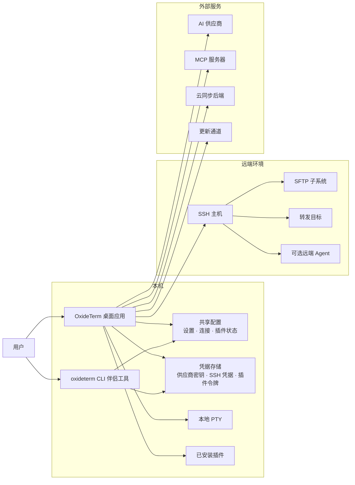

### 用户侧摘要

应用是围绕稳定远端节点构建的桌面工作区。标签页和面板是视图；保存连接是配置；SSH 节点是在线或正在重连的运行时对象；终端会话、SFTP 会话、IDE 工作区、转发、AI 目标和插件能力都是这些节点的消费者。

这种分离解释了常见行为：

- 关闭终端标签页不会删除保存连接。
- 面板关闭后，节点仍可能显示在连接监控中。
- SFTP 和 IDE 可以在重连后恢复，因为它们绑定到节点，而不是只绑定到终端面板。
- AI 工具运行命令或读取文件前必须选择明确目标。
- CLI 伴侣工具可以检查同一套状态，但不是主要交互界面。

---

## 双平面架构

Tauri 架构把通信分为数据平面和控制平面。Native GPUI 去掉了 WebView 边界，但架构分离仍然成立。

### 数据平面

数据平面处理高频终端活动：

```text
终端输入
  -> 终端运行时
  -> 本地 PTY 或 SSH shell 通道
  -> 终端输出
  -> 终端渲染器
```

特征：

- 低延迟。
- 事件频率高。
- 不依赖云同步或备份。
- 普通输入不需要用户确认流程。
- 渲染和输入焦点属于终端页面。

### 控制平面

控制平面处理结构化管理操作：

```text
用户操作或已批准 AI 工具
  -> 工作区命令
  -> 领域运行时
  -> 持久化 / 连接 / 文件 / 同步操作
  -> 结果、通知或恢复建议
```

示例：

- 创建保存连接。
- 打开 SSH 节点。
- 启动 SFTP。
- 创建转发。
- 检查进程、Docker、服务、tmux、软件包、日志、端口和文件系统等主机工具。
- 打开 IDE 工作区。
- 打开图形/VNC 会话。
- 确认终端文件传输提示。
- 修改设置。
- 管理提权凭据。
- 执行云同步操作。
- 执行已批准 AI 工具。
- 生成支持包。

### 持久化平面

持久化平面保存长期状态：

- 设置。
- 保存连接。
- 转发规则。
- 插件状态。
- 提权凭据元数据。
- AI 对话和摘要。
- 云同步快照。
- 备份。
- 便携运行时元数据。

包含凭据的数据必须进入凭据感知存储，而不是普通 JSON 或文本字段。对于提权辅助，持久作用域元数据可以随设置或保存连接保存，但凭据值本身属于凭据存储。

### 平面交互

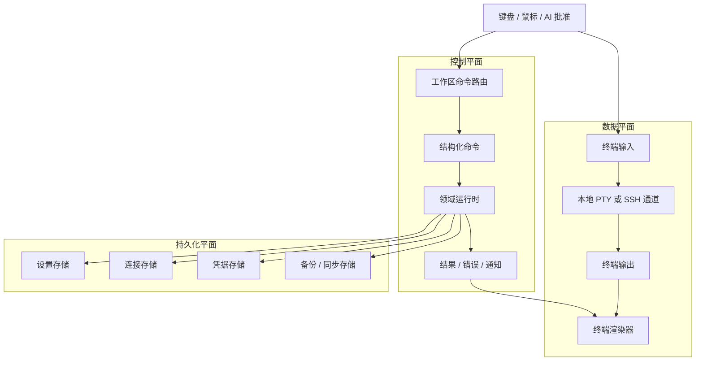

---

## Native 工作区分层

### 第一层：GPUI 应用外壳

主要由 `oxideterm-gpui-app` 承担。

职责：

- 创建桌面窗口。
- 渲染活动栏、标签页、面板树、对话框和设置页面。
- 将用户操作路由到领域 crate。
- 区分界面状态和持久领域状态。
- 提供应用级通知和命令面板动作。

代表模块：

```text
crates/oxideterm-gpui-app/src/workspace.rs
crates/oxideterm-gpui-app/src/workspace/tabs/
crates/oxideterm-gpui-app/src/workspace/pane_tree.rs
crates/oxideterm-gpui-app/src/workspace/sidebar/
crates/oxideterm-gpui-app/src/workspace/settings/
```

### 分层依赖形状

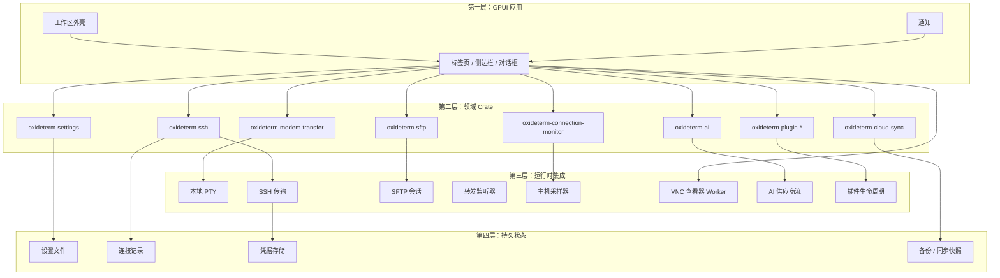

### 第二层：领域 Crate

领域 crate 持有可复用业务逻辑和协议模型。

示例：

- `oxideterm-ssh`：SSH 配置、连接注册表、节点路由、重连模型。
- `oxideterm-sftp`：SFTP 协议、会话和传输语义。
- `oxideterm-connections`：保存连接存储和校验。
- `oxideterm-forwarding`：转发规则模型。
- `oxideterm-ai`：AI 供应商、上下文窗口、RAG、MCP、orchestrator 工具定义和策略。
- `oxideterm-settings`：设置加载、保存和变更逻辑。
- `oxideterm-cloud-sync`：同步和备份逻辑。
- `oxideterm-plugin-*`：插件清单、协议、注册表和宿主 API 类型。

### 第三层：运行时集成

运行时集成把界面请求连接到活跃资源：

- 本地终端进程。
- SSH shell 通道。
- SFTP 通道。
- 转发监听器或远端转发。
- IDE 文件系统访问。
- 插件宿主生命周期。
- 云同步后端。
- AI 供应商请求。

关键规则是所有权：一个运行时对象应有唯一清晰所有者，界面视图通过明确句柄或快照消费它。

### 第四层：持久化与凭据存储

持久化状态由桌面应用和 CLI 伴侣工具共享。凭据值不能序列化进普通设置、支持包、AI 上下文或插件标签。

---

## 节点优先运行时模型

### 避免的问题

Tauri Oxide-Next 架构识别出一个结构性问题：SFTP、IDE 和转发不应依赖临时终端会话 ID。终端会话可以重建；远端节点才是稳定工作单元。

Native 保留同样的用户侧模型。

### 目标拓扑

```text
保存连接
  -> 节点身份
       -> SSH 连接句柄
       -> 终端会话
       -> SFTP 会话
       -> 转发规则
       -> IDE 工作区
       -> AI 目标
       -> 插件消费者
```

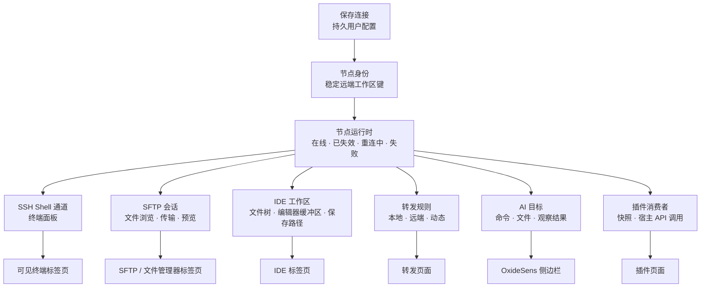

### 稳定对象与临时对象

| 对象 | 稳定角色 | 临时实现细节 |
|---|---|---|
| 保存连接 | 用户配置 | 当前传输状态 |
| 节点 | 远端工作区身份 | 当前连接句柄 |
| 终端标签页 | 可见 shell 视图 | 当前 PTY 或通道实例 |
| SFTP 视图 | 节点文件工作流 | 当前 SFTP 通道 |
| IDE 工作区 | 项目和编辑上下文 | 当前文件操作通道 |
| 转发规则 | 期望隧道 | 当前监听器或任务 |
| AI 目标 | 工具侧快照 | 当前目标状态 |

### 用户规则

远端操作失败时，先检查节点。不要假设当前聚焦标签页就是整个运行时的所有者。

---

## 桌面工作区架构

### 工作区外壳

工作区外壳拥有可见布局：

- 标签页。
- 面板树。
- 活动栏。
- 侧边栏。
- 命令面板。
- 对话框栈。
- 通知。

它不应拥有低层 SSH 传输或凭据。

### 标签页

标签页是可见页面。一个标签页可以表示：

- 本地终端。
- SSH 终端。
- SFTP。
- IDE 工作区。
- 设置。
- 文件管理器。
- 插件管理器。
- 连接监控。
- 云同步。

标签页是可关闭视图，不是保存连接或凭据的长期真源。

### 活动栏

活动栏是导航入口。它应把用户带到应用页面，而不是暴露低层运行时句柄。

### 通知

通知把异步领域事件转为用户可见消息。通知应帮助用户判断下一步检查哪里：连接监控、设置、SFTP、云同步、插件管理器或支持包。

---

## 终端架构

### 本地终端

本地终端标签页运行在当前机器上。在涉及远端主机前，它可以验证渲染器、键盘输入、shell 启动、字体配置和终端设置。

本地终端职责：

- 启动配置的本地 shell。
- 渲染输出。
- 接收键盘输入。
- 处理尺寸变化。
- 应用终端外观设置。
- 应用终端背景和图像设置，但不把它们写进终端缓冲区。
- 检测终端原生文件传输提示和提权提示，但不记录凭据。
- 将本地命令状态与远端 SSH 节点状态分离。

### SSH 终端

SSH 终端标签页附着到在线节点。它是 SSH 连接的消费者，不是连接配置本身。

SSH 终端职责：

- 展示 shell 通道。
- 维护可见屏幕和滚动上下文。
- 发送输入。
- 渲染输出。
- 在批准后向 AI 工具暴露终端观察。
- 报告就绪状态和等待输入提示。
- 复用节点拥有的 SSH 传输，同时把 shell 通道状态保留在面板本地。
- 通过“活跃终端 -> 节点 -> 保存 owner”解析提权凭据作用域，而不是从 host、title 或 prompt 文本启发式反推。

### 终端渲染与图像

终端渲染器组合多层状态：

- emulator 文本网格和 scrollback。
- 光标、选择区、命令标记和 inline hint。
- Kitty/Sixel/iTerm2 等终端图像协议。
- 应用级背景图片、不透明度和模糊。
- 右键菜单和命令栏 overlay。

只有 emulator 文本属于终端缓冲区。背景图片和应用 overlay 是渲染状态。终端图像 placement 是与当前 screen buffer 绑定的协议状态，因此 alternate-screen 切换会清理图像 placement，避免 yazi 这类 TUI 退出后继续绘制预览残留。

### 提权与文件传输辅助

提权提示和 modem 传输是终端相邻辅助能力，不是普通输入文本：

- 提示检测只观察活跃终端输出。
- 凭据提交走专用 secret path，不得经过插件、AI 上下文、日志、录制或 shell history。
- 本地提权凭据作用于本地终端；SSH 提权凭据通过“活跃终端 -> 节点 -> 保存 owner”确定作用域。
- X/Y/ZMODEM 字节级状态由 `oxideterm-modem-transfer` 持有；GPUI 只负责请求文件/目录、显示进度，并把协议响应写回当前 PTY 或通道。
- 检测必须保持保守：除非协议上下文已被证明，普通命令输出和全屏 TUI 重绘都应回放为终端文本。

### 命令栏与右键动作

命令栏和终端右键菜单是工作区控件。它们可以发送文本、粘贴、选择、搜索、触发传输或路由命令，但其状态不应从终端标题或 prompt 文本推断。选择动作作用于终端 snapshot 和渲染坐标；会产生副作用的动作应通过明确的终端/session API 路由。

### 终端所有权规则

关闭终端面板会关闭该面板。不应把它解释为删除保存连接配置。根据运行时状态，SFTP、转发或 IDE 等其他消费者可能仍然需要这个节点，或者需要重连。

---

## SSH 连接池

SSH 连接池把远端运行时状态和界面标签页分离。

### 职责

- 跟踪活跃、空闲、已失效、正在重连和失败连接。
- 在可能时让多个消费者共享一个连接。
- 暴露监控快照。
- 支持重连编排。
- 避免 SFTP、转发、IDE、终端、AI 和插件消费者各自创建无关传输状态。

### 消费者模型

```text
SSH 连接
  |-- 终端消费者
  |-- SFTP 消费者
  |-- 转发消费者
  |-- IDE 消费者
  |-- AI 工具消费者
  `-- 插件消费者
```

### 监控模型

连接监控应回答：

- 哪些节点在线？
- 哪些节点正在重连？
- 哪些节点失败？
- 哪些消费者已附着？
- 哪些转发或传输需要处理？

### 主机工具模型

连接监控同时承载面向已连接节点的资源类工具。这些工具是节点级视图，不是在终端面板里粘贴的命令。

主机工具覆盖：

- 进程列表和进程动作。
- Docker 容器和日志。
- 服务。
- tmux 会话、窗口和面板。
- 软件包清单。
- 系统日志。
- 监听端口和暴露风险提示。
- 文件系统和磁盘用量。
- 计划任务。
- CPU、内存、磁盘、GPU 和网络指标。

架构规则：

- `oxideterm-connection-monitor` 持有采样命令、解析逻辑、行签名、过滤器、动作命令构造和领域 DTO。
- `oxideterm-gpui-app` 负责渲染监控页面、确认用户动作，并通过所属节点/运行时边界分发命令。
- 资源快照是运行时观察结果，可以刷新、失效或失败，但不会修改保存连接配置。
- 重型或重复采样不得阻塞终端输入，也不能成为 SSH 连接归属的事实来源。

---

## SFTP 架构

SFTP 是节点级文件能力，不应被视为终端面板功能。

### 职责

- 为已连接节点获取 SFTP 能力。
- 列出目录。
- 预览文件。
- 上传和下载文件。
- 在明确请求时写入文件内容。
- 管理传输进度。
- 在支持时于重连后重试或重新获取传输。

### 目录传输

目录传输和单文件传输使用不同执行路径。应用必须区分：

- 单文件上传。
- 单文件下载。
- 目录上传。
- 目录下载。
- 后台传输状态。

### 安全模型

远端文件写入就是目标主机上的真实写入。覆盖重要文件前，用户应确认路径、目标和备份状态。AI 和插件进行文件写入时应使用明确目标 和审批。

---

## IDE 架构

IDE 工作区是远端项目页面。

### 职责

- 为已连接节点打开项目根目录。
- 维护文件树状态。
- 维护编辑器标签页。
- 跟踪未保存缓冲区。
- 明确保存或丢弃变更。
- 将项目上下文与终端面板分离。

### 与 SFTP 的关系

IDE 文件操作可以使用远端文件层，但 IDE 不是简单 SFTP 表格。它拥有编辑器状态、项目根目录、当前编辑器标签页和未保存缓冲区决策。

### 用户规则

关闭 IDE 标签页或重连不稳定主机前，先检查未保存缓冲区。连接可以重建，但未保存编辑状态仍然需要明确保存或丢弃。

---

## 端口转发架构

端口转发是连接级能力。

### 转发类型

- **Local**：本地端口连接到远端目标。
- **Remote**：远端端口反连到本地目标。
- **Dynamic**：SOCKS 风格动态转发。

### 运行时职责

- 创建监听器或远端转发请求。
- 跟踪运行、失败、停止或挂起状态。
- 将转发附着到所属节点。
- 重连成功后恢复已保存或挂起的转发。
- 端口冲突或连接失败时显示可操作错误。

### 自动启动规则

只有当转发应随所属连接打开而启动时，才使用自动启动。否则应从转发页面手动启动。

---

## 图形与 VNC 会话

图形会话是视觉运行时页面。即使远端视觉程序由终端或命令启动，它也不属于终端缓冲区。

RDP、VNC 和 X11 的详细所有权边界记录在 [远程桌面边界](../../design/remote-desktop-boundary.zh-Hans.md)。Native 当前应把视觉远程能力分成三条相关但独立的路径：

- **WSL 图形**：`oxideterm-wsl-graphics` 拥有 WSL 发行版探测、VNC server 启动、桌面/应用子进程和清理。
- **远程桌面**：未来 RDP/VNC 连接类型应使用协议无关的远程桌面领域层和进程外 helper。
- **SSH X11 转发**：`oxideterm-x11-forwarding` 拥有 DISPLAY、xauth、假 cookie、setup rewrite 和 SSH X11 channel 桥接语义；它不是完整桌面查看器。

### 职责

- 将图形会话与终端标签页分开跟踪。
- 通过图形运行时启动或重连后端图形会话。
- 将 GPUI 查看器连接到后端 framebuffer 来源。
- 把键盘、指针和滚轮输入路由到 viewer worker。
- 将渲染帧保留为查看器状态，而不是终端输出或 scrollback。

### 所有权规则

图形运行时拥有 server/session 进程生命周期。GPUI 查看器拥有客户端连接、当前 framebuffer、指针几何和输入分发。关闭查看器应根据用户选择停止或分离图形会话，但不应重写保存的 SSH 连接配置。

对未来 RDP/VNC 会话，应用应在 tab/session 层拥有 helper 生命周期，而 `oxideterm-connections` 拥有保存配置元数据和凭据引用。RDP/VNC 协议代码应该放在 helper binary 或协议专属 crate 中，而不是放进 `oxideterm-gpui-app`。

---

## 重连与恢复

重连是跨多个子系统的工作流，不是单纯终端事件。

### 恢复输入

一次恢复可能需要：

- 节点状态。
- 连接状态。
- 终端面板。
- SFTP 传输。
- 转发规则。
- IDE 工作区。
- AI 目标。
- 插件消费者。
- 通知和错误。

### 概念管线

```text
检测已失效状态
  -> 快照受影响消费者
  -> 尝试重连
  -> 重建或刷新终端访问
  -> 恢复转发
  -> 恢复或重试传输
  -> 重新打开或刷新 IDE 状态
  -> 更新监控和通知
```

### 用户流程

1. 打开连接监控。
2. 找到受影响节点。
3. 重连或等待重连。
4. 刷新 SFTP、IDE、转发或 AI 目标状态。
5. 验证任何写入、传输或命令结果。

---

## 设置与持久化

设置是持久化应用状态。桌面设置页面是交互式编辑设置的主要入口。

### 设置领域

- 通用应用行为。
- 外观和主题。
- 终端行为。
- 本地终端行为。
- 终端图像、背景图片和传输辅助。
- SSH 行为。
- 提权凭据。
- SFTP 行为。
- IDE 行为。
- AI 供应商和模型设置。
- AI 记忆、工具调用和知识设置。
- 插件。
- 云同步。
- 便携运行时。
- 快捷键。
- 帮助和更新通道。

### 持久化规则

设置应保存配置，而不是凭据值。凭据字段应写入凭据感知存储。

提权凭据条目需要拆分：标签、提示匹配器、启用状态和保存节点作用域属于配置；密码或等价秘密值只能通过凭据感知边界保存。

### CLI 关系

CLI 伴侣工具可以为脚本化流程检查和修改设置。探索性或视觉配置应使用桌面设置页面。

---

## 云同步、备份与便携包

云同步、备份和 `.oxide` 包作用于持久化状态，不作用于在线终端字节。

### 云同步

云同步将选定本地状态与配置的远端后端对齐。执行 push、pull、apply 或冲突解决这类改变方向的操作前，应能检查状态。

### 备份

备份用于保护高影响变更前的状态：

- 批量导入。
- 同步应用。
- 恢复。
- 插件迁移。
- 设置迁移。
- 便携包导入。

### 便携包

`.oxide` 包是加密便携导出，可以包含连接、转发、设置、插件设置、快捷命令和可选便携凭据。

### 审查规则

每次导入、恢复或同步应用都应可预览。分享支持包前应先检查内容。

---

## OxideSens AI 架构

OxideSens 是理解工作区上下文的助手。它使用已配置供应商和本地应用上下文，不需要 OxideTerm 账号。

### 上下文来源

- 对话历史。
- 当前终端上下文。
- 保存连接。
- 在线节点。
- 终端会话。
- SFTP 目标。
- IDE 工作区。
- 设置摘要。
- RAG 知识集合。
- MCP 资源和工具。
- 前序工具结果。

### Orchestrator 工具模型

AI 工具层暴露高层应用工具，而不是任意内部 API。例如：

- 目标发现和选择。
- 连接目标。
- 运行命令。
- 观察终端。
- 发送终端输入。
- 读取资源。
- 写入资源。
- 传输资源。
- 打开应用页面。
- 获取状态。
- 读取或记住偏好。

### 审批模型

AI 动作按风险分类：

- 只读。
- 交互式。
- 执行。
- 写入。
- 破坏性。

写入、终端输入、命令执行、文件修改和破坏性操作应明确且可审查。不要把凭据粘贴进提示词。

---

## 插件架构

插件通过清单声明能力，并通过宿主提供的页面扩展应用。

### 组成部分

- 插件清单。
- 插件注册表。
- 插件宿主 API。
- 插件设置。
- 插件凭据。
- 插件界面页面。
- 插件生命周期事件。

### 边界规则

- 插件设置不是插件凭据。
- 插件界面应使用宿主提供的 API。
- 插件错误应与主工作区隔离。
- 启用插件前应检查插件权限。
- 插件默认不应拿到无关应用内部状态。

---

## CLI 伴侣工具边界

`oxideterm` CLI 伴侣工具与桌面应用共享配置和数据路径，但不是主要交互界面。

CLI 适合：

- 无界面诊断。
- CI 校验。
- 脚本化设置变更。
- 连接导出或校验。
- 备份和恢复自动化。
- 云同步自动化。
- 支持包生成。
- 便携包校验。

桌面应用可用时，不应把 CLI 当作驱动交互式 SSH 工作的常规方式。

---

## 安全设计

### 凭据类别

- SSH 密码。
- 私钥口令。
- 云同步 token。
- AI 供应商密钥。
- 插件 token。
- 便携包密码。
- 来自环境变量的凭据。

### 存储规则

- 导航元数据不是凭据存储。
- 凭据字段应使用系统钥匙串支持或凭据感知存储。
- CLI 写入凭据时应优先使用 stdin 或环境变量。
- 支持包应包含提示和状态，不包含原始值。
- AI 上下文离开应用边界前应脱敏。

### 输出边界

以下位置都应视为输出边界：

- AI 提示词。
- 工具调用载荷。
- 日志。
- 支持包。
- 插件消息。
- 云同步快照。
- CLI JSON 输出。

---

## 性能设计

### 终端响应

终端热路径应避免：

- 阻塞磁盘 I/O。
- 云同步工作。
- 备份生成。
- 大型插件扫描。
- 长时间 AI 总结。
- 重型设置序列化。

### 虚拟化视图

文件、传输、连接、插件条目或日志这类大型列表应在适合时使用稳定行高和虚拟化。

### 后台工作

长时间操作应显示进度，并避免阻塞主工作区：

- SFTP 传输。
- X/Y/ZMODEM 传输。
- 主机资源采样。
- 图形/VNC 帧更新。
- 云同步。
- 备份。
- AI 供应商调用。
- 插件加载。
- 远端文件预览。

---

## 详细模块结构

本节把用户可见架构映射到 Native 模块布局。这里不逐个解释所有文件，而是说明每类行为的归属，避免把界面、运行时和持久化状态混在一起。

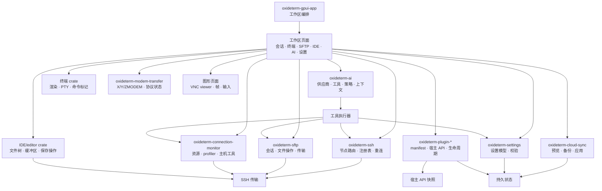

### GPUI 工作区模块

| 模块 | 职责 | 用户可见结果 |
|---|---|---|
| `workspace.rs` 与 `workspace/root/*` | 持有顶层工作区状态、窗口组合、初始化和根渲染 | 应用进入统一桌面工作区，而不是多个割裂工具 |
| `workspace/tabs/*` | 创建、选择、渲染和重连绑定到标签页的视图 | 终端、SFTP、IDE 和工具页可以独立打开、关闭和恢复 |
| `workspace/pane_tree.rs` | 持有分屏面板布局状态 | 用户可以调整工作区布局，而不改变节点或会话归属 |
| `workspace/sidebar/*` | 渲染活动导航、保存会话、AI 侧边栏和侧边栏状态 | 活动页面变化时，导航仍保持稳定 |
| `workspace/session_manager/*` | 管理保存连接、导入导出对话框、连接树和表格视图 | 用户可以创建、编辑、导入、导出和整理连接记录 |
| `workspace/new_connection/*` | 持有连接表单、SSH 连接流程、主机密钥对话框和键盘交互认证对话框 | 首次连接是桌面引导流程，而不是只靠 CLI |
| `workspace/connection_monitor/*` | 跟踪连接池状态、节点健康、拓扑、资源指标、主机工具和生命周期动作 | 用户可以看到已连接节点、资源状态、主机实体、重连状态和可操作失败 |
| `workspace/sftp/*` | 渲染远端文件浏览、对话框、预览、冲突和传输动作 | SFTP 是节点级文件管理器，不是终端附属功能 |
| `workspace/file_manager/*` | 渲染本地文件浏览、书签、预览对话框和外部打开动作 | 本地文件工作流与远端文件使用一致的桌面模式 |
| `workspace/graphics.rs` 与 `workspace/graphics_vnc.rs` | 渲染图形会话、连接 VNC viewer，并路由指针/键盘输入 | 远端视觉工作流是独立应用页面，不是终端 scrollback |
| `workspace/ide.rs` 与 IDE crate | 打开文件夹、路由文件操作、管理编辑器状态 | 远端编辑体现为工作区，而不是裸 SFTP 操作 |
| `workspace/forwards/*` | 渲染转发表单、规则、状态和动作 | 端口转发可见、可恢复、可从桌面应用管理 |
| `workspace/settings/*` | 渲染终端、外观、AI、SFTP、IDE、提权凭据、便携运行时、更新和快捷键设置页 | 配置以应用为主入口，并通过共享设置模型持久化 |
| `workspace/cloud_sync/*` | 渲染同步状态、确认流程和备份动作 | 云同步与备份操作显式展示，尽量可预演和可恢复 |
| `workspace/plugin_manager.rs`, `plugin_runtime.rs`, `plugin_lifecycle/*`, `plugin_settings_store.rs` | 管理插件发现、生命周期、宿主 API 快照、设置、凭据和界面调用 | 插件可以扩展应用页面，但不拥有核心运行时状态 |
| `workspace/sidebar/ai/*` | 渲染 AI 对话、模型选择、流式输出、上下文、工具事件和对话记录状态 | OxideSens 是集成在工作区内的助手，并有明确工具边界 |
| `workspace/terminal_context_actions.rs` | 构建选择、搜索、传输和命令路由等终端右键动作 | 终端动作使用统一应用菜单风格，同时仍通过明确 session API 分发 |
| `workspace/quick_commands*` 与 `terminal_command_bar/*` | 存储快捷命令和命令行补全来源 | 重复终端动作可以变成可复用的桌面控件 |
| `workspace/local_terminal_background.rs` 与 `workspace/root/background.rs` | 解析应用和终端背景图片渲染 | 背景图片属于视觉设置，不是终端缓冲区内容 |
| `workspace/notification_center.rs` | 收集并渲染可操作的应用通知 | 后台失败和恢复动作不会阻塞终端输入，但仍然可见 |
| `workspace/onboarding/*` | 渲染首次启动设置和设置状态 | 用户可以从主应用完成配置，而不是从 CLI 文档开始 |

### SSH 领域模块

| 模块 | 职责 | 架构边界 |
|---|---|---|
| `oxideterm-ssh/src/config.rs` | 定义 SSH 连接配置和面向校验的类型 | 保存元数据与在线传输句柄分离 |
| `connection_registry.rs` | 跟踪可复用 SSH 连接和连接池身份 | 多个消费者可以共享节点，而不是各自持有 socket |
| `router.rs` 与 `router/node_router.rs` | 把工作路由到节点，并强制节点身份 | 用户动作面向节点，而不是偶然存在的终端标签页 |
| `router/runtime_store.rs` | 存储消费者和监控器使用的在线节点状态 | 运行时状态可以查询，但不会变成持久连接配置 |
| `router/events.rs` | 发布节点和连接事件 | 界面和工具可以接收状态变化，而不是直接轮询每个领域 |
| `reconnect.rs` | 描述重连策略和重试行为 | 断线尽可能变成可恢复生命周期事件 |
| `monitor.rs` | 把底层状态转换为监控页面使用的健康状态 | 连接监控能展示健康状态，但不暴露传输内部细节 |
| `host_key.rs` | 处理主机密钥校验语义 | 信任决策保持显式且可审计 |
| `transport/auth.rs` | 处理密码、密钥、agent 和键盘交互认证路径 | 凭据收集与普通界面状态隔离 |
| `transport/client.rs`, `connection.rs`, `handler.rs`, `output.rs` | 打开 SSH 客户端、通道、处理器和输出流 | 终端与文件消费者共享传输行为，但各自保留视图状态 |
| `transport/paths.rs`, `signers.rs` | 解析 SSH 路径和签名辅助逻辑 | 密钥材料和路径解析留在传输层 |

### 连接监控与主机工具模块

| 模块 | 职责 | 架构边界 |
|---|---|---|
| `oxideterm-connection-monitor/src/profiler.rs` | 持有采样节奏、shell 初始化、超时限制和 profiler 状态 | 采样是运行时观察，不是保存连接数据 |
| `metrics.rs`, `summary.rs`, `stats.rs` | 解析指标并构建紧凑监控行 | UI 行来自结构化快照，而不是原始命令文本 |
| `process.rs` | 过滤、排序、展示进程，并构建进程动作 | 进程动作是明确主机工具命令，不是终端按键 |
| `docker.rs`, `service.rs`, `tmux.rs` | 建模主机管理器及其动作 | 管理器专属解析留在监控领域 |
| `package.rs`, `log.rs`, `port.rs`, `filesystem.rs`, `scheduled_task.rs` | 采样软件包清单、日志、端口、文件系统和计划任务 | 资源工具可以独立失败，但不改变 SSH 节点归属 |

### SFTP 领域模块

| 模块 | 职责 | 架构边界 |
|---|---|---|
| `oxideterm-sftp/src/session.rs` | 持有高层 SFTP 会话行为 | 文件浏览绑定到节点级会话 |
| `session/basic.rs` | 提供基础会话操作 | 简单操作使用一致的会话入口 |
| `session/file_ops.rs` | 实现读取、写入、重命名、删除和元数据操作 | 会改变远端文件的操作不放在界面渲染代码中 |
| `session/preview.rs` 与 `preview_helpers.rs` | 为文本、媒体和不支持内容构建安全预览 | 预览逻辑与传输逻辑分离 |
| `session/transfers.rs` | 把会话连接到上传下载操作 | 传输复用节点和会话状态，而不是执行终端命令 |
| `transfer_manager.rs` | 跟踪传输队列、状态、进度和取消 | 用户可以查看并取消长时间文件操作 |
| `progress.rs` | 表示进度事件和字节数 | 界面进度来自结构化数据，而不是解析文本 |
| `retry.rs` | 集中处理重试决策 | 可恢复网络失败不需要每个界面临时处理 |
| `tar_transfer.rs` | 在合适时通过归档路径处理目录传输 | 目录上传下载可以保持结构和进度语义 |
| `path_utils.rs` | 规范化并校验远端路径 | SFTP 和 IDE 的远端路径行为保持一致 |
| `types.rs` 与 `error.rs` | 定义通用 SFTP 数据类型和错误 | 界面可以展示准确错误，而不依赖实现细节 |

### AI 领域模块

| 模块 | 职责 | 架构边界 |
|---|---|---|
| `chat.rs` 与 `types.rs` | 定义对话和消息类型 | 界面对话记录基于结构化记录 |
| `context_window.rs` | 决定哪些内容可以进入模型上下文 | token 预算集中处理，而不是散落在侧边栏里 |
| `context_sanitizer.rs` | 在模型或工具边界前脱敏敏感值 | AI 上下文属于输出边界 |
| `key_store.rs` 与 `touch_id.rs` | 存储和解锁供应商密钥 | 供应商凭据不进入普通设置文本 |
| `providers/*` 与 `streaming/*` | 发现模型、选择供应商、构造请求、解析流式响应 | 供应商差异隐藏在统一流式语义后面 |
| `orchestrator.rs` | 定义 orchestrator 工具名称、schema 和分发契约 | 面向模型的工具定义保持稳定 |
| `policy.rs` | 决定哪些工具动作需要批准或拒绝 | 危险或会改变状态的动作不能只因模型要求就执行 |
| `persistence.rs` | 存储对话和 AI 持久状态 | 在启用时，长对话可跨应用重启保留 |
| `profiles.rs` 与 `settings.rs` | 管理 AI 配置档和设置 | 模型/供应商选择是用户配置，不是硬编码默认值 |
| `rag/*` | 切分、嵌入、存储和搜索知识来源 | 检索是领域服务，不是侧边栏渲染逻辑 |
| `mcp/*` | 管理 MCP 注册表、进程启动和协议类型 | 外部工具服务器与核心应用状态隔离 |
| `references.rs`, `slash.rs`, `suggestions.rs` | 提供引用、斜杠命令和建议 | 助手输入辅助与供应商传输分离 |

### 持久化、设置、插件与同步模块

| 区域 | Native 所有者 | 说明 |
|---|---|---|
| 设置 | `oxideterm-settings`, `oxideterm-settings-model`, `oxideterm-gpui-settings-view` | 设置通过共享模型加载和保存，再由 GPUI 页面渲染 |
| 保存连接 | `oxideterm-connections`, 会话管理器模块 | 连接记录是持久对象；活跃节点是运行时对象 |
| 转发 | `oxideterm-forwarding`, 应用转发模块 | 规则是配置；监听器是运行时状态 |
| 提权凭据 | 设置提权页面、终端提权提示、凭据感知存储 | 作用域和提示匹配器是配置；secret 值留在普通设置之外 |
| 终端 modem 传输 | `oxideterm-modem-transfer`, `oxideterm-gpui-terminal` modem worker | 协议状态属于终端运行时；文件选择和进度属于 UI |
| 图形会话 | `oxideterm-wsl-graphics`, 应用图形/VNC 模块 | session/server 生命周期与 viewer framebuffer、终端缓冲区分离 |
| 插件 | `oxideterm-plugin-*`, 插件管理器和生命周期模块 | manifest、设置、宿主 API 调用和插件凭据有各自边界 |
| 云同步 | `oxideterm-cloud-sync`, `oxideterm-gpui-cloud-sync`, 应用云同步模块 | 同步计划、备份创建和应用步骤都是显式控制平面操作 |
| 便携运行时 | `oxideterm-portable-runtime`, 设置中的便携运行时模块 | 便携元数据和加密载荷处理与普通设置页分离 |
| 通知 | `oxideterm-notification-center`, 应用通知模块 | 后台状态以可操作通知呈现 |
| CLI 伴侣工具 | `oxideterm-cli` | CLI 为自动化读取和修改共享状态，但不替代桌面工作流 |

### 为什么这样拆分

这种模块拆分保护四个用户可见不变量：

1. 关闭视图不会销毁底层持久对象。
2. 运行时对象可以恢复，而不需要重写保存配置。
3. 后台操作可以失败，但不应阻塞终端输入。
4. 凭据可以用于认证或供应商访问，但不能变成普通应用文本。

---

## 数据流详解

### 首次启动与本地终端

```text
应用启动
  -> 加载设置
  -> 初始化工作区状态
  -> 渲染引导页或主工作区
  -> 创建本地终端标签页
  -> 连接本地 PTY
  -> 将输出流送入终端渲染器
```

本地终端路径刻意保持很短。它不应等待云同步、插件扫描、AI 供应商发现或远端连接检查。

### 打开保存的 SSH 连接

```text
会话页
  -> 选择保存连接
  -> 加载连接记录
  -> 必要时收集缺失凭据
  -> 必要时校验主机密钥
  -> 打开 SSH 传输
  -> 注册节点运行时
  -> 按请求创建终端/SFTP/IDE/转发消费者
  -> 向连接监控发布健康状态
```

保存连接仍然只是持久元数据。在线节点只会在传输建立成功后创建，或进入可重连状态。

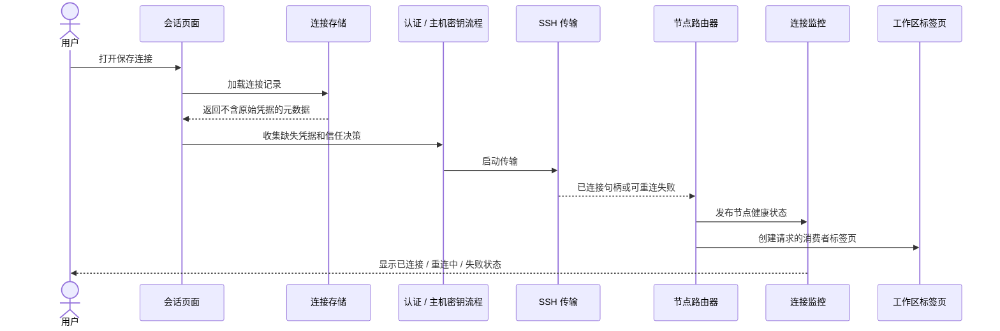

### 终端输入与输出

本地终端：

```text
键盘输入 -> 终端面板 -> 本地 PTY -> 输出流 -> 渲染器
```

SSH 终端：

```text
键盘输入 -> 终端面板 -> 节点 shell 通道 -> SSH 传输 -> 输出流 -> 渲染器
```

终端文本不是可靠的结构化 API。需要文件元数据、传输进度、转发状态或工具结果的功能，应使用领域 API，而不是抓取终端输出。

### SFTP 列表与预览

```text
SFTP 页面
  -> 选择节点
  -> 获取该节点的 SFTP 会话
  -> 列出远端路径
  -> 规范化条目
  -> 渲染文件列表
  -> 通过预览逻辑打开选中文件
  -> 展示权限/网络/不支持内容错误
```

预览与下载分离。预览可以限制文件大小、选择渲染器，或拒绝不支持内容，而普通传输仍可使用。

### SFTP 上传与下载

```text
用户开始传输
  -> 构造传输请求
  -> 加入传输管理器队列
  -> 通过 SFTP 会话传输字节
  -> 发出进度事件
  -> 处理冲突/重试/取消
  -> 更新传输列表和通知中心
```

单文件传输可以直接流式传输。目录传输在有利于保留结构和进度语义时，可以使用归档辅助路径。

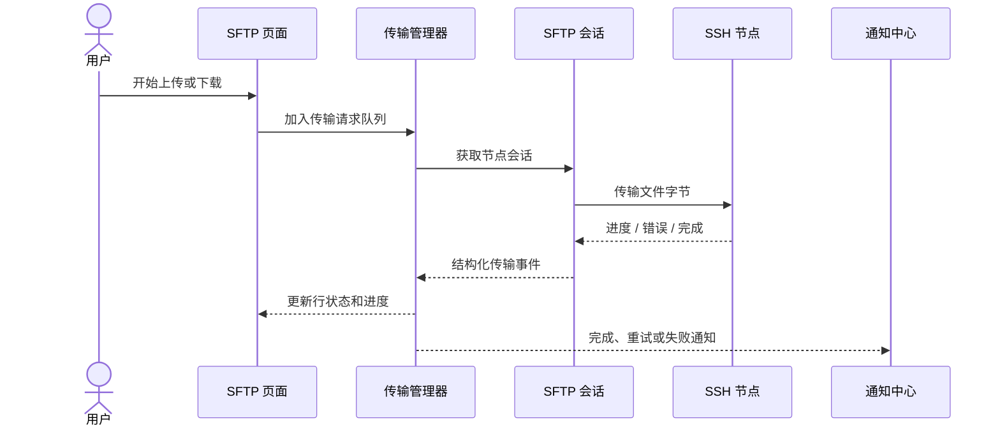

### IDE 打开与保存

```text
打开 IDE 工作区
  -> 选择节点和根路径
  -> 通过远端文件 API 加载文件树
  -> 将文件打开到编辑器缓冲区
  -> 在工作区状态中本地编辑
  -> 通过远端写入路径保存
  -> 清除未保存状态或展示保存失败
```

编辑器缓冲区是视图/工作区对象。远端文件是节点上的持久状态。保存动作是两者之间的显式桥梁。

### 创建端口转发

```text
转发表单
  -> 校验本地/远端端口和方向
  -> 将规则绑定到节点或保存连接
  -> 通过转发运行时启动监听器
  -> 发布运行/挂起/失败状态
  -> 在节点健康变化时恢复或挂起
```

转发规则可以持久化，但在线监听器依赖节点健康和本地端口可用性。

### AI 工具调用

```text
用户消息
  -> 构建已脱敏上下文
  -> 选择模型/供应商
  -> 流式接收模型响应
  -> 解析工具请求
  -> 评估策略和目标
  -> 必要时请求用户批准
  -> 通过领域运行时执行
  -> 将结构化结果追加到对话记录
```

AI 工具不会隐式拥有 shell。命令、文件读取、文件写入或设置动作必须解析到允许的目标，并通过策略检查。

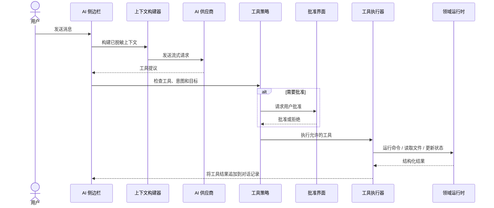

### 云同步应用与备份

```text
用户打开同步页
  -> 加载本地状态摘要
  -> 获取或读取远端快照
  -> 构建预览/计划
  -> 应用变更前请求确认
  -> 必要时创建备份
  -> 应用选中变更
  -> 展示结果和冲突
```

预览步骤是架构的一部分，不是装饰页面。它让用户在持久状态变化前理解将要发生的修改。

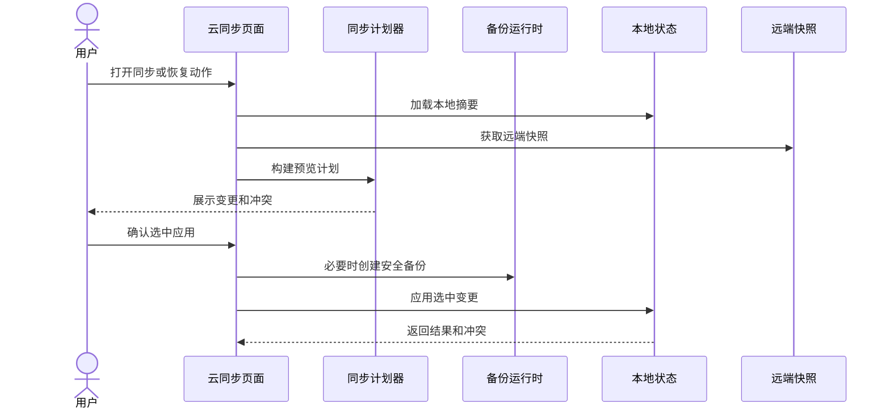

### 启用插件

```text
插件管理器
  -> 发现 manifest
  -> 校验元数据和权限
  -> 加载默认设置
  -> 必要时请求凭据
  -> 启用生命周期钩子
  -> 暴露宿主 API 快照
  -> 渲染插件提供的页面或动作
```

插件接收快照并通过宿主 API 调用应用能力。插件不应直接拥有 SSH 传输、终端面板或凭据存储。

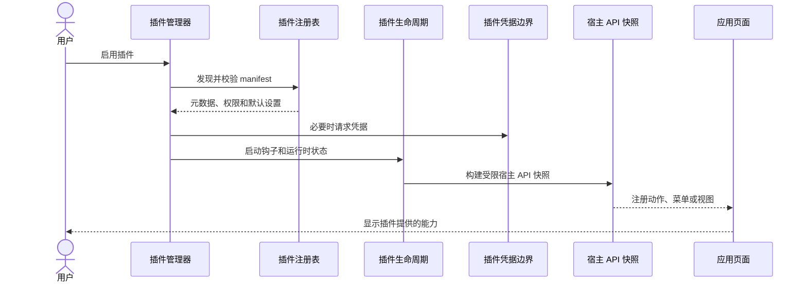

---

## 状态机与生命周期

### 保存连接生命周期

| 状态 | 含义 | 常见后续动作 |
|---|---|---|
| 草稿 | 表单数据存在，但尚未持久化 | 保存、测试、丢弃 |
| 已保存 | 持久连接记录存在 | 连接、编辑、导出、删除 |
| 已编辑 | 用户修改了字段，但尚未提交 | 保存变更或还原 |
| 已导入 | 记录来自导入流程 | 检查、保存、连接 |
| 已导出 | 记录被包含在导出操作中 | 本地继续使用或共享导出结果 |
| 已删除 | 持久记录已移除 | 已存在的在线节点可以继续到关闭为止 |

### SSH 节点生命周期

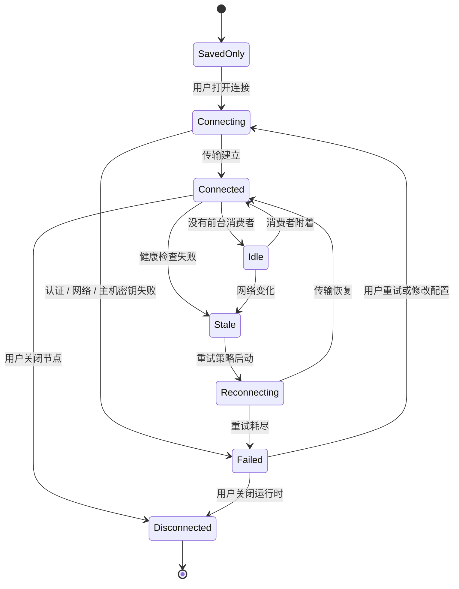

| 状态 | 含义 | 用户影响 |
|---|---|---|
| 仅保存 | 配置存在，没有在线连接 | 稍后可以连接 |
| 连接中 | 正在打开传输 | 依赖视图等待或显示进度 |
| 已连接 | 节点在线且可用 | 终端、SFTP、IDE、转发和 AI 工具都可选择它 |
| 空闲 | 节点已连接，但没有前台消费者 | 连接监控仍可展示它 |
| 已失效 | 最近连接状态已经不能信任 | 消费者应暂停或刷新 |
| 重连中 | 重试策略正在尝试恢复 | 视图不应做破坏性假设 |
| 失败 | 连接尝试或恢复失败 | 需要用户处理 |
| 已断开 | 运行时对象已关闭 | 视图必须分离或要求重连 |

### 终端生命周期

| 状态 | 含义 | 用户影响 |
|---|---|---|
| 已创建 | 面板/标签页存在 | 启动可能仍在进行 |
| 启动中 | PTY 或 SSH 通道正在打开 | 输入可能延迟 |
| 就绪 | 终端可以接受输入 | 正常交互 |
| 忙碌 | 命令正在产生输出 | 终端保持响应，但输出量可能很大 |
| 等待输入 | 进程正在提示输入 | AI 观察和用户控件可以报告该状态 |
| 已关闭 | 通道或 PTY 已结束 | 视图可显示退出状态或关闭 |

### SFTP 传输生命周期

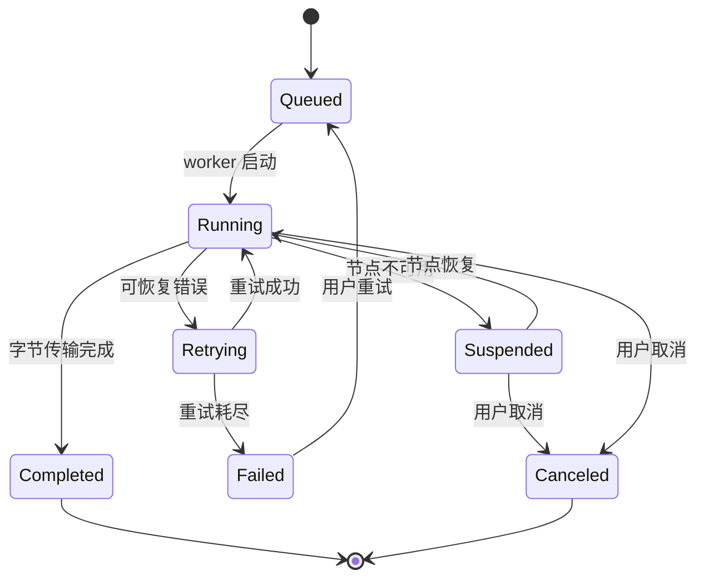

| 状态 | 含义 | 用户影响 |
|---|---|---|
| 排队中 | 传输请求已存在 | 等待工作容量或节点就绪 |
| 运行中 | 字节正在传输 | 可以看到进度 |
| 重试中 | 出现可恢复失败 | 进度可能暂停 |
| 已挂起 | 节点或应用状态阻止继续 | 用户可以重连或取消 |
| 已完成 | 传输结束 | 结果显示在传输历史中 |
| 失败 | 传输无法继续 | 应展示错误和重试选项 |
| 已取消 | 用户停止了传输 | 部分输出可能需要清理 |

### Modem 传输生命周期

| 状态 | 含义 | 用户影响 |
|---|---|---|
| 已检测 | 终端输出匹配保守协议触发条件 | 用户可能需要选择文件或目录 |
| 等待选择 | UI 正在等待本地路径选择 | 必要时协议字节由传输消费者暂存 |
| 运行中 | worker 正在与 PTY/通道交换协议帧 | 应展示进度、取消和错误 |
| 已完成 | 传输结束，终端状态释放 | 文件结果出现在所选路径 |
| 已取消 | 用户取消或终端关闭 | 协议消费者必须释放终端输出 |
| 失败 | 协议或 I/O 出错 | 用户可以用更明确的命令/路径重试 |

### 转发生命周期

| 状态 | 含义 | 用户影响 |
|---|---|---|
| 已配置 | 规则存在，但没有在线监听器 | 可以启动 |
| 启动中 | 正在打开监听器或远端通道 | 端口可能尚不可用 |
| 运行中 | 转发已激活 | 流量可以通过 |
| 已挂起 | 所属节点不可用或策略暂停 | 规则仍然可见 |
| 已停止 | 监听器被用户或应用关闭 | 可以重新启动 |
| 失败 | 绑定、权限或连接错误 | 用户需要修改规则或恢复节点 |

### 图形会话生命周期

| 状态 | 含义 | 用户影响 |
|---|---|---|
| 可用 | 图形支持可以启动 | 用户可以启动视觉会话 |
| 启动中 | 正在准备 server/session 进程和 VNC 查看器 | 查看器可以显示进度 |
| 活跃 | VNC 帧和输入正在流动 | 用户可以与视觉页面交互 |
| 已断开 | 查看器或后端会话停止 | 用户可以重连或重新启动 |
| 失败 | 依赖、服务端启动或 viewer 连接失败 | 用户应检查依赖或停止会话 |

### IDE 缓冲区生命周期

| 状态 | 含义 | 用户影响 |
|---|---|---|
| 干净 | 缓冲区与最近加载或保存内容一致 | 可以安全关闭 |
| 未保存 | 用户有未保存编辑 | 关闭或切换时可能提示 |
| 保存中 | 写入正在进行 | 界面应避免重复保存 |
| 保存失败 | 写入失败 | 缓冲区保持未保存状态 |
| 冲突 | 远端状态出现非预期变化 | 用户需要选择比较、覆盖或重新加载 |
| 已关闭 | 缓冲区不再可见 | 除非已保存，否则远端文件不变 |

### AI 工具生命周期

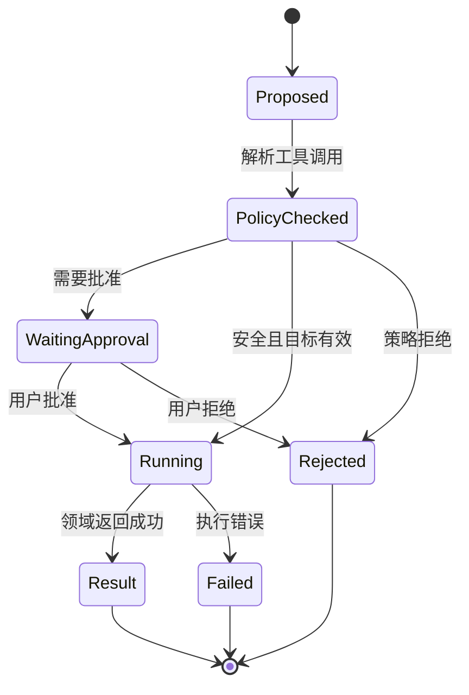

| 状态 | 含义 | 用户影响 |
|---|---|---|
| 已提出 | 模型请求工具 | 尚无副作用 |
| 已检查策略 | 工具已与策略和目标状态比较 | 可以继续、拒绝或要求批准 |
| 等待批准 | 需要用户决定 | 执行暂停 |
| 运行中 | 工具正在执行 | 结果应流式展示或汇总 |
| 已返回结果 | 工具完成 | 对话记录保存结构化输出 |
| 已拒绝 | 策略或用户拒绝 | 对话记录保存拒绝原因 |
| 失败 | 执行失败 | 显示错误但不泄漏凭据 |

### 同步与插件生命周期

| 区域 | 状态 | 含义 |
|---|---|---|
| 云同步 | 未配置、就绪、预览中、应用中、冲突、已完成、失败 | 同步是“计划后应用”的流程，不是静默后台修改 |
| 插件 | 已发现、已安装、已启用、失败、已禁用、已更新、已移除 | 插件可用性与插件运行健康状态分离 |

---

## 所有权与持久化矩阵

| 用户概念 | 运行时所有者 | 持久化所有者 | 凭据所有者 | 应用关闭后保留 | 重连后保留 | 用户恢复方式 |
|---|---|---|---|---|---|---|
| 保存连接 | 会话管理器 / 连接存储 | 连接记录 | Keychain 或凭据感知存储 | 是 | 是 | 编辑、删除、导入、导出 |
| SSH 节点 | SSH 路由器 / 注册表 | 在线句柄不持久化 | SSH 认证层 | 否 | 不保留同一个 socket | 重连或重新打开 |
| 终端会话 | 终端面板 / 运行时 | 通常只保留历史或设置 | 默认无 | 通常否 | 只有后端节点恢复并重建通道时才可能恢复 | 重新打开终端 |
| 终端图像 placement | 终端图像状态 | 无 | 无 | 否 | screen-buffer 切换时清理 | 由应用输出重新渲染 |
| 提权凭据 | 设置提权页面 / 终端辅助 | 只保存作用域元数据 | 凭据存储 | 保存时是 | 通过本地或保存节点作用域保留 | 修改作用域、重新输入 secret、禁用辅助 |
| Modem 传输 | 终端运行时 / modem worker | 只落地目标文件 | 默认无 | 否 | 通常取消后重试 | 重试传输或选择其他路径 |
| SFTP 会话 | SFTP 运行时 | 在线句柄不持久化 | SSH 认证层 | 否 | 重连后重新获取 | 刷新或重连 |
| 传输 | 传输管理器 | 按配置保留传输历史 | 默认无 | 只保留部分状态或历史 | 操作支持时可重试 | 重试、取消、清理部分文件 |
| 转发规则 | 转发页面 / 运行时 | 转发配置 | 远端侧使用 SSH 认证层 | 规则保留 | 监听器必须重启 | 重启或修改端口 |
| 主机工具快照 | 连接监控 / profiler | 在线采样不持久化 | SSH 认证层 | 否 | 重连后刷新 | 刷新、重新执行动作或重连节点 |
| 图形会话 | 图形运行时 / VNC 查看器 | 在线 viewer 不持久化 | 通常只依赖 SSH/session 启动 | 否 | 可行时重连 viewer/session | 重连、停止或重新启动 |
| IDE 工作区 | IDE 页面 / 运行时 | 最近工作区和设置 | 远端侧使用 SSH 认证层 | 最近记录保留 | 重连后重新打开或刷新 | 保存、重新加载、解决冲突 |
| 编辑器缓冲区 | IDE / 编辑器状态 | 只有保存后才写入文件 | 默认无 | 未保存内容取决于恢复策略 | 节点重连不会自动保存 | 保存、重新加载、丢弃 |
| AI 对话 | AI 侧边栏 / 运行时 | AI 持久化 | 供应商密钥存储 | 启用时保留 | 除非工具目标是节点，否则不依赖连接 | 继续、压缩、删除 |
| AI 供应商密钥 | AI 密钥存储 | 凭据存储 | 凭据存储 | 是 | 是 | 重新输入或解锁 |
| 插件设置 | 插件设置存储 | 插件设置文件/存储 | 插件凭据另行存储 | 是 | 通常是 | 重置、禁用插件 |
| 插件凭据 | 插件生命周期凭据边界 | 凭据存储 | 凭据存储 | 是 | 是 | 重新输入、撤销、禁用 |
| 云同步配置 | 同步运行时 / 设置 | 设置和云同步状态 | 凭据存储 | 是 | 取决于网络 | 重新认证或禁用 |
| 便携运行时 | 便携运行时 crate | 便携元数据/载荷 | 便携密钥材料 | 是 | 与连接无关 | 解锁、恢复、重建 |
| 支持包 | 备份/支持流程 | 生成的文件 | 必须排除原始凭据 | 文件保留到删除为止 | 不适用 | 按正确范围重新生成 |

---

## 事件与通知模型

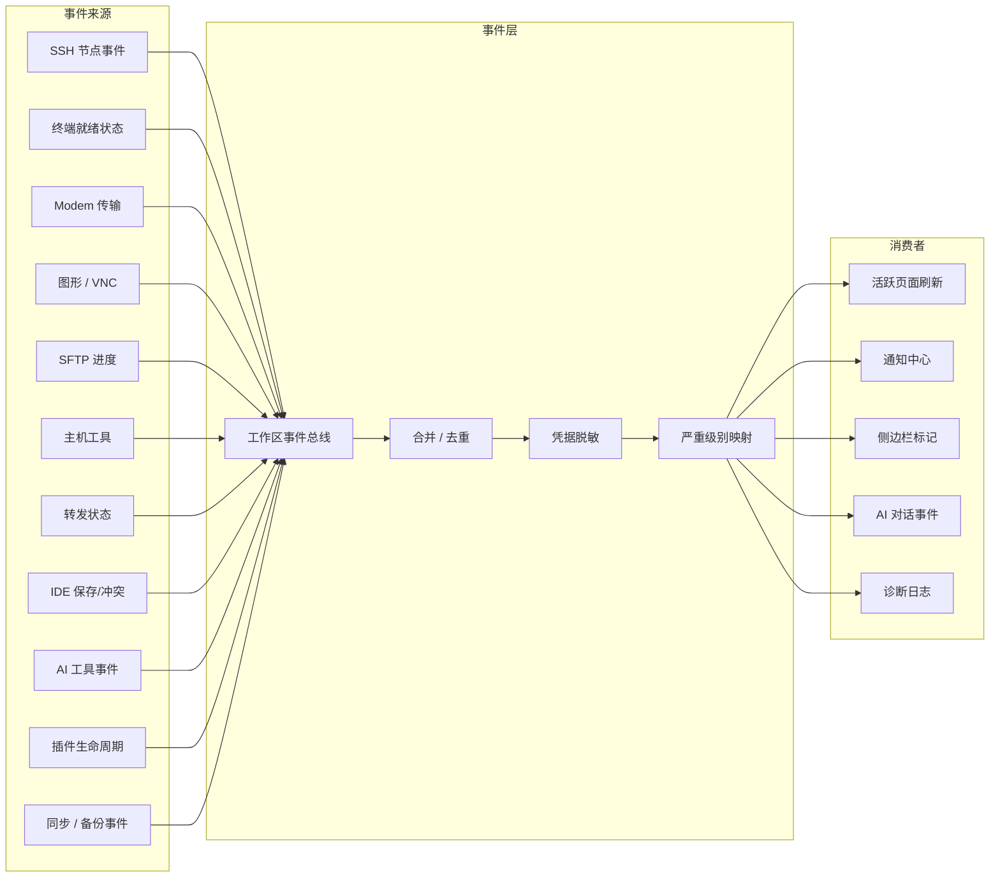

### 事件来源

应用从多个领域接收结构化事件：

- SSH 节点状态变化。
- 终端就绪和进程状态。
- 终端提权提示状态和 modem 传输进度。
- 图形/VNC 连接、帧和断开状态。
- 主机工具采样状态、资源快照和动作结果。
- SFTP 传输进度和冲突。
- 转发启动、停止、挂起和失败。
- IDE 保存、冲突和重新加载结果。
- 插件安装、启用、禁用、设置和宿主 API 失败。
- 云同步预览、应用、冲突和备份结果。
- AI 工具提出、批准、执行结果和策略拒绝。

### 通知规则

通知应可操作且范围明确：

- 通知应指向能解决问题的页面。
- 通知不应包含原始凭据、请求头、token 或终端缓冲区转储。
- 重复事件如果描述同一底层条件，应合并展示。
- 与终端无关的后台通知不应阻塞终端输入。
- 建议生成支持包时，应说明会包含什么、会排除什么。

### 刷新与事件

事件是保持活跃页面更新的主要方式。以下情况仍需要显式刷新：

- 页面在大量状态变化期间处于非活跃状态。
- 应用从睡眠或网络变化中恢复。
- 插件或外部工具改变了持久状态。
- 某个领域报告缓存视图可能已失效。

界面不应成为连接健康、传输状态或持久设置的事实来源。界面只渲染相应领域持有的状态。

### 失效规则

“已失效”表示应用无法证明这个状态仍然是当前状态；它不等于数据被删除或损坏。

- 已失效节点在刷新或重连前，不应接受新的高风险操作。
- 已失效文件列表在破坏性动作前应提供刷新。
- 已失效转发应显示挂起或失败状态，而不是假装流量仍在通过。
- 已失效 AI 目标应要求重新选择目标，或拒绝工具调用。

---

## 故障模型

| 现象 | 优先检查页面 | 子系统 | 可能原因 | 恢复动作 |
|---|---|---|---|---|
| 终端标签页关闭，但主机仍显示在线 | 连接监控 | 标签页和节点运行时 | 标签页是视图；节点可以比标签页活得更久 | 如果不再需要，从连接监控关闭节点 |
| 终端打开但不能输入 | 终端标签页 | 终端运行时 | PTY 或通道仍在启动，或就绪失败 | 等待就绪、重新打开终端，或重连节点 |
| 大型操作期间终端输出变慢 | 终端标签页和通知中心 | 数据平面竞争 | 重型后台任务可能正在竞争资源 | 暂停传输/同步，或等待任务完成 |
| TUI 预览退出后留下旧黑块 | 终端标签页 | 终端图形/图片占位 | 全屏应用没有完整清理图片占位或备用屏状态 | 清屏、重新打开终端，或带命令样本提交终端渲染问题 |
| 已保存的终端背景不显示 | 终端或运行时页面 | 终端背景渲染 | 背景未对该页面启用，或图片库选择已失效 | 重新选择图片、检查启用标签页类型，或重新加载页面 |
| 提权密码辅助没有触发 | 终端标签页和提权设置 | 终端辅助 | 未检测到提示，或活跃 session 没有匹配凭据作用域 | 检查活跃终端作用域、提示匹配器和保存凭据 owner |
| 提交了错误的提权密码 | 终端标签页和提权设置 | 凭据作用域解析 | 凭据被绑定到错误的本地或 SSH owner | 停止命令、修改凭据作用域，并在提示重新出现后重试 |
| Modem 传输意外弹出 | 终端标签页 | Modem 协议检测器 | 输出片段像协议前导，但上下文不足 | 取消辅助、继续终端输出，并报告触发样本 |
| Modem 传输卡住 | 传输提示或通知 | Modem 传输引擎 | 对端停止响应、路径选择被取消，或协议协商失败 | 取消或用明确的 `rz`/`sz` 命令和稳定本地路径重试 |
| SSH 连接在密码提示前失败 | 新建连接或会话页 | SSH 传输 | 主机、端口、代理或 DNS 配置错误 | 修改连接设置并重新测试 |
| 主机密钥提示异常出现 | 主机密钥对话框 | SSH 信任边界 | 远端主机密钥变化，或首次连接尚未信任 | 接受前先校验指纹 |
| 键盘交互认证反复出现 | 新建连接对话框 | SSH 认证 | 服务端请求更多答案，或凭据被拒绝 | 重新输入答案、更新保存凭据，或检查服务端认证策略 |
| 节点长时间显示重连中 | 连接监控 | 重连编排器 | 网络不可用，或重试策略仍在运行 | 等待、取消重连，或修改连接详情 |
| 主机工具页面为空或过期 | 连接监控 / 主机工具 | 连接监控采样器 | 节点已失效、采样命令失败，或解析器拒绝输出 | 刷新、重连节点，或检查动作错误 |
| 主机工具动作失败 | 主机工具动作对话框 | 连接监控动作路径 | 权限不足、缺少二进制、节点失效，或命令失败 | 查看确认输出、调整权限，并在在线节点上重试 |
| 节点已连接但 SFTP 打不开 | SFTP 页面 | SFTP 会话 | 服务端不支持 SFTP，或会话获取失败 | 重连、检查服务端 subsystem，或改用终端 |
| 远端文件列表为空或过期 | SFTP 页面 | SFTP 列表/缓存 | 路径变化、权限不足，或缓存视图已失效 | 刷新路径、返回上级目录，或检查权限 |
| SFTP 上传卡住 | 传输列表 | 传输管理器 | 网络中断、远端磁盘压力，或节点已挂起 | 恢复/重试、重连节点，或取消部分传输 |
| 目录传输很慢 | 传输列表 | SFTP 传输策略 | 小文件很多，或归档辅助路径回退 | 等待完成，或拆分目录 |
| 文件预览被拒绝 | 预览对话框 | SFTP 预览 | 文件过大、二进制、不支持，或权限不足 | 下载/外部打开，或使用终端工具 |
| 转发处于挂起状态 | 转发页面和连接监控 | 转发运行时 | 所属节点已失效或断开 | 重连节点或停止转发 |
| 转发启动失败 | 转发页面 | 转发运行时 | 本地端口被占用、权限不足，或远端绑定失败 | 修改端口、关闭冲突进程，或修改方向 |
| 运行中的转发没有流量 | 转发页面和终端/网络工具 | 转发运行时 | 远端端点不可用，或规则指向错误主机/端口 | 从远端主机测试端点并修改规则 |
| VNC 查看器空白或断开 | 图形 / VNC 页面 | 图形会话运行时 | 查看器无法连接转发端点，或后端会话停止 | 重连查看器、重启图形会话，或检查依赖 |
| IDE 工作区打开但文件树缺失 | IDE 工作区 | IDE 文件系统 | 根路径错误、权限阻止列表，或缓存已失效 | 刷新文件树，或打开其他根路径 |
| IDE 保存失败 | IDE 工作区和连接监控 | IDE 写入路径 | 节点断开、权限不足、冲突，或远端文件已变化 | 重连、解决冲突，或另存为其他路径 |
| 重连后仍有未保存编辑 | IDE 工作区 | 编辑器缓冲区 | 重连只恢复节点访问，不会自动写入文件 | 重连后显式保存 |
| AI 想在保存主机上运行命令 | AI 审批和会话页 | AI 目标选择 | 保存配置不是在线 shell 目标 | 先连接主机，或选择其他活跃目标 |
| AI 工具被拒绝 | AI 侧边栏 | AI 策略 | 工具危险、缺少批准，或目标不允许 | 按提示批准、缩小目标，或提出更安全请求 |
| AI 上下文缺少最近终端输出 | AI 侧边栏 | 上下文窗口 | token 预算或脱敏移除了内容 | 显式附加所需上下文，或缩小任务 |
| AI 供应商调用失败 | AI 设置和 AI 侧边栏 | 供应商传输 | 密钥缺失、模型无效、额度不足或网络失败 | 更新供应商设置并重试 |
| 插件设置变更后界面未更新 | 插件管理器和受影响页面 | 插件生命周期 | 页面需要刷新，或插件事件未触发重新渲染 | 刷新页面、禁用/启用插件，或重启应用 |
| 插件启用失败 | 插件管理器 | 插件注册表/生命周期 | manifest 无效、权限不足、依赖缺失，或凭据不可用 | 查看插件详情、更新设置，或移除插件 |
| 出现云同步冲突 | 云同步 | 同步计划器 | 本地和远端持久状态各自发生变化 | 查看预览，选择本地/远端解决方式，再应用 |
| 备份生成失败 | 云同步或备份对话框 | 备份运行时 | 目标位置不可用、权限不足，或凭据脱敏失败 | 选择其他位置，或缩小所选数据 |
| 便携运行时无法解锁 | 便携设置 | 便携运行时 | 口令错误、密钥材料缺失，或载荷损坏 | 重新输入口令、从备份恢复，或重建便携数据 |
| CLI 报告与应用视图不同 | CLI 和应用页面 | 共享状态边界 | CLI 读取持久状态，而应用还持有在线运行时状态 | 刷新应用状态，或与连接监控对照 |
| 支持包缺少预期数据 | 支持包对话框 | 输出边界 | 凭据脱敏或选择范围排除了该数据 | 使用正确范围重新生成，同时仍排除原始凭据 |

---

## Native Crate 对照

| 区域 | Crates |
|---|---|
| 桌面外壳和工作区衔接 | `oxideterm-gpui-app`, `oxideterm-workspace` |
| 共享 GPUI 组件和平台辅助 | `oxideterm-gpui-ui`, `oxideterm-gpui-platform`, `oxideterm-theme` |
| 终端渲染和终端领域 | `oxideterm-gpui-terminal`, `oxideterm-terminal`, `oxideterm-terminal-*` |
| 终端 modem 传输 | `oxideterm-modem-transfer`, 终端 modem worker 集成 |
| SSH、节点路由、重连 | `oxideterm-ssh`, `oxideterm-topology` |
| 主机工具和连接监控 | `oxideterm-connection-monitor`, 应用连接监控页面 |
| SFTP 与传输 | `oxideterm-sftp` |
| 保存连接 | `oxideterm-connections` |
| 转发 | `oxideterm-forwarding`, 应用转发页面 |
| 图形和 VNC 会话 | `oxideterm-wsl-graphics`, 应用图形/VNC 页面 |
| IDE 和编辑器 | `oxideterm-gpui-ide`, `oxideterm-gpui-editor`, `oxideterm-ide-core`, `oxideterm-ide-fs`, `oxideterm-editor-*` |
| 设置和提权凭据 | `oxideterm-settings`, `oxideterm-settings-model`, `oxideterm-gpui-settings-view`, 应用凭据感知边界 |
| AI、RAG、MCP、工具策略 | `oxideterm-ai`, 应用 AI 侧边栏 |
| 插件 | `oxideterm-plugin-*`, 应用插件生命周期 |
| 云同步和便携运行时 | `oxideterm-cloud-sync`, `oxideterm-gpui-cloud-sync`, `oxideterm-portable-runtime` |
| 通知、启动器、更新 | `oxideterm-notification-center`, `oxideterm-launcher`, `oxideterm-update` |
| CLI 伴侣工具 | `oxideterm-cli` |

---

## Tauri 参考映射

| Tauri 架构章节 | Native 架构对应 |
|---|---|
| React 前端层 | GPUI 工作区外壳和应用页面 |
| Tauri 命令后端 | Rust 领域 crate 和运行时集成 |
| 数据平面 | 终端热路径 |
| 控制平面 | 结构化应用/领域命令 |
| SessionTreeStore 与 AppStore 分离 | 保存连接存储、节点运行时状态、连接监控快照 |
| Oxide-Next 节点主权 | 节点优先运行时模型 |
| SFTP 挂在连接而非终端上 | 节点级 SFTP 架构 |
| 主机/资源侧栏 | 连接监控 / 主机工具架构 |
| 终端协议辅助 | 终端提权辅助和 X/Y/ZMODEM modem 传输引擎 |
| 远端视觉会话 | 图形 / VNC 会话架构 |
| ReconnectOrchestratorStore | Native 重连编排模型 |
| AI 侧边栏与工具 | OxideSens AI 架构 |
| 插件运行时 | 插件注册表、宿主 API、生命周期、设置和凭据 |
| SettingsStore | 设置领域 crate 和设置页面 |
| `.oxide` 格式和备份 | 便携包、备份、云同步 |

实现细节已经从 Tauri/React 替换为 Native GPUI/Rust，但架构意图一致：保持终端热路径响应，远端能力通过稳定节点身份路由，区分用户视图和运行时所有者，并把凭据排除在普通应用文本之外。
