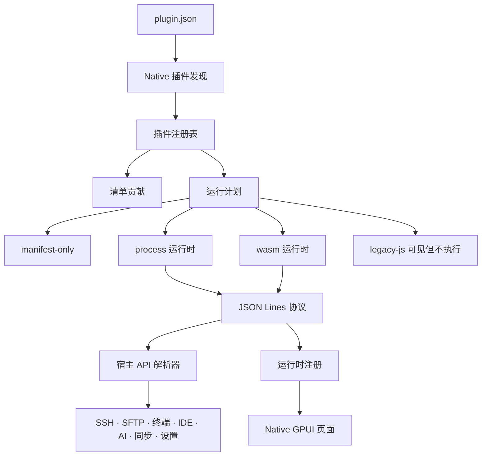

# Native 插件开发

本文档介绍 OxideTerm Native 插件模型。它和 Tauri/Web 插件模型不同：Native 插件不运行 React 组件，不注入 CSS，也不会通过 WebView 执行 `main.js`。Native 插件通过 `plugin.json` 被发现，然后要么只提供清单声明的元数据，要么通过宿主拥有的进程/WASM 运行时桥接运行。

## 目录

1. [Native 插件模型](#native-插件模型)
2. [Native 插件与 Tauri 插件的区别](#native-插件与-tauri-插件的区别)
3. [插件目录](#插件目录)
4. [最小清单插件](#最小清单插件)
5. [进程运行时插件](#进程运行时插件)
6. [协议帧](#协议帧)
7. [运行时注册](#运行时注册)
8. [声明式 Native 界面](#声明式-native-界面)
9. [宿主 API 调用](#宿主-api-调用)
10. [权限与能力](#权限与能力)
11. [设置、存储与凭据](#设置存储与凭据)
12. [终端、SFTP、转发、IDE 与 AI](#终端sftp转发ide-与-ai)
13. [打包与安装](#打包与安装)
14. [接口参考](#接口参考)
15. [宿主 API 参考](#宿主-api-参考)
16. [事件参考](#事件参考)
17. [调试](#调试)
18. [迁移说明](#迁移说明)

---

## Native 插件模型



宿主持有所有持久化和安全敏感边界：

- 清单解析与校验。
- 运行时启动和超时处理。
- 贡献注册和清理。
- 宿主 API 权限检查。
- 插件设置、存储和凭据。
- 通过 Native GPUI 控件渲染界面。

插件不会拿到原始 GPUI 元素、DOM 节点、React 实例、SSH 传输句柄，或越过宿主 API 的直接文件系统访问。

## Native 插件与 Tauri 插件的区别

| 区域 | Tauri/Web 插件 | Native 插件 |
|---|---|---|
| 运行时 | 通过动态导入加载 ESM `main.js` | `runtime.kind` 为 `process`、`wasm` 或 `manifest-only` |
| 界面 | React 组件和 CSS | GPUI 渲染的声明式 Native UI 结构 |
| 共享模块 | `window.__OXIDE__` | 不可用 |
| 样式 | CSS 和主题变量 | 只使用宿主拥有的 Native 控件 |
| 宿主 API | 冻结的 `PluginContext` 对象 | 带命名空间、方法和参数的 JSON 协议调用 |
| 旧 JS 插件 | 在 Tauri 中可执行 | 显示为 `legacy-js`，不执行 |
| 安全边界 | 浏览器膜层加 Tauri 命令 | 运行时桥、权限门、作用域存储和凭据 |

如果插件只有 `main` 而没有 Native `runtime` 块，Native 会把它归类为旧 JS 插件。它可以出现在插件管理器中用于迁移，但不会被执行。

## 插件目录

插件位于应用配置目录下：

```text
<config-dir>/plugins/<plugin-id>/
  plugin.json
  bin/
    plugin-runtime
  assets/
  locales/
```

使用 `oxideterm paths --json` 查看当前生效配置目录。CLI 可以在无界面流程中启用、禁用和检查插件状态，但交互式安装、更新和卸载由桌面插件管理器负责。

## 最小清单插件

清单插件适合静态元数据、声明式设置、AI 工具元数据和未来包迁移。它不执行代码。

```json
{
  "id": "com.example.audit",
  "name": "Audit Helper",
  "version": "0.1.0",
  "description": "Adds audit-related settings and tool metadata.",
  "author": "Example",
  "runtime": {
    "kind": "manifest-only",
    "entry": ""
  },
  "contributes": {
    "settings": [
      {
        "id": "scanDepth",
        "type": "number",
        "default": 3,
        "title": "Scan depth",
        "description": "Maximum audit depth."
      }
    ],
    "aiTools": [
      {
        "name": "audit_summarize",
        "description": "Summarize visible connection and terminal state.",
        "capabilities": ["state.list", "terminal.observe"],
        "risk": "read",
        "targetKinds": ["ssh-node", "terminal-session"]
      }
    ]
  }
}
```

支持的设置类型是 `string`、`number`、`boolean` 和 `select`。`select` 设置必须提供 `options`，选项值必须是字符串或数字。

## 进程运行时插件

进程插件是插件目录内的可执行文件。宿主通过 stdin/stdout 启动它，并交换换行分隔的 JSON 协议帧。

```json
{
  "id": "com.example.native-dashboard",
  "name": "Native Dashboard",
  "version": "0.1.0",
  "runtime": {
    "kind": "process",
    "entry": "./bin/native-dashboard"
  },
  "contributes": {
    "tabs": [
      { "id": "dashboard", "title": "Dashboard", "icon": "LayoutDashboard" }
    ],
    "sidebarPanels": [
      { "id": "dashboard-panel", "title": "Dashboard", "icon": "Activity", "position": "bottom" }
    ],
    "terminalHooks": {
      "shortcuts": [
        { "key": "Ctrl+Shift+D", "command": "dashboard.refresh" }
      ]
    },
    "apiCommands": [
      "app.getVersion",
      "connections.getAll",
      "ui.showToast"
    ]
  }
}
```

规则：

- `runtime.entry` 必须是插件目录内的相对路径。
- `process` 和 `wasm` 运行时的入口文件必须存在。
- 进程不能把普通人类日志写到 stdout。stdout 是协议通道。
- 诊断文本写到 stderr。
- 每个协议帧是一行 JSON 对象，以 `\n` 结尾。

## 协议帧

宿主会把每个请求和响应包在 envelope 中：

```json
{
  "protocolVersion": 1,
  "requestId": "activate-1",
  "payload": {
    "requestId": "activate-1",
    "kind": {
      "type": "activate",
      "manifest": {},
      "permissions": {
        "capabilities": [],
        "allowedHostApis": []
      }
    },
    "timeoutMs": 3000
  }
}
```

插件需要用相同 `requestId` 响应：

```json
{
  "protocolVersion": 1,
  "requestId": "activate-1",
  "payload": {
    "requestId": "activate-1",
    "result": {
      "status": "ok",
      "value": { "activated": true }
    }
  }
}
```

宿主可能发送 `activate`、`deactivate`、`dispatchCommand`、`sendEvent`、`callHostApi`、`health` 和 `kill` 等请求。插件可以发出 `runtimeReady`、`registerContribution`、`disposeContribution`、`callHostApi`、`emitEvent`、`reportProgress`、`log` 和 `runtimeError` 等出站帧。

## 运行时注册

运行时注册让正在运行的进程/WASM 插件增加宿主持有的贡献：

```json
{
  "protocolVersion": 1,
  "requestId": null,
  "payload": {
    "type": "registerContribution",
    "registration": {
      "registrationId": "cmd-refresh",
      "pluginId": "com.example.native-dashboard",
      "kind": "command",
      "metadata": {
        "id": "dashboard.refresh",
        "label": "Refresh Dashboard",
        "icon": "RefreshCw",
        "section": "Dashboard"
      }
    }
  }
}
```

常见注册类型：

| 类型 | 用途 |
|---|---|
| `command` | 添加命令面板动作，并派发回插件 |
| `keybinding` | 在内置快捷键未命中后添加快捷键 |
| `context-menu` | 为声明目标添加上下文菜单项 |
| `status-bar` | 添加宿主持有的状态栏项 |
| `tab` | 为已声明标签页注册声明式界面 |
| `sidebar-panel` | 为已声明面板注册声明式界面 |
| `event-subscription` | 订阅宿主事件 |
| `terminal-input-interceptor` | 转换或抑制终端输入 |
| `terminal-output-processor` | 在解析器前处理终端输出 |
| `terminal-shortcut` | 把终端快捷键处理附着到命令 |
| `progress` | 创建宿主持有的进度报告器 |

注册必须使用发出它的同一个插件 id。释放注册是幂等的，并由宿主执行。

## 声明式 Native 界面

Native 插件通过注册界面结构渲染界面，不注册组件。

```json
{
  "protocolVersion": 1,
  "requestId": null,
  "payload": {
    "type": "registerContribution",
    "registration": {
      "registrationId": "tab-dashboard",
      "pluginId": "com.example.native-dashboard",
      "kind": "tab",
      "metadata": {
        "tabId": "dashboard",
        "schema": {
          "kind": "form",
          "title": "Dashboard",
          "sections": [
            {
              "id": "overview",
              "title": "Overview",
              "controls": [
                { "kind": "markdown", "text": "Native plugin UI is host-rendered." },
                { "kind": "keyValue", "label": "Status", "value": "Ready" },
                { "kind": "progress", "label": "Sync", "value": 42 },
                { "kind": "button", "id": "refresh", "label": "Refresh" }
              ]
            }
          ]
        }
      }
    }
  }
}
```

支持的控件类型：

| 类型 | 说明 |
|---|---|
| `text`, `password`, `number`, `checkbox`, `select` | 字段控件，需要 `id` |
| `button` | 只有存在 `id` 且未禁用/加载中时才可操作 |
| `markdown` | 宿主渲染的文本块 |
| `code`, `codeBlock`, `code-block` | 代码块 |
| `statusBadge`, `status-badge` | 状态指示 |
| `progress` | 进度显示 |
| `table`, `list` | 结构化数据显示 |
| `emptyState`, `empty-state` | 空状态 |
| `divider` | 分隔线 |
| `keyValue`, `key-value`, `keyValueRow`, `key-value-row` | 键值行 |

按钮点击会作为插件 UI 事件传回。焦点、布局、无障碍、主题和控件渲染都由宿主持有。

## 宿主 API 调用

运行时插件通过命名空间、方法和 JSON 参数调用宿主 API：

```json
{
  "protocolVersion": 1,
  "requestId": null,
  "payload": {
    "type": "callHostApi",
    "requestId": "host-1",
    "namespace": "connections",
    "method": "getAll",
    "args": {}
  }
}
```

宿主会拒绝权限集中不允许的调用。`contributes.apiCommands` 也用于声明许多宿主调用。优先声明精确项，例如 `connections.getAll`；只有插件确实需要整个命名空间时才使用通配。

常见命名空间：

| 命名空间 | 常见用途 |
|---|---|
| `connections` | 读取保存/在线连接快照 |
| `sessions` | 读取节点树和活跃节点状态 |
| `terminal` | 观察缓冲区或发送已批准输入 |
| `sftp` | 通过节点拥有的 SFTP 列出、读取、写入远端文件 |
| `forward` | 列出、创建、停止转发 |
| `transfers` | 观察传输状态 |
| `profiler` | 读取节点指标 |
| `eventLog` | 读取应用事件日志 |
| `ide` | 观察 IDE 项目和打开文件状态 |
| `ai` | 读取已脱敏 AI 元数据 |
| `app` | 主题、平台、版本和设置快照 |
| `settings` | 插件设置和可同步设置 |
| `storage` | 插件作用域 JSON KV |
| `sync` | `.oxide`、保存连接、插件设置和同步元数据 |
| `secrets` | 插件作用域凭据存储 |
| `ui` | toast、确认对话框、布局和进度 |

## 权限与能力

Native 使用显式能力门。当前共享能力名称包括：

| 能力 | 含义 |
|---|---|
| `filesystem.read` | 通过已批准宿主 API 读取文件元数据或内容 |
| `filesystem.write` | 通过已批准宿主 API 修改文件 |
| `network.forward` | 创建或管理转发/网络桥接行为 |

AI 工具元数据还可以声明 `terminal.observe`、`terminal.send`、`state.list`、`settings.read`、`settings.write` 和 `plugin.invoke` 等语义能力。这些声明用于描述工具行为，服务于宿主和模型侧展示；它们不会绕过运行时权限检查。

## 设置、存储与凭据

按数据性质选择最小边界：

| 数据 | 边界 | 说明 |
|---|---|---|
| 用户可见插件选项 | `contributes.settings` 和 `settings.*` | 类型化值；不是凭据时可安全导入导出 |
| 插件内部缓存 | `storage.*` | 插件作用域 JSON KV，有大小限制 |
| token、密码、密钥 | `secrets.*` | 系统钥匙串支持的插件作用域凭据存储 |
| 跨机器插件偏好 | 插件设置导入导出或 `.oxide` | 不要包含原始凭据，除非加密便携流程明确支持 |

不要把凭据写进插件 id、名称、标签、日志、AI 提示词、事件载荷或支持包。

## 终端、SFTP、转发、IDE 与 AI

Native 插件应尽量使用稳定节点 id：

- 使用节点/会话快照，不要假设当前终端标签页就是所有者。
- 终端输入钩子出错或超时时必须失败开放。
- SFTP 修改操作需要文件写能力和在线节点。
- 转发调用需要网络转发能力，并应处理已挂起节点。
- IDE API 暴露项目和打开文件元数据，不暴露任意编辑器内部状态。
- AI API 暴露已脱敏元数据，避免暴露工具消息内容。

破坏性动作应表示为宿主可见命令或带清晰风险元数据的 AI 工具。

## 打包与安装

推荐包形状：

```text
com.example.native-dashboard/
  plugin.json
  bin/
    native-dashboard
  README.md
  LICENSE
```

打包规则：

- 插件根目录或单层嵌套插件目录必须包含 `plugin.json`。
- 归档条目不能逃逸插件目录。
- 包大小和条目数量应低于宿主限制。
- 一个包优先只包含一个插件 id。
- 使用类似 semver 的版本，便于更新检查比较。
- 除非入口本身可移植，否则运行时二进制应按平台分发。

开发时：

1. 将插件目录复制到 `<config-dir>/plugins/`。
2. 打开桌面插件管理器。
3. 启用或重新加载插件。
4. 检查状态、错误和权限。
5. 只在无界面状态/设置检查中使用 CLI：

```sh
oxideterm plugins list --json
oxideterm plugins enable com.example.native-dashboard --dry-run --json
oxideterm plugins settings export --json
```

## 接口参考

### 清单接口

```ts
interface NativePluginManifest {
  id: string;
  name: string;
  version: string;
  description?: string;
  author?: string;
  main?: string; // Tauri 旧 JS 入口；Native 可见但不执行。
  engines?: { oxideterm?: string };
  manifestVersion?: number;
  format?: string;
  assets?: string;
  styles?: string[];
  sharedDependencies?: Record<string, string>;
  repository?: string;
  checksum?: string;
  contributes?: NativePluginContributes;
  locales?: string;
  runtime?: NativePluginRuntime;
}

interface NativePluginRuntime {
  kind: 'wasm' | 'process' | 'manifest-only';
  entry: string;
}

interface NativePluginContributes {
  tabs?: NativePluginTabDef[];
  sidebarPanels?: NativePluginSidebarDef[];
  settings?: NativePluginSettingDef[];
  terminalHooks?: NativePluginTerminalHooksDef;
  terminalTransports?: string[];
  connectionHooks?: Array<'onConnect' | 'onDisconnect' | 'onReconnect' | 'onLinkDown'>;
  aiTools?: NativePluginAiToolDef[];
  apiCommands?: string[];
}

interface NativePluginTabDef {
  id: string;
  title: string;
  icon: string;
}

interface NativePluginSidebarDef {
  id: string;
  title: string;
  icon: string;
  position?: 'top' | 'bottom';
}

interface NativePluginSettingDef {
  id: string;
  type: 'string' | 'number' | 'boolean' | 'select';
  default: unknown;
  title: string;
  description?: string;
  options?: Array<{ label: string; value: string | number }>;
}

interface NativePluginTerminalHooksDef {
  inputInterceptor?: boolean;
  outputProcessor?: boolean;
  shortcuts?: Array<{ key: string; command: string }>;
}

interface NativePluginAiToolDef {
  name: string;
  description: string;
  parameters?: unknown;
  capabilities?: string[];
  risk?: 'read' | 'write-file' | 'execute-command' | 'interactive-input' | 'destructive' | 'network-expose' | 'settings-change' | 'credential-sensitive';
  targetKinds?: Array<'local-shell' | 'ssh-node' | 'terminal-session' | 'sftp-session' | 'ide-workspace' | 'app-tab' | 'mcp-server' | 'rag-index'>;
  resultSchema?: unknown;
}
```

校验规则：

- `id`、`name`、`version`、贡献 id、标题和图标必须是非空文本。
- 相对路径必须留在插件目录内。
- `terminalTransports` 当前接受 `telnet`。
- `apiCommands` 条目是宿主 API 名称，例如 `connections.getAll` 或 `sftp.listDir`。
- 只有旧 `main` 且没有 `runtime` 时，插件状态为 `legacy-js`，不会执行。

### 协议接口

```ts
interface PluginProtocolEnvelope<T> {
  protocolVersion: 1;
  requestId?: string | null;
  payload: T;
}

interface PluginRequest {
  requestId: string;
  kind:
    | { type: 'activate'; manifest: NativePluginManifest; permissions: PluginPermissionSet }
    | { type: 'deactivate' }
    | { type: 'callHostApi'; namespace: string; method: string; args?: unknown }
    | { type: 'dispatchCommand'; command: string; args?: unknown }
    | { type: 'sendEvent'; event: PluginEvent }
    | { type: 'cancelRequest'; requestId: string }
    | { type: 'health' }
    | { type: 'kill' };
  timeoutMs?: number;
}

interface PluginResponse {
  requestId: string;
  result:
    | { status: 'ok'; value: unknown }
    | { status: 'error'; error: PluginError };
}

interface PluginError {
  kind: string;
  code: string;
  message: string;
}

interface PluginPermissionSet {
  capabilities: string[];
  allowedHostApis: string[];
}

interface PluginEvent {
  name: string;
  payload?: unknown;
}
```

### 出站消息接口

```ts
type PluginOutboundMessage =
  | { type: 'registerContribution'; registration: PluginRegistration }
  | { type: 'disposeContribution'; registrationId: string }
  | { type: 'log'; level: 'debug' | 'info' | 'warn' | 'error'; message: string }
  | { type: 'reportProgress'; registrationId: string; value: unknown }
  | { type: 'runtimeReady' }
  | { type: 'runtimeError'; error: PluginError }
  | { type: 'emitEvent'; event: PluginEvent }
  | { type: 'callHostApi'; requestId: string; namespace: string; method: string; args?: unknown };

interface PluginRegistration {
  registrationId: string;
  pluginId: string;
  kind:
    | 'command'
    | 'keybinding'
    | 'context-menu'
    | 'status-bar'
    | 'tab'
    | 'sidebar-panel'
    | 'terminal-input-interceptor'
    | 'terminal-output-processor'
    | 'terminal-shortcut'
    | 'event-subscription'
    | 'progress';
  metadata?: unknown;
}
```

### 注册元数据

| 注册类型 | 必需元数据 | 可选元数据 |
|---|---|---|
| `command` | `id` 或 `command`、`label` | `icon`、`shortcut`、`section` |
| `keybinding` | `keybinding` 或 `key`、`command`、`label` | `when` |
| `context-menu` | `target`、`items` | 目标相关菜单项元数据 |
| `status-bar` | `text` | `alignment`、`icon`、`tooltip` |
| `tab` | `tabId`、`schema` | schema 内的 `title` |
| `sidebar-panel` | `panelId`、`schema` | `position`、schema 内的 `title` |
| `event-subscription` | `event` 或 `namespace` + `method` | 部分事件族支持 `nodeId` 过滤 |
| `terminal-input-interceptor` | `command` 或 `id` | 无 |
| `terminal-output-processor` | `command` 或 `id` | 无 |
| `terminal-shortcut` | `command` 或 `id` | 使用清单里声明的快捷键 |
| `progress` | `id` 或生成的 id | `title`、`message` |

### 声明式界面接口

```ts
interface NativePluginDeclarativeUiSchema {
  kind?: 'form';
  title?: string;
  description?: string;
  sections?: NativePluginDeclarativeUiSection[];
  controls?: NativePluginDeclarativeUiControl[];
}

interface NativePluginDeclarativeUiSection {
  id: string;
  title?: string;
  description?: string;
  controls?: NativePluginDeclarativeUiControl[];
}

interface NativePluginDeclarativeUiControl {
  kind:
    | 'text'
    | 'password'
    | 'number'
    | 'checkbox'
    | 'select'
    | 'button'
    | 'markdown'
    | 'code'
    | 'codeBlock'
    | 'code-block'
    | 'statusBadge'
    | 'status-badge'
    | 'progress'
    | 'table'
    | 'list'
    | 'emptyState'
    | 'empty-state'
    | 'divider'
    | 'keyValue'
    | 'key-value'
    | 'keyValueRow'
    | 'key-value-row';
  id?: string;
  label?: string;
  description?: string;
  value?: unknown;
  text?: string;
  language?: string;
  options?: Array<{ label: string; value: unknown }>;
  rows?: unknown[];
  columns?: string[];
  disabled?: boolean;
  loading?: boolean;
}
```

`text`、`password`、`number`、`checkbox`、`select` 和 `button` 控件需要 `id`。按钮只有在存在 `id`、未禁用且不处于加载中时才可操作。

## 宿主 API 参考

所有宿主 API 使用同一种调用结构：

```ts
interface HostCall {
  requestId: string;
  namespace: string;
  method: string;
  args?: unknown;
}
```

调用必须出现在 `allowedHostApis` 中。支持精确名称和命名空间通配，例如 `connections.getAll` 和 `connections.*`。

`api.invoke` 还有额外白名单：`args.command` 必须同时出现在 `contributes.apiCommands` 中。

| `api.invoke` 命令 | Native 适配器 |
|---|---|
| `ssh_get_pool_stats` | SSH 连接池统计 |
| `list_connections` | 保存/已知连接快照 |
| `get_app_version` | 应用版本 |
| `get_system_info` | 平台、架构、系统和系统族 |
| `sftp_cancel_transfer` | 按 `transferId` 取消传输 |
| `sftp_pause_transfer` | 按 `transferId` 暂停传输 |
| `sftp_resume_transfer` | 按 `transferId` 恢复传输 |
| `sftp_transfer_stats` | 传输队列统计 |
| `node_sftp_init` | `sftp.init` 适配器 |
| `node_sftp_list_dir` | `sftp.listDir` 适配器 |
| `node_sftp_stat` | `sftp.stat` 适配器 |
| `node_sftp_preview` | `sftp.preview` 适配器 |
| `node_sftp_write` | `sftp.write` 适配器 |
| `node_sftp_download` | `sftp.download` 适配器 |
| `node_sftp_upload` | `sftp.upload` 适配器 |
| `node_sftp_mkdir` | `sftp.mkdir` 适配器 |
| `node_sftp_delete` | `sftp.delete` 适配器 |
| `node_sftp_delete_recursive` | `sftp.deleteRecursive` 适配器 |
| `node_sftp_rename` | `sftp.rename` 适配器 |
| `node_sftp_download_dir` | `sftp.downloadDir` 适配器 |
| `node_sftp_upload_dir` | `sftp.uploadDir` 适配器 |
| `node_sftp_tar_probe` | `sftp.tarProbe` 适配器 |
| `node_sftp_tar_upload` | `sftp.tarUpload` 适配器 |
| `node_sftp_tar_download` | `sftp.tarDownload` 适配器 |
| `list_port_forwards` | `forward.list` 适配器 |
| `create_port_forward` | `forward.create` 适配器 |
| `stop_port_forward` | `forward.stop` 适配器 |
| `delete_port_forward` | `forward.delete` 适配器 |
| `restart_port_forward` | `forward.restart` 适配器 |
| `update_port_forward` | `forward.update` 适配器 |
| `get_port_forward_stats` | `forward.getStats` 适配器 |
| `stop_all_forwards` | `forward.stopAll` 适配器 |
| `plugin_http_request` | HTTP/HTTPS 请求适配器，正文上限 10 MiB |

### App、布局、设置、i18n

| 宿主 API | 参数 | 返回 |
|---|---|---|
| `api.invoke` | `{ command: string, args?: object }` | `contributes.apiCommands` 已声明命令的适配器结果 |
| `app.getTheme` | `{}` | `{ name, isDark }` |
| `app.getSettings` | `{ category: string }` | 设置部分 JSON |
| `app.getVersion` | `{}` | 版本字符串 |
| `app.getPlatform` | `{}` | 平台字符串 |
| `app.getLocale` | `{}` | 语言字符串 |
| `app.getPoolStats` | `{}` | 类似 `{ activeConnections, totalSessions }` 的统计 |
| `app.refreshAfterExternalSync` | `{}` | 单向刷新工作区效果 |
| `ui.getLayout` | `{}` | 布局快照 |
| `ui.registerTabView` | `{ tabId: string, schema: NativePluginDeclarativeUiSchema }` | 声明式标签页注册结果 |
| `ui.registerSidebarPanel` | `{ panelId: string, schema: NativePluginDeclarativeUiSchema }` | 声明式侧边栏注册结果 |
| `ui.openTab` | `{ tabId: string }` | 打开或聚焦已声明插件标签页 |
| `ui.showToast` | `{ title?: string, description?: string, variant?: string }` | 单向 toast 效果 |
| `ui.showNotification` | `{ title?: string, body?: string, severity?: string }` | 单向通知效果 |
| `ui.showConfirm` | `{ title: string, description: string }` | `boolean` |
| `ui.showProgress` | `{ title?: string, message?: string, registrationId?: string, id?: string }` | `{ id, registrationId }` |
| `events.emit` | `{ name: string, payload?: unknown }` | `{ emitted: true, event }` |
| `settings.get` | `{ key: string }` | 插件设置值或 `null` |
| `settings.set` | `{ key: string, value: unknown }` | 单向设置写入 |
| `settings.exportSyncableSettings` | `{}` | `{ revision, exportedAt, payload, warnings }` |
| `settings.applySyncableSettings` | `{ payload: object }` | `{ revision, appliedPayload, warnings }` |
| `i18n.getLanguage` | `{}` | 语言字符串 |
| `i18n.t` | `{ key: string }` | 翻译文本或回退 key |

### 连接与会话

| 宿主 API | 参数 | 返回 |
|---|---|---|
| `connections.getAll` | `{}` | 连接快照 |
| `connections.get` | `{ connectionId: string }` | 连接快照或 `null` |
| `connections.getState` | `{ connectionId: string }` | 连接状态或 `null` |
| `connections.getByNode` | `{ nodeId: string }` | 连接快照或 `null` |
| `sessions.getTree` | `{}` | 节点树快照 |
| `sessions.getActiveNodes` | `{}` | 活跃/已连接节点快照 |
| `sessions.getNodeState` | `{ nodeId: string }` | 节点状态或 `null` |
| `eventLog.getEntries` | `{ severity?: string, category?: string, limit?: number }` | 事件日志条目 |

### 终端

| 宿主 API | 参数 | 返回 |
|---|---|---|
| `terminal.getActiveTarget` | `{}` | 活跃终端目标快照 |
| `terminal.getNodeBuffer` | `{ nodeId: string }` | 终端缓冲文本或 `null` |
| `terminal.getNodeSelection` | `{ nodeId: string }` | 选中文本或 `null` |
| `terminal.search` | `{ nodeId: string, query: string, regex?: boolean, caseSensitive?: boolean, wholeWord?: boolean, maxResults?: number }` | 搜索匹配 |
| `terminal.getScrollBuffer` | `{ nodeId: string, start?: number, limit?: number }` | 有界滚动缓冲区行 |
| `terminal.getBufferSize` | `{ nodeId: string }` | 缓冲区大小摘要 |
| `terminal.writeToActive` | `{ text: string }` | `boolean` |
| `terminal.writeToNode` | `{ nodeId: string, text: string }` | `boolean` |
| `terminal.clearBuffer` | `{ nodeId: string }` | 清理结果 |
| `terminal.openTelnet` | `{ host: string, port?: number }` | `{ sessionId, info }` |

### SFTP 与传输

| 宿主 API | 能力 | 参数 | 返回 |
|---|---|---|---|
| `sftp.init` | `filesystem.read` | `{ nodeId: string }` | 会话状态 |
| `sftp.listDir` | `filesystem.read` | `{ nodeId: string, path: string }` | 目录条目 |
| `sftp.stat` | `filesystem.read` | `{ nodeId: string, path: string }` | 文件元数据 |
| `sftp.readFile` | `filesystem.read` | `{ nodeId: string, path: string }` | 文件内容载荷 |
| `sftp.preview` | `filesystem.read` | `{ nodeId: string, path: string }` | 预览载荷 |
| `sftp.download` | `filesystem.read` | `{ nodeId: string, remotePath: string, localPath: string }` | 传输结果 |
| `sftp.downloadDir` | `filesystem.read` | `{ nodeId: string, remotePath: string, localPath: string }` | 传输结果 |
| `sftp.tarProbe` | `filesystem.read` | `{ nodeId: string, path: string }` | tar 能力/探测结果 |
| `sftp.tarDownload` | `filesystem.read` | `{ nodeId: string, remotePath: string, localPath: string }` | 传输结果 |
| `sftp.writeFile` | `filesystem.write` | `{ nodeId: string, path: string, content: string }` | 写入结果 |
| `sftp.write` | `filesystem.write` | `{ nodeId: string, path: string, content: string }` | 写入结果 |
| `sftp.upload` | `filesystem.write` | `{ nodeId: string, localPath: string, remotePath: string }` | 传输结果 |
| `sftp.uploadDir` | `filesystem.write` | `{ nodeId: string, localPath: string, remotePath: string }` | 传输结果 |
| `sftp.tarUpload` | `filesystem.write` | `{ nodeId: string, localPath: string, remotePath: string }` | 传输结果 |
| `sftp.mkdir` | `filesystem.write` | `{ nodeId: string, path: string }` | 目录结果 |
| `sftp.delete` | `filesystem.write` | `{ nodeId: string, path: string }` | 删除结果 |
| `sftp.deleteRecursive` | `filesystem.write` | `{ nodeId: string, path: string }` | 递归删除结果 |
| `sftp.rename` | `filesystem.write` | `{ nodeId: string, oldPath: string, newPath: string }` | 重命名结果 |
| `transfers.getAll` | 只读 | `{}` | 传输快照 |
| `transfers.getByNode` | 只读 | `{ nodeId: string }` | 节点传输快照 |

### 转发

| 宿主 API | 能力 | 参数 | 返回 |
|---|---|---|---|
| `forward.list` | 只读 | `{ nodeId?: string }` | 活跃转发规则 |
| `forward.listSavedForwards` | 只读 | `{}` | 保存转发规则 |
| `forward.exportSavedForwardsSnapshot` | 只读 | `{}` | 保存转发同步快照 |
| `forward.applySavedForwardsSnapshot` | `network.forward` | `{ snapshot: object, strategy?: string }` | 应用结果 |
| `forward.create` | `network.forward` | `{ nodeId: string, type: 'local' | 'remote' | 'dynamic', localPort?: number, remoteHost?: string, remotePort?: number }` | 创建的规则 |
| `forward.stop` | `network.forward` | `{ id: string }` | 停止结果 |
| `forward.delete` | `network.forward` | `{ id: string }` | 删除结果 |
| `forward.restart` | `network.forward` | `{ id: string }` | 重启结果 |
| `forward.update` | `network.forward` | `{ id: string, ...changes }` | 更新结果 |
| `forward.stopAll` | `network.forward` | `{ nodeId?: string }` | 全部停止结果 |
| `forward.getStats` | 只读 | `{}` | 转发统计 |

### 同步、存储、凭据

| 宿主 API | 参数 | 返回 |
|---|---|---|
| `storage.get` | `{ key: string }` | JSON 值或 `null` |
| `storage.set` | `{ key: string, value: unknown }` | 单向写入 |
| `storage.remove` | `{ key: string }` | 单向删除 |
| `secrets.get` | `{ key: string }` | 凭据字符串或 `null` |
| `secrets.getMany` | `{ keys: string[] }` | key 到凭据/null 的映射 |
| `secrets.set` | `{ key: string, value: string }` | 空值表示删除 |
| `secrets.has` | `{ key: string }` | `boolean` |
| `secrets.delete` | `{ key: string }` | 删除结果 |
| `sync.listSavedConnections` | `{}` | 保存连接快照 |
| `sync.refreshSavedConnections` | `{}` | 刷新后的保存连接快照 |
| `sync.exportSavedConnectionsSnapshot` | `{}` | 保存连接同步快照 |
| `sync.applySavedConnectionsSnapshot` | `{ snapshot: object, conflictStrategy?: 'rename' | 'skip' | 'replace' | 'merge' }` | 应用结果 |
| `sync.getLocalSyncMetadata` | `{}` | revision 元数据 |
| `sync.preflightExport` | `{ connectionIds?: string[], embedKeys?: boolean }` | 导出预检查结果 |
| `sync.exportOxide` | `{ connectionIds?: string[], password: string, embedKeys?: boolean, includeAppSettings?: boolean, selectedAppSettingsSections?: string[], includePluginSettings?: boolean, selectedPluginIds?: string[], progressRegistrationId?: string }` | `.oxide` 字节/元数据结果 |
| `sync.validateOxide` | `{ fileData: number[] }` | `.oxide` 元数据 |
| `sync.previewImport` | `{ fileData: number[], password: string, conflictStrategy?: string, progressRegistrationId?: string }` | 导入预览 |
| `sync.importOxide` | `{ fileData: number[], password: string, conflictStrategy?: string, progressRegistrationId?: string, selectedNames?: string[], selectedForwardIds?: string[], importForwards?: boolean, importPortableSecrets?: boolean, importAppSettings?: boolean, selectedAppSettingsSections?: string[], importPluginSettings?: boolean, selectedPluginIds?: string[], importQuickCommands?: boolean }` | 导入结果 |

### IDE、AI、Profiler

| 宿主 API | 参数 | 返回 |
|---|---|---|
| `ide.isOpen` | `{}` | `boolean` |
| `ide.getProject` | `{}` | 项目快照或 `null` |
| `ide.getOpenFiles` | `{}` | 打开文件快照 |
| `ide.getActiveFile` | `{}` | 活跃文件快照或 `null` |
| `ai.getConversations` | `{}` | 已脱敏对话摘要 |
| `ai.getMessages` | `{ conversationId: string }` | 已脱敏消息 |
| `ai.getActiveProvider` | `{}` | 活跃供应商摘要或 `null` |
| `ai.getAvailableModels` | `{}` | 模型名称 |
| `profiler.getMetrics` | `{ nodeId: string }` | 指标快照或 `null` |
| `profiler.getHistory` | `{ nodeId: string, limit?: number }` | 指标历史 |
| `profiler.isRunning` | `{ nodeId: string }` | `boolean` |

## 事件参考

通过 `event-subscription` 注册订阅，可以直接提供 `event`，也可以提供 Tauri 风格的 `namespace` + `method`。

| Namespace + method | 事件 key |
|---|---|
| `app.onThemeChange` | `app.themeChanged` |
| `app.onSettingsChange` | `app.settingsChanged` |
| `i18n.onLanguageChange` | `i18n.languageChanged` |
| `settings.onChange` | `settings.changed` |
| `ui.onLayoutChange` | `ui.layoutChanged` |
| `sessions.onTreeChange` | `sessions.treeChanged` |
| `sessions.onNodeStateChange` | `sessions.nodeStateChanged` |
| `eventLog.onEntry` | `eventLog.entry` |
| `forward.onSavedForwardsChange` | `forward.savedForwardsChanged` |
| `transfers.onProgress` | `transfers.progress` |
| `transfers.onComplete` | `transfers.complete` |
| `transfers.onError` | `transfers.error` |
| `profiler.onMetrics` | `profiler.metrics` |
| `ide.onFileOpen` | `ide.fileOpen` |
| `ide.onFileClose` | `ide.fileClose` |
| `ide.onActiveFileChange` | `ide.activeFileChanged` |
| `ai.onMessage` | `ai.message` |
| `events.onConnect` | `lifecycle.onConnect` |
| `events.onDisconnect` | `lifecycle.onDisconnect` |
| `events.onLinkDown` | `lifecycle.onLinkDown` |
| `events.onReconnect` | `lifecycle.onReconnect` |

自定义插件事件走 `events.on` / `events.emit` 路径，并按插件 id 作用域隔离，避免插件抢占任意全局事件名。

## 调试

先从插件管理器开始：

- 检查插件是 `ready`、`disabled`、`legacy-js`、`error` 还是 `auto-disabled`。
- 调试运行时代码前，先检查清单校验错误。
- 进程诊断文本写 stderr。
- stdout 严格保持 JSON Lines 协议。
- 开发时一次只注册一个贡献。
- 确认 `registrationId` 在插件内稳定且唯一。
- 确认每个宿主调用都已声明并被允许。
- 使用 `oxideterm plugins list --json` 检查无界面状态。
- 使用 `oxideterm plugins settings export --json` 检查插件设置。

如果进程插件已激活但界面没有出现，检查两侧：

- `contributes.tabs` 或 `contributes.sidebarPanels` 声明了页面 id。
- 运行时注册使用相同的 `tabId` 或 `panelId`。
- 界面结构的 `kind` 是 `form`。
- 界面结构至少包含一个 section 或顶层控件。
- 需要 id 的控件已经设置 `id`。

## 迁移说明

不要直接复制 Tauri 插件的 `main.js`。

| Tauri 概念 | Native 替代 |
|---|---|
| `main.js` ESM `activate(ctx)` | 使用 JSON 协议的进程/WASM 运行时 |
| React 标签页/侧边栏组件 | 声明式 Native UI 结构 |
| CSS 文件 | 宿主渲染控件和主题 |
| `window.__OXIDE__` | 宿主 API 调用和协议帧 |
| 直接 JS 事件总线 | `event-subscription` 注册和 `sendEvent` 请求 |
| Tauri 命令导入 | 清单声明的宿主 API 调用 |
| 浏览器 asset URL | 未来宿主持有的资源句柄 |

尽量保留公共插件意图、清单 id、设置 id 和工具元数据。把浏览器实现细节替换为 Native 进程/WASM 协议行为。
