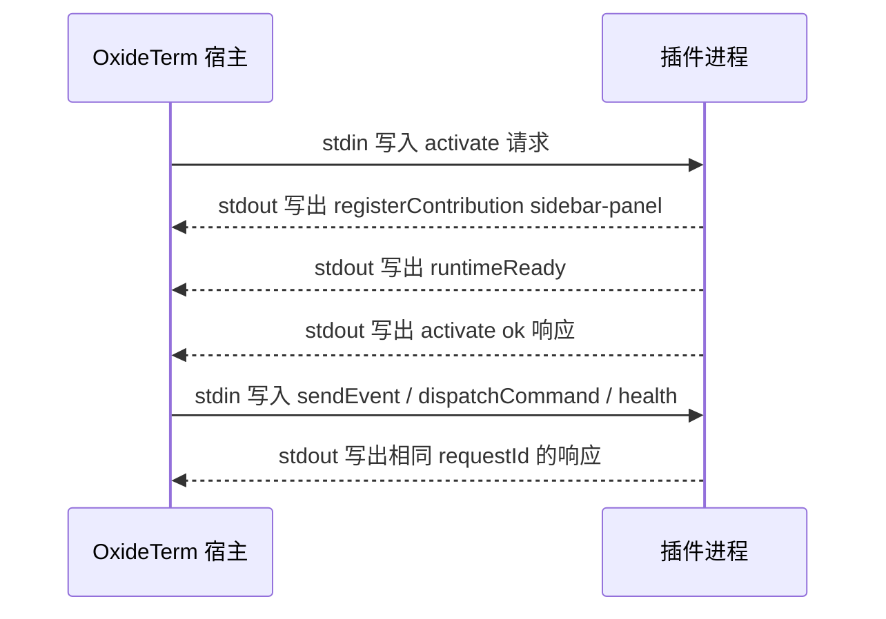
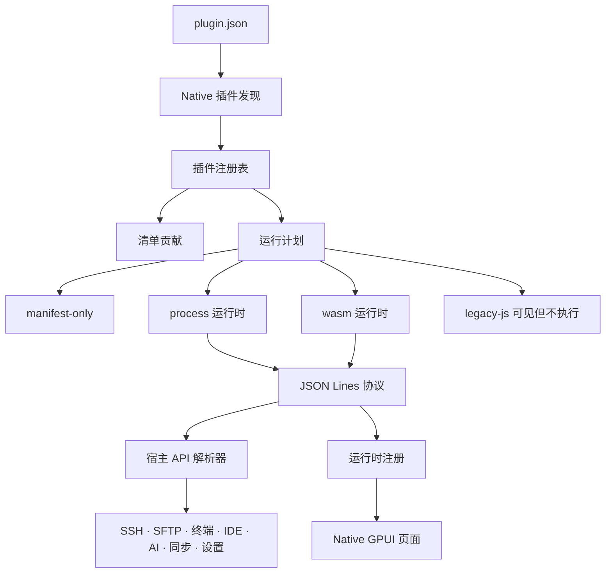

# Native 插件开发

本文档介绍 OxideTerm Native 插件模型。它和 Tauri/Web 插件模型不同：Native 插件不运行 React 组件，不注入 CSS，也不会通过 WebView 执行 `main.js`。Native 插件通过 `plugin.json` 被发现，然后要么只提供清单声明的元数据，要么通过宿主拥有的进程/WASM 运行时桥接运行。

## 目录

1. [写出一个可运行插件](#写出一个可运行插件)
2. [运行时通信过程](#运行时通信过程)
3. [在插件代码里调用宿主](#在插件代码里调用宿主)
4. [界面与事件写法](#界面与事件写法)
5. [常见失败检查](#常见失败检查)
6. [Native 插件模型](#native-插件模型)
7. [Native 插件与 Tauri 插件的区别](#native-插件与-tauri-插件的区别)
8. [插件目录](#插件目录)
9. [最小清单插件](#最小清单插件)
10. [进程运行时插件](#进程运行时插件)
11. [协议帧](#协议帧)
12. [运行时注册](#运行时注册)
13. [声明式 Native 界面](#声明式-native-界面)
14. [宿主 API 调用](#宿主-api-调用)
15. [权限与能力](#权限与能力)
16. [设置、存储与凭据](#设置存储与凭据)
17. [终端、SFTP、转发、IDE 与 AI](#终端sftp转发ide-与-ai)
18. [打包与安装](#打包与安装)
19. [接口参考](#接口参考)
20. [宿主 API 参考](#宿主-api-参考)
21. [事件参考](#事件参考)
22. [调试](#调试)
23. [迁移说明](#迁移说明)

---

## 写出一个可运行插件

先从进程插件开始。进程运行时最容易调试，因为所有消息都是 stdin/stdout 上的一行一个 JSON 对象。

在用户插件目录里创建这个目录：

```text
hello-native/
  plugin.json
  bin/
    hello.js
```

进程入口必须是插件目录内的真实可执行文件。macOS/Linux 上需要给脚本加可执行权限：

```sh
chmod +x hello-native/bin/hello.js
```

使用这个清单：

```json
{
  "id": "com.example.hello-native",
  "name": "Hello Native",
  "version": "0.1.0",
  "description": "Minimal native process plugin.",
  "runtime": {
    "kind": "process",
    "entry": "bin/hello.js"
  },
  "permissions": {
    "capabilities": [
      "legacy.invoke",
      "ui.write"
    ]
  },
  "contributes": {
    "sidebarPanels": [
      {
        "id": "hello-panel",
        "title": "Hello",
        "icon": "panel-left",
        "position": "top"
      }
    ],
    "settings": [
      {
        "id": "message",
        "type": "string",
        "default": "Hello from a native plugin",
        "title": "Message"
      }
    ],
    "apiCommands": [
      "get_app_version"
    ]
  }
}
```

使用这个进程入口：

```js
#!/usr/bin/env node

const readline = require("node:readline");

const pluginId = "com.example.hello-native";
let nextHostRequest = 1;
const pendingHostCalls = new Map();

// Keep stdout reserved for protocol frames.
function writeFrame(payload, requestId = null) {
  process.stdout.write(JSON.stringify({
    protocolVersion: 1,
    requestId,
    payload
  }) + "\n");
}

function respondOk(requestId, value) {
  writeFrame({
    requestId,
    result: {
      status: "ok",
      value
    }
  }, requestId);
}

function respondError(requestId, code, message) {
  writeFrame({
    requestId,
    result: {
      status: "error",
      error: {
        code,
        message,
        recoverable: false
      }
    }
  }, requestId);
}

function registerPanel() {
  writeFrame({
    type: "registerContribution",
    registration: {
      registrationId: "hello-panel-view",
      pluginId,
      kind: "sidebar-panel",
      metadata: {
        panelId: "hello-panel",
        schema: {
          kind: "form",
          title: "Hello Native",
          sections: [
            {
              id: "main",
              controls: [
                {
                  kind: "markdown",
                  text: "This panel was registered by a native process plugin."
                },
                {
                  kind: "button",
                  id: "refresh",
                  label: "Refresh"
                }
              ]
            }
          ]
        }
      }
    }
  });
}

// Returnable host calls are matched by requestId.
function callHost(namespace, method, args = {}) {
  const requestId = `host-${nextHostRequest++}`;
  writeFrame({
    type: "callHostApi",
    requestId,
    namespace,
    method,
    args
  });
  return new Promise((resolve, reject) => {
    pendingHostCalls.set(requestId, { resolve, reject });
  });
}

// Host-call responses arrive on stdin like normal host requests.
function handleHostResponse(payload) {
  const pending = pendingHostCalls.get(payload.requestId);
  if (!pending) {
    return false;
  }
  pendingHostCalls.delete(payload.requestId);
  if (payload.result.status === "ok") {
    pending.resolve(payload.result.value);
  } else {
    pending.reject(new Error(payload.result.error.message));
  }
  return true;
}

// Host requests and host-call responses share the same input stream.
async function handleRequest(envelope) {
  const request = envelope.payload;
  if (handleHostResponse(request)) {
    return;
  }

  const requestId = request.requestId;
  switch (request.kind.type) {
    case "activate":
      registerPanel();
      writeFrame({
        type: "runtimeReady"
      });
      respondOk(requestId, { activated: true });
      break;
    case "sendEvent":
      respondOk(requestId, { received: request.kind.event.name });
      break;
    case "health":
      respondOk(requestId, { ok: true });
      break;
    case "deactivate":
    case "kill":
      respondOk(requestId, { stopped: true });
      process.exit(0);
      break;
    case "dispatchCommand":
      try {
        const version = await callHost("api", "invoke", {
          command: "get_app_version",
          args: {}
        });
        respondOk(requestId, { version });
      } catch (error) {
        respondError(requestId, "command_failed", error.message);
      }
      break;
    default:
      respondError(requestId, "unsupported_request", `Unsupported request ${request.kind.type}`);
  }
}

readline.createInterface({
  input: process.stdin,
  crlfDelay: Infinity
}).on("line", (line) => {
  if (!line.trim()) {
    return;
  }
  handleRequest(JSON.parse(line)).catch((error) => {
    process.stderr.write(`Plugin error: ${error.stack || error.message}\n`);
  });
});
```

这个例子展示了最重要的约定：

- `stdout` 只能写协议帧，一行一个 JSON 对象。
- `stderr` 才能写给人看的诊断文本。
- 插件必须用相同的 `requestId` 回答激活请求。
- 运行时界面不是 React，而是通过 `sidebar-panel` 或 `tab` 注册的声明式结构。
- 需要返回值的宿主调用用出站 `callHostApi` 帧发送；宿主会把结果写回插件的 stdin。

如果需要完整的仓库示例，可参考 [Host Tools Dashboard](../../../examples/plugins/host-tools-dashboard/README.md)。它会同时注册标签页和左侧活动栏面板，自动发现活动节点，并运行清单中声明的自定义 Host Tools 监控。

## 运行时通信过程

进程运行时只有一条按行分隔的通信通道。



宿主发给插件的激活请求。这里缩短了 `manifest` 和 `allowedHostApis`；真实请求会携带解析后的 `plugin.json` 和完整的最终生效白名单：

```json
{
  "protocolVersion": 1,
  "requestId": "activate:com.example.hello-native",
  "payload": {
    "requestId": "activate:com.example.hello-native",
    "kind": {
      "type": "activate",
      "manifest": {
        "id": "com.example.hello-native",
        "name": "Hello Native",
        "version": "0.1.0"
      },
      "permissions": {
        "capabilities": [
          "legacy.invoke",
          "runtime.process.trusted",
          "ui.write"
        ],
        "allowedHostApis": [
          "api.invoke",
          "app.getVersion",
          "connections.getSummaries",
          "settings.get",
          "ui.registerSidebarPanel",
          "ui.registerActivityBarItem"
        ]
      }
    },
    "timeoutMs": 5000
  }
}
```

插件回给宿主的激活响应：

```json
{
  "protocolVersion": 1,
  "requestId": "activate:com.example.hello-native",
  "payload": {
    "requestId": "activate:com.example.hello-native",
    "result": {
      "status": "ok",
      "value": {
        "activated": true
      }
    }
  }
}
```

错误响应：

```json
{
  "protocolVersion": 1,
  "requestId": "activate:com.example.hello-native",
  "payload": {
    "requestId": "activate:com.example.hello-native",
    "result": {
      "status": "error",
      "error": {
        "code": "invalid_config",
        "message": "Missing required plugin setting",
        "recoverable": false
      }
    }
  }
}
```

插件发给宿主的 Host API 调用：

```json
{
  "protocolVersion": 1,
  "requestId": null,
  "payload": {
    "type": "callHostApi",
    "requestId": "host-1",
    "namespace": "app",
    "method": "getVersion",
    "args": {}
  }
}
```

宿主写回插件的 Host API 响应：

```json
{
  "protocolVersion": 1,
  "requestId": "host-1",
  "payload": {
    "requestId": "host-1",
    "result": {
      "status": "ok",
      "value": "0.1.0"
    }
  }
}
```

进程桥会在消息进入工作区之前拒绝无效帧。常见拒绝原因包括 `protocolVersion` 不支持、响应缺少 `requestId`、响应 id 不匹配、注册信息不属于当前插件，以及 stdout 输出了非 JSON 文本。

## 在插件代码里调用宿主

宿主调用不是全局 JavaScript 函数，而是协议消息。只有名称出现在最终生效的 `allowedHostApis` 中，调用才会被接受。默认提供的脱敏只读接口会自动加入；敏感读取和副作用接口会在对应清单能力获批后加入。

`api.invoke` 还有一道检查：`args.command` 必须同时出现在 `contributes.apiCommands` 中。

读取插件设置：

```json
{
  "type": "callHostApi",
  "requestId": "host-2",
  "namespace": "settings",
  "method": "get",
  "args": {
    "key": "message"
  }
}
```

无需申请能力即可读取脱敏终端元数据：

```json
{
  "type": "callHostApi",
  "requestId": "host-3",
  "namespace": "terminal",
  "method": "getMetadata",
  "args": {}
}
```

向活跃终端写入文本：

```json
{
  "type": "callHostApi",
  "requestId": "host-4",
  "namespace": "terminal",
  "method": "writeToActive",
  "args": {
    "text": "pwd\n"
  }
}
```

该写入操作需要 `terminal.write`。读取终端正文或活动目标需要 `terminal.content.read`。

通过 SFTP 读取远程文件：

```json
{
  "type": "callHostApi",
  "requestId": "host-5",
  "namespace": "sftp",
  "method": "readFile",
  "args": {
    "nodeId": "node-1",
    "path": "/etc/hostname"
  }
}
```

这个 SFTP 调用还需要 `filesystem.read` 能力。写入类操作需要 `filesystem.write`。传统 SCP 传输沿用同一组能力，并且必须指定在线节点。端口转发变更需要 `network.forward`。

导入 `.oxide` 包：

```json
{
  "type": "callHostApi",
  "requestId": "host-6",
  "namespace": "sync",
  "method": "importOxide",
  "args": {
    "fileData": [1, 2, 3],
    "password": "user-entered-password",
    "conflictStrategy": "rename",
    "importAppSettings": true,
    "importPluginSettings": true
  }
}
```

不要记录或回显密码、凭据值、终端缓冲区、连接配置、原始导入/导出载荷。

## 界面与事件写法

注册标签页视图：

```json
{
  "type": "registerContribution",
  "registration": {
    "registrationId": "hello-tab-view",
    "pluginId": "com.example.hello-native",
    "kind": "tab",
    "metadata": {
      "tabId": "hello-tab",
      "schema": {
        "componentVersion": 1,
        "kind": "form",
        "title": "Hello",
        "controls": [
          {
            "kind": "markdown",
            "text": "This tab is rendered by OxideTerm, not by plugin HTML."
          }
        ]
      }
    }
  }
}
```

通过 `event-subscription` 注册订阅：

```json
{
  "type": "registerContribution",
  "registration": {
    "registrationId": "watch-active-node",
    "pluginId": "com.example.hello-native",
    "kind": "event-subscription",
    "metadata": {
      "namespace": "sessions",
      "method": "onNodeStateChange",
      "nodeId": "node-1"
    }
  }
}
```

事件触发时，宿主会给进程发送普通的 `sendEvent` 请求：

```json
{
  "protocolVersion": 1,
  "requestId": "event:sessions.nodeStateChanged",
  "payload": {
    "requestId": "event:sessions.nodeStateChanged",
    "kind": {
      "type": "sendEvent",
      "event": {
        "name": "sessions.nodeStateChanged",
        "payload": {
          "nodeId": "node-1"
        }
      }
    }
  }
}
```

插件仍然必须响应：

```json
{
  "protocolVersion": 1,
  "requestId": "event:sessions.nodeStateChanged",
  "payload": {
    "requestId": "event:sessions.nodeStateChanged",
    "result": {
      "status": "ok",
      "value": {
        "handled": true
      }
    }
  }
}
```

自定义插件事件使用 `events.emit` 和 `events.on`。事件会按插件 id 作用域隔离，因此一个插件不能抢占任意全局事件名。

## 常见失败检查

如果插件没有激活：

- 检查 `runtime.entry` 是否指向插件目录内存在的可执行文件。
- 检查进程是否只向 stdout 输出 JSON Lines。
- 检查激活响应是否同时包含 envelope `requestId` 和 payload `requestId`。
- 检查 `protocolVersion` 是否为 `1`。
- 检查 stderr 里的插件诊断信息。

如果界面没有出现：

- `contributes.tabs` 或 `contributes.sidebarPanels` 必须声明界面 id。
- 运行时注册必须使用相同的 `tabId` 或 `panelId`。
- `registration.pluginId` 必须匹配清单 `id`。
- `metadata.schema.kind` 应该是 `form`。
- `button`、`text`、`password`、`number`、`checkbox`、`select` 等可交互控件需要稳定的 `id`。

如果独立活动栏动作没有出现或无法执行：

- `contributes.activityBarItems` 必须声明动作 id、标题、图标、命令和位置。
- 运行时必须使用 `kind: "activity-bar-item"` 和相同的 `itemId` 注册。
- 插件必须请求 `ui.write`，并处理清单中声明的 `dispatchCommand` 值。
- 运行时元数据不能覆盖清单声明的图标或命令。

如果 Host API 调用失败：

- 确认调用出现在 `allowedHostApis` 中。
- 确认方法名和参数名与下方参考表一致。
- 对 `api.invoke`，确认命令出现在 `contributes.apiCommands` 中。
- 对 SFTP 或端口转发，确认具备对应能力。
- 对凭据和密码，确认插件没有通过日志或界面文本发送敏感值。

## Native 插件模型



宿主持有所有持久化和安全敏感边界：

- 清单解析与校验。
- 运行时启动和超时处理。
- 贡献注册和清理。
- 宿主 API 权限检查。
- 插件设置、存储和凭据。
- 通过 Native GPUI 控件渲染界面。

插件不会拿到原始 GPUI 元素、DOM 节点、React 实例、SSH 传输句柄，或越过宿主 API 的直接文件系统访问。

## Native 插件与 Tauri 插件的区别

| 区域 | Tauri/Web 插件 | Native 插件 |
|---|---|---|
| 运行时 | 通过动态导入加载 ESM `main.js` | `runtime.kind` 为 `process`、`wasm` 或 `manifest-only` |
| 界面 | React 组件和 CSS | GPUI 渲染的声明式 Native UI 结构 |
| 共享模块 | `window.__OXIDE__` | 不可用 |
| 样式 | CSS 和主题变量 | 只使用宿主拥有的 Native 控件 |
| 宿主 API | 冻结的 `PluginContext` 对象 | 带命名空间、方法和参数的 JSON 协议调用 |
| 旧 JS 插件 | 在 Tauri 中可执行 | 显示为 `legacy-js`，不执行 |
| 安全边界 | 浏览器膜层加 Tauri 命令 | 运行时桥、权限门、作用域存储和凭据 |

如果插件只有 `main` 而没有 Native `runtime` 块，Native 会把它归类为旧 JS 插件。它可以出现在插件管理器中用于迁移，但不会被执行。

## 插件目录

插件位于应用配置目录下：

```text
<config-dir>/plugins/<plugin-id>/
  plugin.json
  bin/
    plugin-runtime
  assets/
  locales/
```

使用 `oxideterm paths --json` 查看当前生效配置目录。CLI 可以在无界面流程中启用、禁用和检查插件状态，但交互式安装、更新和卸载由桌面插件管理器负责。

## 最小清单插件

清单插件适合静态元数据、声明式设置、AI 工具元数据和未来包迁移。它不执行代码。

```json
{
  "id": "com.example.audit",
  "name": "Audit Helper",
  "version": "0.1.0",
  "description": "Adds audit-related settings and tool metadata.",
  "author": "Example",
  "contributes": {
    "settings": [
      {
        "id": "scanDepth",
        "type": "number",
        "default": 3,
        "title": "Scan depth",
        "description": "Maximum audit depth."
      }
    ],
    "aiTools": [
      {
        "name": "audit_summarize",
        "description": "Summarize visible connection and terminal state.",
        "capabilities": ["state.list", "terminal.observe"],
        "risk": "read",
        "targetKinds": ["ssh-node", "terminal-session"]
      }
    ]
  }
}
```

支持的设置类型是 `string`、`number`、`boolean` 和 `select`。`select` 设置必须提供 `options`，选项值必须是字符串或数字。

## 进程运行时插件

进程插件是插件目录内的可执行文件。宿主通过 stdin/stdout 启动它，并交换换行分隔的 JSON 协议帧。

```json
{
  "id": "com.example.native-dashboard",
  "name": "Native Dashboard",
  "version": "0.1.0",
  "runtime": {
    "kind": "process",
    "entry": "./bin/native-dashboard"
  },
  "permissions": {
    "capabilities": [
      "connections.read",
      "legacy.invoke",
      "ui.write"
    ]
  },
  "contributes": {
    "tabs": [
      { "id": "dashboard", "title": "Dashboard", "icon": "LayoutDashboard" }
    ],
    "sidebarPanels": [
      { "id": "dashboard-panel", "title": "Dashboard", "icon": "Activity", "position": "bottom" }
    ],
    "activityBarItems": [
      { "id": "refresh", "title": "刷新仪表盘", "icon": "RefreshCw", "command": "dashboard.refresh", "position": "top" }
    ],
    "terminalHooks": {
      "shortcuts": [
        { "key": "Ctrl+Shift+D", "command": "dashboard.refresh" }
      ]
    },
    "apiCommands": [
      "get_app_version"
    ]
  }
}
```

规则：

- `runtime.entry` 必须是插件目录内的相对路径。
- `process` 和 `wasm` 运行时的入口文件必须存在。
- 进程插件会隐式申请 `runtime.process.trusted`。由于进程在没有操作系统沙箱的环境中运行，插件管理器会把这项信任决定纳入启用时的集中批准。
- 进程不能把普通人类日志写到 stdout。stdout 是协议通道。
- 诊断文本写到 stderr。
- 每个协议帧是一行 JSON 对象，以 `\n` 结尾。

## 协议帧

宿主会把每个请求和响应包在 envelope 中。下面省略了部分默认白名单：

```json
{
  "protocolVersion": 1,
  "requestId": "activate-1",
  "payload": {
    "requestId": "activate-1",
    "kind": {
      "type": "activate",
      "manifest": {
        "id": "com.example.runtime",
        "name": "Example Runtime",
        "version": "0.1.0"
      },
      "permissions": {
        "capabilities": [],
        "allowedHostApis": [
          "app.getVersion",
          "connections.getSummaries",
          "sessions.getSummary",
          "terminal.getMetadata"
        ]
      }
    },
    "timeoutMs": 3000
  }
}
```

插件需要用相同 `requestId` 响应：

```json
{
  "protocolVersion": 1,
  "requestId": "activate-1",
  "payload": {
    "requestId": "activate-1",
    "result": {
      "status": "ok",
      "value": { "activated": true }
    }
  }
}
```

宿主可能发送 `activate`、`deactivate`、`dispatchCommand`、`sendEvent`、`callHostApi`、`health` 和 `kill` 等请求。插件可以发出 `runtimeReady`、`registerContribution`、`disposeContribution`、`callHostApi`、`emitEvent`、`reportProgress`、`log` 和 `runtimeError` 等出站帧。

## 运行时注册

运行时注册让正在运行的进程/WASM 插件增加宿主持有的贡献：

```json
{
  "protocolVersion": 1,
  "requestId": null,
  "payload": {
    "type": "registerContribution",
    "registration": {
      "registrationId": "cmd-refresh",
      "pluginId": "com.example.native-dashboard",
      "kind": "command",
      "metadata": {
        "id": "dashboard.refresh",
        "label": "Refresh Dashboard",
        "icon": "RefreshCw",
        "section": "Dashboard"
      }
    }
  }
}
```

常见注册类型：

| 类型 | 用途 |
|---|---|
| `command` | 添加命令面板动作，并派发回插件 |
| `keybinding` | 在内置快捷键未命中后添加快捷键 |
| `context-menu` | 为声明目标添加上下文菜单项 |
| `status-bar` | 添加宿主持有的状态栏项 |
| `tab` | 为已声明标签页注册声明式界面 |
| `sidebar-panel` | 为已声明面板注册声明式界面 |
| `activity-bar-item` | 注册清单中声明的独立左侧活动栏动作 |
| `event-subscription` | 订阅宿主事件 |
| `terminal-input-interceptor` | 转换或抑制终端输入 |
| `terminal-output-processor` | 在解析器前处理终端输出 |
| `terminal-shortcut` | 把终端快捷键处理附着到命令 |
| `progress` | 创建宿主持有的进度报告器 |

注册必须使用发出它的同一个插件 id。释放注册是幂等的，并由宿主执行。

## 声明式 Native 界面

Native 插件通过带版本的结构选择 OxideTerm 组件。插件提供数据并接收事件；
宿主提供真正的共享组件、主题令牌、密度、字体、焦点、输入法行为、无障碍语义
和响应式布局。插件运行时不会获得原始 GPUI 对象，也不能注入 HTML、CSS、
闭包或自绘代码。

```json
{
  "protocolVersion": 1,
  "requestId": null,
  "payload": {
    "type": "registerContribution",
    "registration": {
      "registrationId": "tab-dashboard",
      "pluginId": "com.example.native-dashboard",
      "kind": "tab",
      "metadata": {
        "tabId": "dashboard",
        "schema": {
          "componentVersion": 1,
          "kind": "form",
          "title": "Dashboard",
          "sections": [
            {
              "id": "overview",
              "title": "Overview",
              "controls": [
                { "kind": "markdown", "text": "Native plugin UI is host-rendered." },
                { "kind": "keyValue", "label": "Status", "value": "Ready" },
                { "kind": "progress", "label": "Sync", "value": 42 },
                { "kind": "button", "id": "refresh", "label": "Refresh" }
              ]
            }
          ]
        }
      }
    }
  }
}
```

支持的控件类型：

| 类型 | 说明 |
|---|---|
| `stack`, `row`, `card`, `toolbar` | 布局组件，以有界的宿主布局渲染嵌套 `children` |
| `text`, `password`, `number`, `checkbox`, `select` | 共享字段组件，需要稳定的 `id` |
| `radioGroup`, `radio-group`, `segmentedControl`, `segmented-control`, `slider` | 共享选择/范围组件，需要稳定的 `id` |
| `button`, `iconButton`, `icon-button` | 共享动作组件；有 `id`、未禁用且未加载时可操作；图标按钮还需要 `icon` 和 `label` |
| `alert` | 带语义色调、可选图标、标题和说明的宿主提示 |
| `markdown` | 使用 OxideTerm 的 Markdown 渲染器解析；禁用后台图片和本地文件链接 |
| `code`, `codeBlock`, `code-block` | 代码块 |
| `statusBadge`, `status-badge`, `badge` | 带语义色调和强度的共享状态徽章 |
| `progress` | 共享进度组件，数值可使用 `0..1` 或 `0..100` |
| `table`, `list` | 有界、虚拟化的共享数据组件 |
| `emptyState`, `empty-state` | 带可选图标和说明的共享空状态 |
| `divider` | 共享分隔线 |
| `keyValue`, `key-value`, `keyValueRow`, `key-value-row` | 键值行 |

组件事件只会发给拥有该界面的插件：

```json
{
  "name": "ui.event",
  "payload": {
    "type": "change",
    "componentKind": "select",
    "surfaceKind": "tab",
    "surfaceId": "dashboard",
    "sectionId": "overview",
    "controlId": "environment",
    "value": "production"
  }
}
```

按钮发出 `click`，文本字段发出 `input`，选择和范围组件发出 `change`。
密码草稿由宿主清零。没有明确获批的 `credentials.raw.read` 能力时，密码事件
只包含 `{ "present": boolean, "redacted": true }`；只有敏感内容权限获批后，
原文才会发给拥有该界面的插件。密码组件不能声明初始 `value`，因此凭据不会
被保留在已注册的界面结构中。

为保证安全和可预测性能，组件版本 1 最多接受 8 层嵌套、256 个组件、每个容器
64 个直接子项、每个选择组件 128 个选项、每个数据组件 2,000 行，以及 64 个
表格列。控件 ID 在其根区域或区段内必须唯一，`root` 不能用作区段 ID。
注册时会拒绝未知版本、变体、色调、尺寸、间距或非法子组件位置。完整编码结构
的上限是 2 MiB。

## 宿主 API 调用

运行时插件通过命名空间、方法和 JSON 参数调用宿主 API：

```json
{
  "protocolVersion": 1,
  "requestId": null,
  "payload": {
    "type": "callHostApi",
    "requestId": "host-1",
    "namespace": "connections",
    "method": "getAll",
    "args": {}
  }
}
```

宿主会拒绝不在最终生效权限集中的调用。直接宿主 API 根据获批能力生成，不需要在 `contributes.apiCommands` 中重复声明。该列表只作为旧版 `api.invoke` 适配器所调用命令的第二层白名单。

常见命名空间：

| 命名空间 | 常见用途 |
|---|---|
| `connections` | 读取并控制保存/在线连接生命周期 |
| `sessions` | 读取节点树和活跃节点状态 |
| `terminal` | 观察缓冲区或发送已批准输入 |
| `sftp` | 通过节点拥有的 SFTP 列出、读取、写入远端文件 |
| `scp` | 在 SFTP 不可用时，通过节点拥有的传统 SCP 传输文件 |
| `forward` | 列出、创建、停止转发 |
| `transfers` | 观察传输状态 |
| `profiler` | 读取节点指标 |
| `hostTools` | 读取缓存宿主状态、采集类型化数据集并执行已验证动作 |
| `eventLog` | 读取应用事件日志 |
| `notifications` | 读取或管理通知中心条目 |
| `quickCommands` | 读取、管理或执行保存的快捷命令 |
| `cloudSync` | 读取安全同步状态/历史并控制同步操作 |
| `theme` | 读取完整有效 token 并选择已安装主题 |
| `ide` | 观察和编辑当前 IDE 项目 |
| `ai` | 读取已脱敏 AI 数据并控制对话或生成 |
| `app` | 主题、平台、版本和设置快照 |
| `settings` | 插件设置和可同步设置 |
| `storage` | 插件作用域 JSON KV |
| `sync` | `.oxide`、保存连接、插件设置和同步元数据 |
| `secrets` | 插件作用域凭据存储 |
| `ui` | toast、确认对话框、布局和进度 |

此表描述当前已实现的命名空间。调用默认可用的 `app.getApiCatalog` 可以发现当前宿主支持的准确直接 API，以及每个 API 的访问等级、所需能力和引入版本；版本与能力协商以该目录为准。

## 权限与能力

在清单顶层声明敏感读取和副作用：

```json
{
  "permissions": {
    "capabilities": ["terminal.content.read", "terminal.write"]
  }
}
```

省略 `permissions.capabilities` 或使用空数组，不会得到一个什么都不能做的插件。每个运行时插件默认都能调用实用的脱敏接口，包括 `connections.getSummaries`、`sessions.getSummary`、`terminal.getMetadata`、`ai.getCatalog`、`ide.getSummary` 和 `app.getApiCatalog`。默认元数据不包含终端原文、文件内容、AI 对话正文、凭据或修改操作。

当前能力名称如下：

| 能力 | 含义 |
|---|---|
| `filesystem.read` | 通过已批准宿主 API 读取文件元数据或内容 |
| `filesystem.write` | 通过已批准宿主 API 修改文件 |
| `filesystem.delete` | 通过已批准宿主 API 删除文件或目录树 |
| `network.forward.read` | 读取保存和活动的转发规则 |
| `network.forward` | 创建或管理转发/网络桥接行为 |
| `app.settings.read` | 读取宿主设置分类 |
| `app.sync.refresh` | 外部同步后刷新宿主状态 |
| `connections.read` | 读取完整的保存连接和端点投影 |
| `connections.control` | 连接、重连或显式断开产品拥有的现有节点 |
| `sessions.read` | 读取完整会话树、活动节点投影和事件日志 |
| `terminal.content.read` | 读取终端目标、选区、回滚缓冲或搜索结果 |
| `terminal.write` | 写入终端输入、清空缓冲区或打开 Telnet 传输 |
| `credentials.raw.read` | 返回插件作用域凭据原文 |
| `credentials.manage` | 通过宿主代理保存、检查或删除插件作用域凭据 |
| `network.http` | 允许通过旧版请求适配器发送 HTTP/HTTPS 请求 |
| `sync.read` | 读取或导出同步数据 |
| `sync.write` | 刷新、应用或导入同步数据 |
| `transfers.read` | 读取和订阅传输状态 |
| `ide.read` | 读取完整 IDE 项目和打开文件投影 |
| `ide.write` | 在现有 IDE 项目中打开、编辑、保存、关闭文件或刷新项目 |
| `ai.content.read` | 读取 AI 对话和消息正文 |
| `ai.write` | 创建、选择或删除对话，发送文本或取消生成 |
| `host_tools.read` | 读取缓存宿主状态或采集类型化 Host Tools 数据 |
| `host_tools.write` | 执行已验证的非破坏性进程、容器、服务、tmux 或任务动作 |
| `host_tools.destructive` | 终止进程或销毁 tmux 资源 |
| `host_tools.custom.execute` | 执行当前插件清单中预先声明的静态自定义监控命令 |
| `notifications.read` | 读取通知标题、正文和作用域投影 |
| `notifications.manage` | 标为已读、删除、清空或修改免打扰状态 |
| `quick_commands.read` | 读取完整的保存快捷命令定义 |
| `quick_commands.manage` | 创建、更新或删除快捷命令 |
| `quick_commands.execute` | 通过常规风险确认执行保存的快捷命令 |
| `theme.write` | 选择已安装的内置或自定义主题 |
| `cloud_sync.read` | 读取已脱敏的云同步历史 |
| `cloud_sync.control` | 检查、上传、预览拉取或配置自动上传 |
| `cloud_sync.apply` | 应用当前已审阅的远端预览 |
| `legacy.invoke` | 调用兼容层 `api.invoke` 适配器 |
| `events.emit` | 发出插件作用域自定义事件 |
| `plugin.settings.write` | 修改插件设置或插件作用域存储 |
| `ui.write` | 注册或打开插件界面，并显示宿主界面效果 |
| `runtime.process.trusted` | 信任无沙箱的进程运行时；进程插件会隐式添加 |

插件管理器会在启用插件时集中展示所有申请的敏感能力。批准前不会激活插件；批准后，运行时会在 `activate` 请求里收到最终生效的权限集，插件应把它作为准确信息来源。仅升级版本不会再次提示，也不会扩大权限。新增能力或改变运行时边界需要重新审核；移除能力只会缩小权限，不会再次提示。

进程插件需要特别谨慎：它会隐式申请且不能移除 `runtime.process.trusted`。进程不受 OxideTerm 操作系统沙箱限制，因此其可执行文件可以绕过宿主 API 权限门，直接使用当前用户拥有的系统权限。只应安装并批准可信发布者的进程插件，不能把 WASM 与进程插件描述为具有相同的安全边界。

HTTP 请求当前通过兼容层适配器实现。插件必须同时申请 `legacy.invoke` 和 `network.http`，并在 `contributes.apiCommands` 中列出 `plugin_http_request`，才能通过 `api.invoke` 调用该命令。

AI 工具元数据还可以声明 `terminal.observe`、`terminal.send`、`state.list`、`settings.read`、`settings.write` 和 `plugin.invoke` 等语义能力。这些声明用于描述工具行为，服务于宿主和模型侧展示；它们不会绕过运行时权限检查。

## 设置、存储与凭据

按数据性质选择最小边界：

| 数据 | 边界 | 说明 |
|---|---|---|
| 用户可见插件选项 | `contributes.settings` 和 `settings.*` | 类型化值；不是凭据时可安全导入导出 |
| 插件内部缓存 | `storage.*` | 插件作用域 JSON KV，有大小限制 |
| token、密码、密钥 | `secrets.*` | 系统钥匙串支持的插件作用域凭据存储；读取原文需要 `credentials.raw.read`，set/has/delete 需要 `credentials.manage` |
| 跨机器插件偏好 | 插件设置导入导出或 `.oxide` | 不要包含原始凭据，除非加密便携流程明确支持 |

不要把凭据写进插件 id、名称、标签、日志、AI 提示词、事件载荷或支持包。

## 终端、SFTP、转发、IDE 与 AI

Native 插件应尽量使用稳定节点 id：

- 使用节点/会话快照，不要假设当前终端标签页就是所有者。
- 终端输入钩子出错或超时时必须失败开放。
- SFTP 修改操作需要文件写能力和在线节点。
- SCP 调用共享节点拥有的 SSH 连接。在线通道可以暂停或取消，但失败或断线后的 SCP 重试会从零字节开始。
- 转发调用需要网络转发能力，并应处理已挂起节点。
- IDE API 暴露项目和打开文件元数据，不暴露任意编辑器内部状态。
- AI API 暴露已脱敏元数据，避免暴露工具消息内容。

破坏性动作应表示为宿主可见命令或带清晰风险元数据的 AI 工具。

## 打包与安装

推荐包形状：

```text
com.example.native-dashboard/
  plugin.json
  bin/
    native-dashboard
  README.md
  LICENSE
```

打包规则：

- 插件根目录或单层嵌套插件目录必须包含 `plugin.json`。
- 归档条目不能逃逸插件目录。
- 包大小和条目数量应低于宿主限制。
- 一个包优先只包含一个插件 id。
- 使用类似 semver 的版本，便于更新检查比较。
- 除非入口本身可移植，否则运行时二进制应按平台分发。

开发时：

1. 将插件目录复制到 `<config-dir>/plugins/`。
2. 打开桌面插件管理器。
3. 启用或重新加载插件。
4. 检查状态、错误和权限。
5. 只在无界面状态/设置检查中使用 CLI：

```sh
oxideterm plugins list --json
oxideterm plugins enable com.example.native-dashboard --dry-run --json
oxideterm plugins settings export --json
```

## 接口参考

### 清单接口

```ts
interface NativePluginManifest {
  id: string;
  name: string;
  version: string;
  description?: string;
  author?: string;
  main?: string; // Tauri 旧 JS 入口；Native 可见但不执行。
  engines?: { oxideterm?: string };
  manifestVersion?: number;
  format?: string;
  assets?: string;
  styles?: string[];
  sharedDependencies?: Record<string, string>;
  repository?: string;
  checksum?: string;
  contributes?: NativePluginContributes;
  locales?: string;
  runtime?: NativePluginRuntime;
  permissions?: NativePluginPermissions;
}

interface NativePluginPermissions {
  capabilities?: string[];
}

interface NativePluginRuntime {
  kind: 'wasm' | 'process' | 'manifest-only';
  entry: string;
}

interface NativePluginContributes {
  tabs?: NativePluginTabDef[];
  sidebarPanels?: NativePluginSidebarDef[];
  activityBarItems?: NativePluginActivityBarItemDef[];
  settings?: NativePluginSettingDef[];
  terminalHooks?: NativePluginTerminalHooksDef;
  terminalTransports?: string[];
  connectionHooks?: Array<'onConnect' | 'onDisconnect' | 'onReconnect' | 'onLinkDown'>;
  aiTools?: NativePluginAiToolDef[];
  apiCommands?: string[];
  hostMonitors?: NativePluginHostMonitorDef[];
}

interface NativePluginHostMonitorDef {
  id: string;
  title: string;
  description?: string;
  commands: Partial<Record<'linux' | 'macos' | 'bsd' | 'windows' | 'default', string>>;
  output?: {
    format?: 'json' | 'jsonLines' | 'tsv' | 'textLines';
    columns?: string[]; // 仅 tsv 必填。
    maxRows?: number; // 默认 1,000，最大 2,000。
  };
  timeoutSeconds?: number; // 默认 10，范围 1-30。
  maxOutputBytes?: number; // 默认 262,144，范围 1 KiB-1 MiB。
}

interface NativePluginTabDef {
  id: string;
  title: string;
  icon: string;
}

interface NativePluginSidebarDef {
  id: string;
  title: string;
  icon: string;
  position?: 'top' | 'bottom';
}

interface NativePluginActivityBarItemDef {
  id: string;
  title: string;
  icon: string;
  command: string;
  position?: 'top' | 'bottom';
}

interface NativePluginSettingDef {
  id: string;
  type: 'string' | 'number' | 'boolean' | 'select';
  default: unknown;
  title: string;
  description?: string;
  options?: Array<{ label: string; value: string | number }>;
}

interface NativePluginTerminalHooksDef {
  inputInterceptor?: boolean;
  outputProcessor?: boolean;
  shortcuts?: Array<{ key: string; command: string }>;
}

interface NativePluginAiToolDef {
  name: string;
  description: string;
  parameters?: unknown;
  capabilities?: string[];
  risk?: 'read' | 'write-file' | 'execute-command' | 'interactive-input' | 'destructive' | 'network-expose' | 'settings-change' | 'credential-sensitive';
  targetKinds?: Array<'local-shell' | 'ssh-node' | 'terminal-session' | 'sftp-session' | 'ide-workspace' | 'app-tab' | 'mcp-server' | 'rag-index'>;
  resultSchema?: unknown;
}
```

校验规则：

- `id`、`name`、`version`、贡献 id、标题和图标必须是非空文本。
- 活动栏动作的命令必须非空，插件内的动作 id 必须唯一，`position` 只接受 `top` 或 `bottom`。
- 标签页、侧栏面板和活动栏动作的图标从 OxideTerm 内置 Lucide 图标中解析；匹配时忽略 ASCII 大小写、连字符与下划线，不支持的名称回退为 `Puzzle`。
- 相对路径必须留在插件目录内。
- `terminalTransports` 当前接受 `telnet`。
- `apiCommands` 条目是兼容层适配器命令，例如 `get_app_version` 或 `plugin_http_request`；直接宿主 API 不在这里声明。
- 清单插件应省略 `runtime`；空运行时入口无法通过校验。
- 只有旧 `main` 且没有 `runtime` 时，插件状态为 `legacy-js`，不会执行。

### 协议接口

```ts
interface PluginProtocolEnvelope<T> {
  protocolVersion: 1;
  requestId?: string | null;
  payload: T;
}

interface PluginRequest {
  requestId: string;
  kind:
    | { type: 'activate'; manifest: NativePluginManifest; permissions: PluginPermissionSet }
    | { type: 'deactivate' }
    | { type: 'callHostApi'; namespace: string; method: string; args?: unknown }
    | { type: 'dispatchCommand'; command: string; args?: unknown }
    | { type: 'sendEvent'; event: PluginEvent }
    | { type: 'cancelRequest'; requestId: string }
    | { type: 'health' }
    | { type: 'kill' };
  timeoutMs?: number;
}

interface PluginResponse {
  requestId: string;
  result:
    | { status: 'ok'; value: unknown }
    | { status: 'error'; error: PluginError };
}

interface PluginError {
  kind: string;
  code: string;
  message: string;
}

interface PluginPermissionSet {
  capabilities: string[];
  allowedHostApis: string[];
}

interface PluginEvent {
  name: string;
  payload?: unknown;
}
```

### 出站消息接口

```ts
type PluginOutboundMessage =
  | { type: 'registerContribution'; registration: PluginRegistration }
  | { type: 'disposeContribution'; registrationId: string }
  | { type: 'log'; level: 'debug' | 'info' | 'warn' | 'error'; message: string }
  | { type: 'reportProgress'; registrationId: string; value: unknown }
  | { type: 'runtimeReady' }
  | { type: 'runtimeError'; error: PluginError }
  | { type: 'emitEvent'; event: PluginEvent }
  | { type: 'callHostApi'; requestId: string; namespace: string; method: string; args?: unknown };

interface PluginRegistration {
  registrationId: string;
  pluginId: string;
  kind:
    | 'command'
    | 'keybinding'
    | 'context-menu'
    | 'status-bar'
    | 'tab'
    | 'sidebar-panel'
    | 'activity-bar-item'
    | 'terminal-input-interceptor'
    | 'terminal-output-processor'
    | 'terminal-shortcut'
    | 'event-subscription'
    | 'progress';
  metadata?: unknown;
}
```

### 注册元数据

| 注册类型 | 必需元数据 | 可选元数据 |
|---|---|---|
| `command` | `id` 或 `command`、`label` | `icon`、`shortcut`、`section` |
| `keybinding` | `keybinding` 或 `key`、`command`、`label` | `when` |
| `context-menu` | `target`、`items` | 目标相关菜单项元数据 |
| `status-bar` | `text` | `alignment`、`icon`、`tooltip` |
| `tab` | `tabId`、`schema` | schema 内的 `title` |
| `sidebar-panel` | `panelId`、`schema` | `position`、schema 内的 `title` |
| `activity-bar-item` | `itemId` | 无；标题、图标、位置和命令均来自清单 |
| `event-subscription` | `event` 或 `namespace` + `method` | 部分事件族支持 `nodeId` 过滤 |
| `terminal-input-interceptor` | `command` 或 `id` | 无 |
| `terminal-output-processor` | `command` 或 `id` | 无 |
| `terminal-shortcut` | `command` 或 `id` | 使用清单里声明的快捷键 |
| `progress` | `id` 或生成的 id | `title`、`message` |

### 声明式界面接口

```ts
interface NativePluginDeclarativeUiSchema {
  componentVersion?: 1;
  kind?: 'form';
  title?: string;
  description?: string;
  sections?: NativePluginDeclarativeUiSection[];
  controls?: NativePluginDeclarativeUiControl[];
}

interface NativePluginDeclarativeUiSection {
  id: string;
  title?: string;
  description?: string;
  controls?: NativePluginDeclarativeUiControl[];
}

interface NativePluginDeclarativeUiControl {
  kind:
    | 'text'
    | 'password'
    | 'number'
    | 'checkbox'
    | 'select'
    | 'radioGroup'
    | 'radio-group'
    | 'slider'
    | 'segmentedControl'
    | 'segmented-control'
    | 'button'
    | 'iconButton'
    | 'icon-button'
    | 'stack'
    | 'row'
    | 'card'
    | 'toolbar'
    | 'alert'
    | 'markdown'
    | 'code'
    | 'codeBlock'
    | 'code-block'
    | 'statusBadge'
    | 'status-badge'
    | 'badge'
    | 'progress'
    | 'table'
    | 'list'
    | 'emptyState'
    | 'empty-state'
    | 'divider'
    | 'keyValue'
    | 'key-value'
    | 'keyValueRow'
    | 'key-value-row';
  id?: string;
  label?: string;
  description?: string;
  placeholder?: string;
  icon?: string;
  variant?: 'default' | 'secondary' | 'outline' | 'ghost' | 'destructive' | 'link' | 'panel' | 'inset' | 'inspector';
  tone?: 'neutral' | 'accent' | 'success' | 'warning' | 'error' | 'info';
  size?: 'small' | 'default' | 'large' | 'icon';
  gap?: 'none' | 'compact' | 'normal' | 'spacious';
  value?: unknown;
  text?: string;
  language?: string;
  options?: Array<{ label: string; value: unknown }>;
  rows?: unknown[];
  columns?: string[];
  columnDefs?: Array<{ key: string; label: string; style?: 'primary' | 'meta' | 'mono' }>;
  children?: NativePluginDeclarativeUiControl[];
  min?: number;
  max?: number;
  step?: number;
  indeterminate?: boolean;
  strong?: boolean;
  disabled?: boolean;
  loading?: boolean;
}
```

所有交互组件都需要稳定的 `id`：`text`、`password`、`number`、
`checkbox`、`select`、单选组、分段选择、滑块、按钮和图标按钮。按钮只有在
`disabled` 和 `loading` 均为 `false` 时可操作。为兼容旧结构，
`componentVersion` 省略时默认为 `1`，但插件应明确声明它，以便将来协商组件变化。

## 宿主 API 参考

所有宿主 API 使用同一种调用结构：

```ts
interface HostCall {
  requestId: string;
  namespace: string;
  method: string;
  args?: unknown;
}
```

调用必须出现在 `allowedHostApis` 中。支持精确名称和命名空间通配，例如 `connections.getAll` 和 `connections.*`。

`api.invoke` 需要 `legacy.invoke`，并且还有额外白名单：`args.command` 必须同时出现在 `contributes.apiCommands` 中。`plugin_http_request` 命令还需要 `network.http`。

| `api.invoke` 命令 | Native 适配器 |
|---|---|
| `ssh_get_pool_stats` | SSH 连接池统计 |
| `list_connections` | 保存/已知连接快照 |
| `get_app_version` | 应用版本 |
| `get_system_info` | 平台、架构、系统和系统族 |
| `sftp_cancel_transfer` | 按 `transferId` 取消传输 |
| `sftp_pause_transfer` | 按 `transferId` 暂停传输 |
| `sftp_resume_transfer` | 按 `transferId` 恢复传输 |
| `sftp_transfer_stats` | 传输队列统计 |
| `node_sftp_init` | `sftp.init` 适配器 |
| `node_sftp_list_dir` | `sftp.listDir` 适配器 |
| `node_sftp_stat` | `sftp.stat` 适配器 |
| `node_sftp_preview` | `sftp.preview` 适配器 |
| `node_sftp_write` | `sftp.write` 适配器 |
| `node_sftp_download` | `sftp.download` 适配器 |
| `node_sftp_upload` | `sftp.upload` 适配器 |
| `node_sftp_mkdir` | `sftp.mkdir` 适配器 |
| `node_sftp_delete` | `sftp.delete` 适配器 |
| `node_sftp_delete_recursive` | `sftp.deleteRecursive` 适配器 |
| `node_sftp_rename` | `sftp.rename` 适配器 |
| `node_sftp_download_dir` | `sftp.downloadDir` 适配器 |
| `node_sftp_upload_dir` | `sftp.uploadDir` 适配器 |
| `node_sftp_tar_probe` | `sftp.tarProbe` 适配器 |
| `node_sftp_tar_upload` | `sftp.tarUpload` 适配器 |
| `node_sftp_tar_download` | `sftp.tarDownload` 适配器 |
| `node_scp_probe` | `scp.capabilities` 适配器 |
| `node_scp_download` | `scp.download` 适配器 |
| `node_scp_upload` | `scp.upload` 适配器 |
| `node_scp_download_dir` | `scp.downloadDirectory` 适配器 |
| `node_scp_upload_dir` | `scp.uploadDirectory` 适配器 |
| `list_port_forwards` | `forward.list` 适配器 |
| `create_port_forward` | `forward.create` 适配器 |
| `stop_port_forward` | `forward.stop` 适配器 |
| `delete_port_forward` | `forward.delete` 适配器 |
| `restart_port_forward` | `forward.restart` 适配器 |
| `update_port_forward` | `forward.update` 适配器 |
| `get_port_forward_stats` | `forward.getStats` 适配器 |
| `stop_all_forwards` | `forward.stopAll` 适配器 |
| `plugin_http_request` | HTTP/HTTPS 请求适配器，正文上限 10 MiB |

### App、布局、设置、i18n

| 宿主 API | 参数 | 返回 |
|---|---|---|
| `api.invoke` | `{ command: string, args?: object }` | `contributes.apiCommands` 已声明命令的适配器结果 |
| `app.getTheme` | `{}` | `{ name, isDark }` |
| `app.getSettings` | `{ category: string }` | 设置部分 JSON |
| `app.getVersion` | `{}` | 版本字符串 |
| `app.getPlatform` | `{}` | 平台字符串 |
| `app.getLocale` | `{}` | 语言字符串 |
| `app.getApiCatalog` | `{}` | 已实现直接 API 及其访问等级、能力和引入版本 |
| `app.getPoolStats` | `{}` | 类似 `{ activeConnections, totalSessions }` 的统计 |
| `app.refreshAfterExternalSync` | `{}` | 单向刷新工作区效果 |
| `ui.getLayout` | `{}` | 布局快照 |
| `ui.registerTabView` | `{ tabId: string, schema: NativePluginDeclarativeUiSchema }` | 声明式标签页注册结果 |
| `ui.registerSidebarPanel` | `{ panelId: string, schema: NativePluginDeclarativeUiSchema }` | 声明式侧边栏注册结果 |
| `ui.registerActivityBarItem` | `{ itemId: string }` | 独立活动栏动作注册结果 |
| `ui.openTab` | `{ tabId: string }` | 打开或聚焦已声明插件标签页 |
| `ui.showToast` | `{ title?: string, description?: string, variant?: string }` | 单向 toast 效果 |
| `ui.showNotification` | `{ title?: string, body?: string, severity?: string }` | 单向通知效果 |
| `ui.showConfirm` | `{ title: string, description: string }` | `boolean` |
| `ui.showProgress` | `{ title?: string, message?: string, registrationId?: string, id?: string }` | `{ id, registrationId }` |
| `events.emit` | `{ name: string, payload?: unknown }` | `{ emitted: true, event }` |
| `settings.get` | `{ key: string }` | 插件设置值或 `null` |
| `settings.set` | `{ key: string, value: unknown }` | 单向设置写入 |
| `settings.exportSyncableSettings` | `{}` | `{ revision, exportedAt, payload, warnings }` |
| `settings.applySyncableSettings` | `{ payload: object }` | `{ revision, appliedPayload, warnings }` |
| `i18n.getLanguage` | `{}` | 语言字符串 |
| `i18n.t` | `{ key: string }` | 翻译文本或回退 key |

### 连接与会话

| 宿主 API | 参数 | 返回 |
|---|---|---|
| `connections.getSummaries` | `{}` | 脱敏连接摘要；默认可用 |
| `connections.getSavedSummaries` | `{}` | 用于发现的脱敏保存连接 ID、名称和分组；默认可用 |
| `connections.getAll` | `{}` | 连接快照 |
| `connections.getSaved` | `{}` | 不含凭据、密钥路径、证书路径、连接后命令或代理凭据引用的保存连接投影 |
| `connections.get` | `{ connectionId: string }` | 连接快照或 `null` |
| `connections.getState` | `{ connectionId: string }` | 连接状态或 `null` |
| `connections.getByNode` | `{ nodeId: string }` | 连接快照或 `null` |
| `connections.connect` | `{ connectionId: string }` | `{ queued: true }`；使用现有保存连接和提示流程 |
| `connections.reconnect` | `{ nodeId: string }` | `{ queued: true }`；复用现有节点运行时 |
| `connections.disconnect` | `{ nodeId: string }` | `{ queued: true }`；先打开常规级联确认，再断开 NodeRouter 拥有的子树 |
| `sessions.getTree` | `{}` | 节点树快照 |
| `sessions.getSummary` | `{}` | 脱敏会话摘要；默认可用 |
| `sessions.getActiveNodes` | `{}` | 活跃/已连接节点快照 |
| `sessions.getNodeState` | `{ nodeId: string }` | 节点状态或 `null` |
| `eventLog.getEntries` | `{ severity?: string, category?: string, limit?: number }` | 事件日志条目 |

### 产品数据与控制

工作区修改操作在完成参数和权限预检后返回 `{ queued: true }`，随后由对应产品所有者执行，并反映到后续快照或事件中。Host Tools 因为需要返回类型化远端结果，所以采用同步返回。

| 宿主 API | 能力 | 参数 | 返回 |
|---|---|---|---|
| `notifications.getSummary` | 默认 | `{}` | 不含正文的计数和免打扰状态 |
| `notifications.getAll` | `notifications.read` | `{}` | 通知标题、正文、状态和作用域投影 |
| `notifications.markRead` | `notifications.manage` | `{ id: number }` | `{ queued: true }` |
| `notifications.markAllRead` | `notifications.manage` | `{}` | `{ queued: true }` |
| `notifications.setDnd` | `notifications.manage` | `{ enabled: boolean }` | `{ queued: true }` |
| `notifications.remove` / `notifications.clear` | `notifications.manage` | `{ id: number }` / `{}` | `{ queued: true }` |
| `quickCommands.getMetadata` | 默认 | `{}` | 不含命令正文的发现元数据 |
| `quickCommands.getAll` | `quick_commands.read` | `{}` | 完整分类和命令定义 |
| `quickCommands.execute` | `quick_commands.execute` | `{ id: string }` | `{ queued: true }`；仍执行常规命令风险确认 |
| `quickCommands.upsert` | `quick_commands.manage` | `{ id?, name, command, category?, description?, hostPattern? }` | `{ queued: true }` |
| `quickCommands.remove` | `quick_commands.manage` | `{ id: string }` | `{ queued: true }` |
| `theme.getTokens` | 默认 | `{}` | 完整有效终端、界面、指标、圆角、间距和动效 token |
| `theme.getAvailable` | 默认 | `{}` | 当前、内置和自定义主题标识 |
| `theme.setActive` | `theme.write` | `{ themeId: string }` | `{ queued: true }` |
| `hostTools.getSnapshot` | `host_tools.read` | `{ nodeId: string }` | 缓存的系统信息、指标、进程、Docker 和服务状态；不含完整进程参数 |
| `hostTools.getExtensions` | 默认 | `{}` | 当前插件声明的监控元数据，不含命令字符串 |
| `hostTools.capture` | `host_tools.read` | `{ nodeId, osType, resource, preset?, limit? }` | `docker`、`services`、`logs`、`tmux`、`ports`、`filesystems`、`packages` 或 `scheduledTasks` 的类型化快照 |
| `hostTools.execute` | `host_tools.write` | `{ nodeId, osType, resource, action, target, ...actionArgs }` | `{ success, exitCode, truncated }` |
| `hostTools.terminate` | `host_tools.destructive` | `{ nodeId, osType, resource: 'process' | 'tmux', action, target }` | `{ success, exitCode, truncated }` |
| `hostTools.runExtension` | `host_tools.custom.execute` | `{ nodeId, osType, monitorId }` | `{ monitorId, success, data, rowCount, exitCode, truncated }` |
| `cloudSync.getSummary` | 默认 | `{}` | 安全状态、进度、脏状态和冲突元数据 |
| `cloudSync.getHistory` | `cloud_sync.read` | `{}` | 不含错误、远端 revision、目标、凭据或载荷的历史 |
| `cloudSync.check` | `cloud_sync.control` | `{}` | `{ queued: true }` |
| `cloudSync.upload` | `cloud_sync.control` | `{ force?: boolean }` | `{ queued: true }` |
| `cloudSync.pullPreview` | `cloud_sync.control` | `{}` | `{ queued: true }`；不会应用数据或保存未提交的面板草稿 |
| `cloudSync.applyPreview` | `cloud_sync.apply` | `{}` | `{ queued: true }`；只应用当前已审阅预览 |
| `cloudSync.setAutoUpload` | `cloud_sync.control` | `{ enabled: boolean, intervalMinutes?: number }` | `{ queued: true }`；间隔最小为五分钟 |

Host Tools 不会创建第二条 SSH 连接。它通过 `NodeRouter` 解析当前 `nodeId`，复用现有连接，以产品命令构建器验证每个参数，并省略原始标准错误；采集错误会在序列化前脱敏。

插件可以通过 `contributes.hostMonitors` 声明静态监控命令，把监控范围扩展到内置集合之外：

```json
{
  "permissions": {
    "capabilities": ["host_tools.custom.execute"]
  },
  "contributes": {
    "hostMonitors": [{
      "id": "nginx-workers",
      "title": "Nginx 工作进程",
      "description": "报告工作进程的 PID 和状态",
      "commands": {
        "linux": "ps -C nginx -o pid=,stat= | awk '{printf \"{\\\"pid\\\":%s,\\\"state\\\":\\\"%s\\\"}\\n\", $1, $2}'"
      },
      "output": {
        "format": "jsonLines",
        "maxRows": 200
      },
      "timeoutSeconds": 10,
      "maxOutputBytes": 262144
    }]
  }
}
```

宿主会按 `linux`、`macos`、`bsd` 或 `windows` 选择命令，未命中时再使用 `default`。命令必须是静态文本，刻意不支持运行时参数和模板替换，因此插件不能把 `runExtension` 变成任意命令入口。清单命令是插件包内的明文元数据，绝不能包含密码、令牌、私钥或其他凭据。宿主无法证明 Shell 命令一定只读，所以即使监控用途只是观察，执行仍需要独立的高风险能力 `host_tools.custom.execute`。宿主会限制执行时长、采集字节数和解析行数，不返回标准错误，也不返回失败命令的标准输出；成功输出会按 `json`、`jsonLines`、`tsv` 或 `textLines` 解析后再交给插件。

声明监控器不会自动向内置 Host Tools 添加页面。插件负责通过自己的声明式标签页或侧边栏展示和轮询数据：用 `getExtensions` 发现自身监控器，需要新样本时调用 `runExtension`。

Host Tools 动作名称是封闭枚举：`process` 通过 `execute` 支持 `stop`、`continue` 和 `renice`（`nice`），通过 `terminate` 支持 `terminate` 和 `kill`；`docker` 支持 `start`、`stop`、`restart`；`service` 支持 `start`、`stop`、`restart`、`reload`、`enable`、`disable`；`tmux` 支持 `renameSession`、`renameWindow`（`name`）和 `sendPaneCommand`（`command`），`killSession`、`killWindow`、`killPane` 则需要 `terminate`；`scheduledTask` 支持 `runNow`（`unit`）、`enable`、`disable`（`source`）。`osType` 只用于选择产品内已验证的 Linux、macOS/Darwin、BSD 或 Windows 命令构建器，不会直接插入 shell 命令。

### 终端

| 宿主 API | 参数 | 返回 |
|---|---|---|
| `terminal.getMetadata` | `{}` | 脱敏终端元数据；默认可用 |
| `terminal.getActiveTarget` | `{}` | 活跃终端目标快照 |
| `terminal.getNodeBuffer` | `{ nodeId: string }` | 终端缓冲文本或 `null` |
| `terminal.getNodeSelection` | `{ nodeId: string }` | 选中文本或 `null` |
| `terminal.search` | `{ nodeId: string, query: string, regex?: boolean, caseSensitive?: boolean, wholeWord?: boolean, maxResults?: number }` | 搜索匹配 |
| `terminal.getScrollBuffer` | `{ nodeId: string, start?: number, limit?: number }` | 有界滚动缓冲区行 |
| `terminal.getBufferSize` | `{ nodeId: string }` | 缓冲区大小摘要 |
| `terminal.writeToActive` | `{ text: string }` | `boolean` |
| `terminal.writeToNode` | `{ nodeId: string, text: string }` | `boolean` |
| `terminal.clearBuffer` | `{ nodeId: string }` | 清理结果 |
| `terminal.openTelnet` | `{ host: string, port?: number }` | `{ sessionId, info }` |

### SFTP 与传输

| 宿主 API | 能力 | 参数 | 返回 |
|---|---|---|---|
| `sftp.init` | `filesystem.read` | `{ nodeId: string }` | 会话状态 |
| `sftp.listDir` | `filesystem.read` | `{ nodeId: string, path: string }` | 目录条目 |
| `sftp.stat` | `filesystem.read` | `{ nodeId: string, path: string }` | 文件元数据 |
| `sftp.readFile` | `filesystem.read` | `{ nodeId: string, path: string }` | 文件内容载荷 |
| `sftp.preview` | `filesystem.read` | `{ nodeId: string, path: string }` | 预览载荷 |
| `sftp.download` | `filesystem.read` | `{ nodeId: string, remotePath: string, localPath: string }` | 传输结果 |
| `sftp.downloadDir` | `filesystem.read` | `{ nodeId: string, remotePath: string, localPath: string }` | 传输结果 |
| `sftp.tarProbe` | `filesystem.read` | `{ nodeId: string, path: string }` | tar 能力/探测结果 |
| `sftp.tarDownload` | `filesystem.read` | `{ nodeId: string, remotePath: string, localPath: string }` | 传输结果 |
| `sftp.writeFile` | `filesystem.write` | `{ nodeId: string, path: string, content: string }` | 写入结果 |
| `sftp.write` | `filesystem.write` | `{ nodeId: string, path: string, content: string }` | 写入结果 |
| `sftp.upload` | `filesystem.write` | `{ nodeId: string, localPath: string, remotePath: string }` | 传输结果 |
| `sftp.uploadDir` | `filesystem.write` | `{ nodeId: string, localPath: string, remotePath: string }` | 传输结果 |
| `sftp.tarUpload` | `filesystem.write` | `{ nodeId: string, localPath: string, remotePath: string }` | 传输结果 |
| `sftp.mkdir` | `filesystem.write` | `{ nodeId: string, path: string }` | 目录结果 |
| `sftp.delete` | `filesystem.write` | `{ nodeId: string, path: string }` | 删除结果 |
| `sftp.deleteRecursive` | `filesystem.write` | `{ nodeId: string, path: string }` | 递归删除结果 |
| `sftp.rename` | `filesystem.write` | `{ nodeId: string, oldPath: string, newPath: string }` | 重命名结果 |
| `scp.capabilities` | `filesystem.read` | `{ nodeId: string }` | `{ supported, recursive, restartResume: false }` |
| `scp.download` | `filesystem.read` | `{ nodeId: string, remotePath: string, localPath: string, transferId?: string }` | SCP 传输结果 |
| `scp.downloadDirectory` | `filesystem.read` | `{ nodeId: string, remotePath: string, localPath: string, transferId?: string }` | SCP 传输结果 |
| `scp.upload` | `filesystem.write` | `{ nodeId: string, localPath: string, remotePath: string, transferId?: string }` | SCP 传输结果 |
| `scp.uploadDirectory` | `filesystem.write` | `{ nodeId: string, localPath: string, remotePath: string, transferId?: string }` | SCP 传输结果 |
| `transfers.getAll` | 只读 | `{}` | 传输快照 |
| `transfers.getByNode` | 只读 | `{ nodeId: string }` | 节点传输快照 |

SCP 是面向 POSIX 主机的兼容传输，不是浏览接口。SFTP 可用时，应继续使用 `sftp.listDir`、`sftp.stat` 和预览接口。结果会返回 `protocol: "scp"` 与 `restartResume: false`；通道或节点丢失后的重试会重新传输整个对象，不会从字节偏移继续。

### 转发

| 宿主 API | 能力 | 参数 | 返回 |
|---|---|---|---|
| `forward.list` | 只读 | `{ nodeId?: string }` | 活跃转发规则 |
| `forward.listSavedForwards` | 只读 | `{}` | 保存转发规则 |
| `forward.exportSavedForwardsSnapshot` | 只读 | `{}` | 保存转发同步快照 |
| `forward.applySavedForwardsSnapshot` | `network.forward` | `{ snapshot: object, strategy?: string }` | 应用结果 |
| `forward.create` | `network.forward` | `{ nodeId: string, type: 'local' | 'remote' | 'dynamic', localPort?: number, remoteHost?: string, remotePort?: number }` | 创建的规则 |
| `forward.stop` | `network.forward` | `{ id: string }` | 停止结果 |
| `forward.delete` | `network.forward` | `{ id: string }` | 删除结果 |
| `forward.restart` | `network.forward` | `{ id: string }` | 重启结果 |
| `forward.update` | `network.forward` | `{ id: string, ...changes }` | 更新结果 |
| `forward.stopAll` | `network.forward` | `{ nodeId?: string }` | 全部停止结果 |
| `forward.getStats` | 只读 | `{}` | 转发统计 |

### 同步、存储、凭据

| 宿主 API | 参数 | 返回 |
|---|---|---|
| `storage.get` | `{ key: string }` | JSON 值或 `null` |
| `storage.set` | `{ key: string, value: unknown }` | 单向写入 |
| `storage.remove` | `{ key: string }` | 单向删除 |
| `secrets.get` | `{ key: string }` | 凭据字符串或 `null`；需要 `credentials.raw.read` |
| `secrets.getMany` | `{ keys: string[] }` | key 到凭据/null 的映射；需要 `credentials.raw.read` |
| `secrets.set` | `{ key: string, value: string }` | 空值表示删除；需要 `credentials.manage` |
| `secrets.has` | `{ key: string }` | `boolean`；需要 `credentials.manage` |
| `secrets.delete` | `{ key: string }` | 删除结果；需要 `credentials.manage` |
| `sync.listSavedConnections` | `{}` | 保存连接快照 |
| `sync.refreshSavedConnections` | `{}` | 刷新后的保存连接快照 |
| `sync.exportSavedConnectionsSnapshot` | `{}` | 保存连接同步快照 |
| `sync.applySavedConnectionsSnapshot` | `{ snapshot: object, conflictStrategy?: 'rename' | 'skip' | 'replace' | 'merge' }` | 应用结果 |
| `sync.getLocalSyncMetadata` | `{}` | revision 元数据 |
| `sync.preflightExport` | `{ connectionIds?: string[], embedKeys?: boolean, includeManagedKeys?: boolean }` | 导出预检查结果。插件驱动的同步默认不包含托管密钥。 |
| `sync.exportOxide` | `{ connectionIds?: string[], password: string, embedKeys?: boolean, includeManagedKeys?: boolean, includeManagedKeyPassphrases?: boolean, includeAppSettings?: boolean, selectedAppSettingsSections?: string[], includePluginSettings?: boolean, selectedPluginIds?: string[], progressRegistrationId?: string }` | `.oxide` 字节/元数据结果。插件驱动的同步默认不包含托管密钥。 |
| `sync.validateOxide` | `{ fileData: number[] }` | `.oxide` 元数据 |
| `sync.previewImport` | `{ fileData: number[], password: string, conflictStrategy?: string, progressRegistrationId?: string }` | 导入预览 |
| `sync.importOxide` | `{ fileData: number[], password: string, conflictStrategy?: string, progressRegistrationId?: string, selectedNames?: string[], selectedForwardIds?: string[], importForwards?: boolean, importPortableSecrets?: boolean, importAppSettings?: boolean, selectedAppSettingsSections?: string[], importPluginSettings?: boolean, selectedPluginIds?: string[], importQuickCommands?: boolean }` | 导入结果 |

### IDE、AI、Profiler

| 宿主 API | 参数 | 返回 |
|---|---|---|
| `ide.isOpen` | `{}` | `boolean` |
| `ide.getSummary` | `{}` | 脱敏 IDE 状态摘要；默认可用 |
| `ide.getProject` | `{}` | 项目快照或 `null` |
| `ide.getOpenFiles` | `{}` | 打开文件快照 |
| `ide.getActiveFile` | `{}` | 活跃文件快照或 `null` |
| `ide.openFile` | `{ path: string, nodeId?: string }` | `{ queued: true }` |
| `ide.replaceActiveText` | `{ text: string, nodeId?: string }` | `{ queued: true }` |
| `ide.insertActiveText` | `{ text: string, nodeId?: string }` | `{ queued: true }` |
| `ide.saveActive` | `{ nodeId?: string }` | `{ queued: true }`；保留远端冲突检查 |
| `ide.closeFile` | `{ path: string, nodeId?: string }` | `{ queued: true }`；保留脏缓冲确认 |
| `ide.refreshProject` | `{ nodeId?: string }` | `{ queued: true }` |
| `ai.getConversations` | `{}` | 已脱敏对话摘要 |
| `ai.getCatalog` | `{}` | 脱敏供应商与模型目录；默认可用 |
| `ai.getMessages` | `{ conversationId: string }` | 已脱敏消息 |
| `ai.getActiveProvider` | `{}` | 活跃供应商摘要或 `null` |
| `ai.getAvailableModels` | `{}` | 模型名称 |
| `ai.createConversation` | `{ title?: string }` | `{ queued: true }` |
| `ai.selectConversation` | `{ conversationId: string }` | `{ queued: true }` |
| `ai.sendMessage` | `{ content: string }` | `{ queued: true }`；构造模型上下文前会脱敏类似凭据的文本 |
| `ai.cancelGeneration` | `{}` | `{ queued: true }` |
| `ai.deleteConversation` | `{ conversationId: string }` | `{ queued: true }` |
| `ai.clearConversations` | `{}` | `{ queued: true }` |
| `profiler.getMetrics` | `{ nodeId: string }` | 指标快照或 `null`；可用时，`systemInfo` 包含远端系统名称、版本、架构、开机时间毫秒值和运行秒数 |
| `profiler.getHistory` | `{ nodeId: string, limit?: number }` | 指标历史 |
| `profiler.isRunning` | `{ nodeId: string }` | `boolean` |

## 事件参考

通过 `event-subscription` 注册订阅，可以直接提供 `event`，也可以提供 Tauri 风格的 `namespace` + `method`。

| Namespace + method | 事件 key | 所需能力 |
|---|---|---|
| `app.onThemeChange` | `app.themeChanged` | 无 |
| `app.onSettingsChange` | `app.settingsChanged` | `app.settings.read` |
| `i18n.onLanguageChange` | `i18n.languageChanged` | 无 |
| `settings.onChange` | `settings.changed` | 无 |
| `ui.onLayoutChange` | `ui.layoutChanged` | 无 |
| `sessions.onTreeChange` | `sessions.treeChanged` | `sessions.read` |
| `sessions.onNodeStateChange` | `sessions.nodeStateChanged` | 无 |
| `eventLog.onEntry` | `eventLog.entry` | `sessions.read` |
| `forward.onSavedForwardsChange` | `forward.savedForwardsChanged` | `network.forward.read` |
| `transfers.onProgress` | `transfers.progress` | `transfers.read` |
| `transfers.onComplete` | `transfers.complete` | `transfers.read` |
| `transfers.onError` | `transfers.error` | `transfers.read` |
| `profiler.onMetrics` | `profiler.metrics` | 无 |
| `ide.onFileOpen` | `ide.fileOpen` | `ide.read` |
| `ide.onFileClose` | `ide.fileClose` | `ide.read` |
| `ide.onActiveFileChange` | `ide.activeFileChanged` | `ide.read` |
| `ai.onMessage` | `ai.message` | 无（仅元数据，不含消息正文） |
| `events.onConnect` | `lifecycle.onConnect` | 无 |
| `events.onDisconnect` | `lifecycle.onDisconnect` | 无 |
| `events.onLinkDown` | `lifecycle.onLinkDown` | 无 |
| `events.onReconnect` | `lifecycle.onReconnect` | 无 |

终端输入拦截器同时需要 `terminal.content.read` 和 `terminal.write`；终端输出处理器需要 `terminal.content.read`。

自定义插件事件走 `events.on` / `events.emit` 路径，并按插件 id 作用域隔离，避免插件抢占任意全局事件名。

## 调试

先从插件管理器开始：

- 检查插件是 `ready`、`disabled`、`legacy-js`、`error` 还是 `auto-disabled`。
- 调试运行时代码前，先检查清单校验错误。
- 进程诊断文本写 stderr。
- stdout 严格保持 JSON Lines 协议。
- 开发时一次只注册一个贡献。
- 确认 `registrationId` 在插件内稳定且唯一。
- 确认每个宿主调用都已声明并被允许。
- 使用 `oxideterm plugins list --json` 检查无界面状态。
- 使用 `oxideterm plugins settings export --json` 检查插件设置。

如果进程插件已激活但界面没有出现，检查两侧：

- `contributes.tabs` 或 `contributes.sidebarPanels` 声明了页面 id。
- 运行时注册使用相同的 `tabId` 或 `panelId`。
- 界面结构的 `kind` 是 `form`。
- 界面结构至少包含一个 section 或顶层控件。
- 需要 id 的控件已经设置 `id`。

对于独立活动栏动作，应检查 `contributes.activityBarItems`、运行时 `itemId`、`ui.write` 能力和插件的 `dispatchCommand` 处理器，而不是查找声明式界面结构。

## 迁移说明

不要直接复制 Tauri 插件的 `main.js`。

| Tauri 概念 | Native 替代 |
|---|---|
| `main.js` ESM `activate(ctx)` | 使用 JSON 协议的进程/WASM 运行时 |
| React 标签页/侧边栏组件 | 声明式 Native UI 结构 |
| CSS 文件 | 宿主渲染控件和主题 |
| `window.__OXIDE__` | 宿主 API 调用和协议帧 |
| 直接 JS 事件总线 | `event-subscription` 注册和 `sendEvent` 请求 |
| Tauri 命令导入 | 清单声明的宿主 API 调用 |
| 浏览器 asset URL | 未来宿主持有的资源句柄 |

尽量保留公共插件意图、清单 id、设置 id 和工具元数据。把浏览器实现细节替换为 Native 进程/WASM 协议行为。
